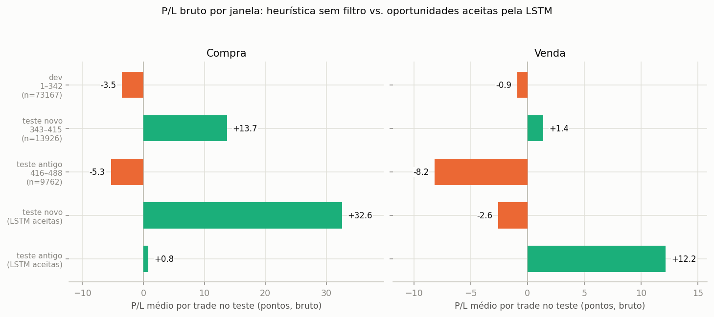

## Leitura dos resultados (análise manual, não gerada pelo script)

Campanha v2: sigma 2,2/2,4/2,6 (antes 1,4/1,6/1,8), teste dobrado para os últimos 30% dos pregões (343–488, 146 pregões; antes 15%, 72 pregões), pregões 168/304/336/338/371/463 excluídos por cotação impossível. Números das tabelas e figuras deste relatório (5 folds) e da comparação `lstm_v2_base` × `lstm_v2_seed2`.

**1. Sigma maior não resolveu o problema identificado na campanha anterior.** O AUC de teste é 0,61 (compra) e 0,60 (venda), parecido com o da campanha com sigma 1,4–1,8 (0,59/0,62). E a causa é a mesma:

- Um score que só conhece a combinação (sigma, Re, Ri), sem olhar o mercado, tem AUC **0,642 (compra) e 0,631 (venda)** — igual ou maior que o do modelo.
- Dentro de cada combinação (mesma sigma, Re, Ri, comparando só as oportunidades entre si) o AUC do modelo é **0,513 (compra) e 0,507 (venda)** — acaso. No mapa por combinação (fig. 11–12), nenhuma das 27 passa de 0,54.
- Na curva de lift (fig. 9), aceitar as oportunidades de maior probabilidade segue de perto a linha "só a combinação" (aceitar pela taxa histórica da combinação, sem olhar o mercado); no fold 1 fica abaixo dela.

**2. O balanceamento de labels (pregões de desenvolvimento, 1–342) segue perto do equilíbrio mesmo com sigma maior.** Taxa de equilíbrio = Ri/(Re+Ri); a taxa observada fica em média 1,7 pontos percentuais ABAIXO do equilíbrio (mediana igual). Só 4 das 54 linhas (27 combinações × compra/venda) ficam acima do equilíbrio, e a folga nelas é de no máximo 0,4 pp. Ou seja, a heurística com sigma 2,2–2,6 continua sem edge bruto detectável nesta amostra, antes de qualquer custo.

**3. O ruído entre execuções continua do tamanho das diferenças que importariam.** Trocando só a semente (`lstm_v2_base` × `lstm_v2_seed2`, 27 combinações comuns), a AUC por fold varia em média 0,024 (compra, máx 0,034) e 0,012 (venda, máx 0,030). A diferença observada entre os dois experimentos é 0,011 (compra) e 0,008 (venda) — menor que o ruído entre sementes, portanto não é uma melhora real.

**4. Conclusão preliminar.** As duas mudanças pedidas (sigma maior, teste maior) não alteraram o quadro da campanha anterior: o modelo aprende a taxa de lucro por combinação (sigma, Re, Ri), não a distinguir oportunidades dentro de uma combinação. Isso é consistente com a hipótese já registrada em `docs/lstm_leitura_base.md`: as features `SL` e `SG` revelam Ri/Re, e a rede pode estar devolvendo a taxa base da combinação em vez de ler o mercado.

**5. P/L em pontos (bruto, sem custos) — atualização.** O cache `--stage pl` foi rodado para a grade sigma 2,2–2,6 (`docs/lstm_pl_oportunidades_v2_*.csv`). Escolhendo o limiar de probabilidade que maximiza o P/L médio NA VALIDAÇÃO e aplicando no teste (mesmo protocolo do relatório anterior, 5 folds × 2 experimentos = 10 medidas por lado), o resultado é **positivo na compra** (todas as 10 medidas positivas, de +4,8 a +42,0 pts/trade; média 17,0) e **majoritariamente positivo na venda** (8 de 10 positivas, de −1,9 a +14,6 pts/trade; média 4,4). Isso parece contradizer o achado de que o AUC intra-combinação é acaso (item 1) — mas não contradiz, pelo motivo do item 6.

**6. A causa do P/L positivo não é o sigma maior nem a LSTM: é a composição do teste maior (achado central desta rodada).** Decompondo o P/L bruto da heurística SEM nenhum filtro por janela de tempo:

| janela | pregões | compra (bruto) | venda (bruto) |
|---|---|---|---|
| desenvolvimento | 1–342 | −3,5 pts/trade | −0,9 pts/trade |
| teste, parte NOVA (dobrar o teste incluiu isso) | 343–415 | **+13,7** pts/trade | +1,4 pts/trade |
| teste, parte ANTIGA (era todo o teste da campanha anterior) | 416–488 | **−5,3** pts/trade | −8,2 pts/trade |

A parte 416–488 — que já era o teste inteiro antes de dobrarmos — continua com P/L bruto negativo com a grade sigma 2,2–2,6, na mesma direção da campanha anterior (sigma 1,4–1,8). O ganho positivo do teste inteiro vem quase todo dos 72 pregões novos (343–415), que por algum motivo de mercado favoreceram a compra nesta heurística — sem qualquer filtro, sem LSTM.

O mesmo padrão aparece nas oportunidades que a LSTM aceita: na parte nova, +30 a +35 pts/trade; na parte antiga (416–488, a mesma de antes), **+0,08 a +1,5 pts/trade** — dentro do ruído, não uma melhora real. Ou seja, **o resultado "P/L positivo" da campanha v2 é dominado pela metade nova do teste, não por sigma maior nem por discriminação da LSTM.** Isso é coerente com o item 1: a LSTM não discrimina dentro de combinação; o que muda de uma janela para outra é a taxa de acerto bruta da própria heurística, que a LSTM continua basicamente reproduzindo via a combinação (item 1) mais, aparentemente, uma leve preferência por negociações de alvo maior (correlação p×|P/L| dentro da combinação, tipicamente 0,10–0,20, contra p×acerto, tipicamente 0,00–0,09 — ver nota abaixo).

*Nota técnica:* dentro de uma mesma combinação (sigma, Re, Ri) o modelo quase não separa vitória de derrota (correlação p×acerto ~0,01–0,09 nas amostras do fold 5, compra), mas separa um pouco mais por TAMANHO do resultado (correlação p×|P/L| ~0,10–0,21). Como o sinal do ganho esperado é fixo por combinação (não muda com o tamanho do trade), essa preferência por trades maiores amplifica o resultado — positivo ou negativo — da combinação, sem ser propriamente uma previsão de acerto.

**7. Recomendação para a próxima rodada.** Com o teste maior, separar sempre os dois trechos (343–415 e 416–488) nas conclusões, em vez de só a média: um resultado que só aparece com o trecho novo dentro não deve ser generalizado. Antes de tentar mais sigmas, vale entender por que 343–415 favoreceu a compra (mudança de volatilidade, tendência do WIN, etc. — não investigado aqui).

**8. O que esta campanha ainda NÃO testou.**
- A ablação sem `SL`/`SG` sugerida na campanha anterior — continua sendo o teste mais direto da hipótese do item 6 (preferência por trades maiores).
- Sigma maior que 2,6: a análise `src/analyze_spread_vs_edge.py` (heurística pura, sem LSTM), com um recorte menor de dados, indicava que o edge bruto crescia com sigma no desenvolvimento mas piorava no antigo teste — coerente com a instabilidade entre janelas descrita acima.
- Custos (spread, corretagem): toda a análise desta seção é bruta (custo 0).
