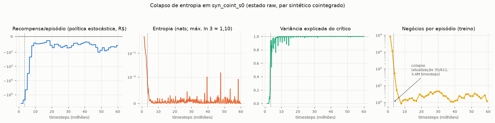
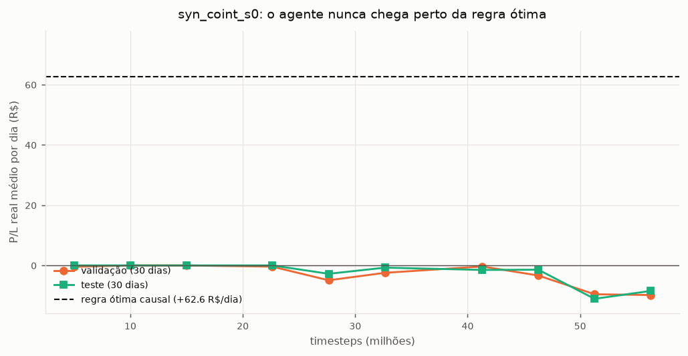

# Relatório — diagnóstico estrutural com par sintético cointegrado (estado "só preços")

> Experimento no Santos Dumont em 21/09/2026 (`syn_coint_s0` e `syn_null_s0`, 60M timesteps cada, seed 0), disparado pelo driver autônomo `slurm/submit_synthetic.sh`. Objetivo: separar "os dados não têm arbitragem capturável" de "o RL não consegue aprender arbitragem", usando um par WIN×BOVA11 **sintético** com cointegração conhecida (`src/synthetic_pair.py`) e o estado "só preços" pedido pelo usuário (`STATE_KIND=raw`, sem preço justo/razão/resíduo prontos — só os 4 preços atuais e features genéricas de mercado). Toda a análise vem de arquivos gravados pelo pipeline, copiados em `sdumont_backup_sintetico/`; as figuras são geradas por `src/analyze_synthetic.py`.

## 0. Resumo

1. **Existe arbitragem real e capturável no sintético, e uma regra causal simples a captura.** Com o spread verdadeiro (conhecido só porque os dados são sintéticos), uma regra de limiar (entra a 2σ, sai ao cruzar 0) rende **+62,6 R$/dia** no teste, com 10,7 negócios/dia, positiva em 30 de 30 dias.
2. **O agente de RL, com o estado "só preços", captura ~0% disso.** O checkpoint escolhido pela validação faz **0,067 negócios/dia** (2 negócios em 30 dias) na validação e **zero negócios** no teste — empata exatamente com o baseline flat (R$ 0,00). Nenhum checkpoint da curva de avaliação chegou perto da regra ótima (Fig. 2).
3. **A causa raiz é um colapso de entropia muito rápido, que trava a política num atrator de "quase não operar" antes de ela explorar o regime lucrativo.** Em **35 de 611 atualizações de PPO (5,7% do orçamento, 3,4M de 60M timesteps)**, a entropia já caiu de ~1,0 para <0,01 nats e a variância explicada do crítico já passa de 0,74 (Fig. 1). Isso acontece antes de 3 episódios completos por ambiente (~129 de ~2.222 episódios do treino inteiro).
4. **O mecanismo é o custo de transação dominando o gradiente inicial.** A política aleatória do início faz ~8.395 negócios por episódio, custando (sem a escala de recompensa ×5) ≈ −83 mil R$/episódio — um castigo grande, imediato e presente em qualquer estado. "Parar de operar" é um gradiente fácil e universal; "operar só quando o spread passa de 2σ" é um sinal raro (~10 vezes em 27 mil ticks) que precisa de uma combinação específica dos preços. O primeiro vence de longe antes do segundo aparecer.
5. **Quando a política treinada opera mais, ela perde dinheiro — não fica perto do lucro da regra ótima.** Nos checkpoints intermediários com mais negócios (1,1–2,4/dia, ver `eval/checkpoint_curve.csv`), o P/L é negativo (−22 a −332 R$ em 30 dias). O agente nunca aprendeu a cronometrar as entradas; só aprendeu, cedo, que operar pouco dói menos que operar muito.
6. **Os testes de diagnóstico são consistentes com essa leitura, não a contradizem.** A resposta a impulsos de preço é **~0,000** (a política não reage a choques, sinal de logits saturados). O alinhamento com o spread verdadeiro e com métodos clássicos (razão com média móvel, OLS, Kalman, cópula) é positivo mas fraco (Spearman 0,05–0,10) — um resíduo do gradiente correto captado nas ~35 atualizações antes do colapso, fraco demais para virar ação. No controle negativo (`syn_null_s0`, sem arbitragem por construção), o agente opera mais (0,35/dia) e tem alinhamento **negativo**, mostrando que o padrão do `coint` não é um artefato do driver — é específico do embate custo-inicial × sinal-raro.
7. **Sem `VecNormalize` nem qualquer normalização de recompensa no pipeline.** O choque de custo inicial entra cru no cálculo de vantagem do PPO; só há um multiplicador fixo (`HEDGE_REWARD_SCALE=5,0`).

**Leitura geral:** a falha não é falta de sinal nos dados — aqui o sinal existe por construção e uma regra causal simples o captura. É um problema estrutural do treino de RL: o PPO, do jeito que está configurado (recompensa não normalizada, `ent_coef` fixo baixo, episódios de 27 mil ticks com rollouts de 2.048 por ambiente), converge para "não operar" muito antes de ter chance de descobrir a estratégia lucrativa. Isso confirma, num cenário controlado, o mesmo padrão de colapso de entropia já visto na campanha com dados reais (`docs/relatorio_resultados_v5.md`, §2.6: entropia < 0,05 em ~1,7M passos nas 4 seeds).

---

## 1. Configuração

| Item | Valor |
|---|---|
| Estado (22 dim.) | 4 preços atuais em log (bid/ask WIN e BOVA11), retornos de cada ativo em 10/100/1.000/4.000 ticks, spread bid-ask relativo, volatilidade de 100 ticks, hora e dia da semana cíclicos, posição, P/L não realizado — **sem preço justo, razão, resíduo ou spread entre os ativos** (`STATE_KIND=raw`, `src/rl_trading_pipeline.py::build_raw_features`) |
| Par sintético | `src/synthetic_pair.py`: BOVA11 = passeio aleatório geométrico; WIN = 1000×BOVA11 + deriva do dia + spread Ornstein-Uhlenbeck (`SYNTH_KIND=coint`: desvio 40 pts, meia-vida 300 ticks, deriva −30 pts/pregão, rollover a cada 32 pregões — parâmetros medidos nos dados reais); `SYNTH_KIND=null`: WIN é um passeio aleatório independente (controle negativo, sem arbitragem) |
| Recompensa | `HedgedPairEnv`: par hedgeado, mesma contabilidade da campanha v5 (WIN + `N_BOVA = P_WIN/(5·P_BOVA)` ações de BOVA11 em sentido oposto; custo R$ 0,25/lado do WIN + 0,023%×valor da perna BOVA11; preços mid, sem meio-spread; recompensa ×5 só para o PPO) |
| PPO | lr 3e-4, `n_steps` 2048 × 48 envs (98.304 timesteps/atualização, 611 atualizações no total), batch 4096, 10 épocas, γ = 0,999999, λ = 0,95, `ent_coef` = 0,01, MLP [64, 64], `DummyVecEnv`, sem `VecNormalize` |
| Orçamento | 60M timesteps por execução (4 chunks de ~20 min) |
| Janelas | 300 pregões sintéticos de treino, 30 de validação, 30 de teste (mesma proporção da v5) |
| Seleção | melhor checkpoint só pela validação (P/L real do par), a cada 5M timesteps |

---

## 2. Referência: o que existe para ser capturado

`src/synthetic_benchmark.py` escolhe, nos 300 dias de treino, o melhor limiar (múltiplo do desvio do spread) para uma regra causal simples — entra quando o spread verdadeiro passa do limiar, sai quando cruza 0 — e mede o resultado nos 30 dias de teste:

| Limiar (× desvio do spread) | 1,0σ | 1,5σ | 2,0σ (escolhido) | 2,5σ | 3,0σ | 3,5σ |
|---|---|---|---|---|---|---|
| P/L médio/dia no treino (R$) | −92,5 | +32,0 | **+55,1** | +33,3 | +15,5 | +4,7 |

| | Valor |
|---|---|
| **Regra ótima causal no teste** | **+62,6 R$/dia** (+1.878 R$ em 30 dias), 10,7 negócios/dia, **30/30 dias positivos** |
| Mesma regra com meio-spread bid/ask nas duas pernas | +30,6 R$/dia |
| Teto do oráculo (previsão perfeita, 10 dias) | +692,9 R$/dia |

A regra usa só informação causal (o spread no tick atual) e nunca vê o futuro. O teto do oráculo mostra que ainda sobra bastante espaço acima da regra simples — mas o agente treinado não chegou nem perto da regra, muito menos do teto.

---

## 3. Resultado do agente

**Fig. 1.** Dinâmica de treino de `syn_coint_s0`: recompensa por episódio (symlog), entropia (symlog), variância explicada do crítico e negócios por episódio, todos contra timesteps. A linha tracejada marca a atualização 35/611 (3,4M timesteps), onde a entropia já caiu abaixo de 0,01 nats.

| Atualização de PPO | Timesteps | Entropia (nats) | Variância explicada do crítico |
|---|---|---|---|
| 14 | 1,4M | −0,51 (ainda alta) | ~0 |
| 26 | 2,6M | −0,077 | 0,03 |
| **35** | **3,4M** | **−0,007** | **0,74** |
| 38 | 3,7M | −0,006 | 0,88 |

Com 48 ambientes e episódios de 27 mil ticks, um episódio completo leva ~13 atualizações; o colapso ocorre antes de 3 episódios completos por ambiente (~129 de ~2.222 episódios do treino inteiro, ~6%).

**Fig. 2.** P/L real médio por dia de cada checkpoint avaliado (validação e teste), contra a regra ótima causal (+62,6 R$/dia). Nenhum checkpoint chega perto.

| Timesteps (M) | Val, negócios/dia | Val, P/L (30 dias) | Teste, negócios/dia | Teste, P/L (30 dias) |
|---|---|---|---|---|
| 5,0 | 0,03 | −13,7 | 0,00 | 0,0 |
| 10,0 – 15,0 | 0,00 | 0,0 | 0,00 | 0,0 |
| 27,6 | 1,10 | **−147,8** | 0,43 | −83,3 |
| 32,6 | 1,43 | −73,6 | 1,07 | −22,2 |
| **40,0 (melhor de validação)** | **0,07** | **+12,1** | **0,00** | **0,0** |
| 51,3 | 2,43 | −287,0 | 2,13 | −332,5 |
| 56,3 | 1,27 | −295,1 | 1,03 | −253,8 |

**Nos 6 checkpoints em que o agente operou mais de 1 vez/dia, o P/L foi negativo em todos.** O checkpoint escolhido (40M) é o que mais se parece com "não operar" (0,07 negócios/dia na validação, 0 no teste) — a validação escolheu o mais próximo do flat porque toda alternativa que ele descobriu perde dinheiro, não porque encontrou a estratégia lucrativa.

| | best_val (checkpoint 40M) | last (checkpoint 60M) | baseline flat |
|---|---|---|---|
| P/L real, validação (30 dias) | +12,1 R$ | −5,3 R$ | 0,0 R$ |
| P/L real, teste (30 dias) | **0,0 R$** | 0,0 R$ | 0,0 R$ |
| Negócios/dia, validação | 0,067 | 0,067 | 0 |
| Negócios/dia, teste | **0,000** | 0,000 | 0 |
| **Fração da regra ótima capturada (teste)** | **0%** | 0% | — |

---

## 4. Diagnóstico de arbitragem (`src/diagnose_agent.py`)

### A) Alinhamento com métodos clássicos (Spearman entre a preferência do agente e −desvio; 60 pregões)

| Sinal | Spearman médio/pregão | IC95% | Pregões positivos |
|---|---|---|---|
| razão com média móvel de 3.000 ticks | 0,096 | [0,071; 0,120] | 51/60 |
| OLS rolante (3.000 ticks) | 0,087 | [0,061; 0,112] | 49/60 |
| Kalman | 0,095 | [0,067; 0,124] | 47/60 |
| Cópula gaussiana | 0,082 | [0,064; 0,100] | 51/60 |
| **spread verdadeiro (`truth`)** | **0,051** | **[0,016; 0,085]** | 43/60 |

Positivo e estatisticamente distinto de 0 nos 5 sinais, mas fraco (0,05–0,10, numa escala de −1 a 1) — e **`pct_ticks_com_preferencia_forte` é 0,005%**: a política quase nunca assume uma preferência clara. É um resíduo de aprendizado correto, não uma política operante.

### B) Resposta a impulso (degrau de +30/+60 pts nos preços; política avaliada com posição flat)

| Δ (pts) | Cenário | Δ preferência | Esperado se fosse arbitragem |
|---|---|---|---|
| 60 | WIN sobe | 0,004 (IC cruza 0) | negativo |
| 60 | WIN cai | 0,006 | positivo |
| 60 | BOVA11 sobe | 0,000 | positivo |
| 60 | os dois sobem | 0,004 | ~0 |

**Todos os valores são ~0,000 (IC95% cruzando 0 ou quase).** A política não responde a nenhum dos choques testados — nem na direção certa, nem na errada. Isso é evidência direta de logits saturados: o colapso de entropia não deixou a política "confiante e correta às vezes", deixou-a **constante**, indiferente ao estado.

### C) Placebo de emparelhamento (BOVA11 adulterado; P/L calculado com preços verdadeiros)

| BOVA11 visto pelo agente | P/L total (30 dias) | Negócios/dia |
|---|---|---|
| original | +12,1 R$ | 0,03 |
| atrasado 10/100/1.000 ticks | +16,9 / −6,5 / −79,0 R$ | 0,08 / 0,15 / 0,47 |
| congelado | +3,6 R$ | 0,05 |
| de outro pregão | −63,7 R$ | 0,27 |

Com tão poucos negócios (2 no total, ver D), este teste não tem poder estatístico — está aqui por completude, não como evidência.

### D) Eventos: desvio dos métodos clássicos nas 2 entradas do agente

| Sinal | Desvio a favor na entrada (pts) | 100 ticks depois | Na saída |
|---|---|---|---|
| razão com média móvel | −13,0 | +18,8 | −82,1 |
| spread verdadeiro | +16,0 | +48,9 | −60,6 |

Amostra de 2 negócios — não dá para tirar conclusão, só ilustra o quão raramente o agente opera.

### Controle negativo (`syn_null_s0`, sem arbitragem por construção)

| | `coint` | `null` |
|---|---|---|
| Negócios/dia (best_val, val) | 0,067 | 0,35 |
| Alinhamento com métodos clássicos (Spearman) | +0,05 a +0,10 | **−0,23 a −0,32** |
| P/L do "original" no placebo (30 dias) | +12,1 R$ | +241,7 R$ (ruído; 0,35 negócio/dia) |

No `null` o agente opera mais e tem alinhamento **negativo** com os mesmos métodos clássicos (que, sem cointegração real, não deveriam prever nada). Isso mostra que o padrão do `coint` — quase não operar, alinhamento fraco mas positivo — não é um artefato fixo do pipeline; é a assinatura específica do colapso ocorrendo bem no início do treino, antes de explorar o sinal real que só existe no `coint`.

---

## 5. Limitações

- **1 seed por cenário.** Não dá para saber se outra inicialização escaparia do atrator "não operar" por acaso.
- **O placebo (C) e os eventos (D) têm baixo poder estatístico** porque o agente quase não opera (2 negócios no `coint`).
- **Os parâmetros do Kalman e da cópula (A) são escolhas razoáveis, não otimizadas** — servem de referência de alinhamento, não de estratégias calibradas.
- **O `ent_coef` (0,01) e a escala de recompensa (×5) foram herdados da campanha v5** (dados reais), não recalibrados para o sintético.

---

## 6. Próximos passos (hipóteses a testar, nenhuma executada)

Decorrem diretamente do mecanismo identificado (§0.4, §3):

1. **`ent_coef` maior ou com cronograma decrescente**, para adiar o colapso além das ~35 atualizações atuais.
2. **Normalizar a recompensa** (ex.: `VecNormalize` do próprio `stable_baselines3`, ou recorte/normalização manual), para o choque inicial de custo (~−83 mil R$/episódio sem escala) não dominar sozinho o gradiente antes de qualquer sinal de lucro aparecer.
3. **Aquecer com a política de arbitragem** (pergunta original do usuário que motivou este experimento): agora há evidência concreta de que o problema é justamente não escapar do atrator "não operar" — começar de uma política que já opera evita esse atrator por construção. Testável primeiro no sintético `coint`, onde a fração capturada da regra ótima é a métrica de sucesso.
4. **Reduzir o atraso de atribuição de crédito**: aumentar `n_steps` (hoje cobre só ~7,6% de um episódio) ou truncar o episódio.
5. **Curva de custo crescente**: começar o treino com custo de transação baixo (ou zero) e subir gradualmente até o valor real, para o agente aprender a cronometrar entradas antes de aprender a temer o custo.

---

## 7. Atualização (23/09/2026): as correções pontuais não resolveram e a bissecção aponta para a receita de treino

### 7.1 Rodada de validação das correções (`syn_coint_fix_{entcoef,costramp,combo}_s0`)
O agente do SDumont relatou que **nenhuma das três variantes capturou a regra ótima** (os arquivos completos ficaram no cluster; só o resumo veio para cá, então não há tabela própria). Duas ressalvas minhas sobre o que essa rodada realmente testou:

- **O `reward_clip=50` quase nunca atuou.** Uma transação custa R$ 5,77, que o PPO vê como 28,9 (recompensa ×5), abaixo do clipe; só uma virada de posição (57,7) o ultrapassa. Portanto "agente sensível a outliers de recompensa" **não foi testado**; `costramp` e `combo` testaram, na prática, a curva de custo (e, no `combo`, `ent_coef` = 0,05).
- **Erro de memória meu, corrigido em `4ea6be0`.** Ao adicionar o `bench` aos ambientes, `self.bench` passou a referenciar a matriz de features float64 original (além da cópia float32), e cada um dos 48 ambientes guardava a sua. No estado raw isso multiplicou a memória por ~2,3× (48 ambientes × 8 dias: de ~2,3 GB para 0 MB de excesso depois da correção, que compartilha uma matriz float32 por dia). Não altera resultados (observações idênticas, testado), mas inflou o uso de memória das rodadas raw no cluster.

### 7.2 A informação do spread está acessível no estado "só preços"
`src/probe_raw_information.py` regride o spread verdadeiro X_t nas features raw (40 dias de treino, 10 de validação, sem RL):

| Features | R² (X_t), OLS | R² (X_t), gradient boosting | R² (X(t+300)−X(t)), OLS |
|---|---|---|---|
| raw **com** os 4 níveis de preço | **−1,23** | +0,41 | −2,97 |
| raw **sem** os níveis | **+0,52** | +0,40 | +0,13 |

- A razão log(WIN/BOVA11) varia ~320 pts **entre dias** (deriva e rollover) contra ~42 pts **dentro do dia**; os níveis viram identificador de dia e fazem o modelo linear extrapolar mal.
- O sinal está na **diferença** entre os retornos dos dois ativos: `ret1000_win − ret1000_bova` tem correlação **0,68** com o spread, contra 0,18 do retorno do WIN sozinho.
- A relação sinal/ruído por tick é baixa: retorno esperado da reversão ≈ 0,037 R$/tick contra desvio de 0,54 R$/tick (razão ≈ 0,07).

### 7.3 Bissecção: o agente falha até quando recebe o spread verdadeiro
Treinos locais de 6M timesteps (61 atualizações de PPO, mesmos hiperparâmetros do baseline, 40 dias sintéticos, custo cheio), variando só o estado (`STATE_KIND`):

| Execução | Estado do agente | Val: negócios/dia | Val: % do tempo flat | Val: P/L (4 dias) | Entropia < 0,01 em |
|---|---|---|---|---|---|
| `oracle_c1` | **só o spread verdadeiro** (+ posição e P/L) | 1,0 | **0%** | −59,7 R$ (idêntico nos 4 checkpoints) | atualização 22 (2,2M) |
| `raw_nolevels_c1` | raw sem níveis de preço | 2,25 → 1,0 | 45% → **0%** | −139,5 → −26,3 R$ | atualização ~27 (2,7M) |
| `syn_coint_s0` (baseline, 60M) | raw com níveis | 0,07 | ~99,7% flat | +12,1 R$ (30 dias) | atualização 35 (3,4M) |

- **No `oracle_c1` o agente tem em mãos exatamente a variável que a regra ótima usa e mesmo assim não aprende a regra.** A política converge para "abrir uma posição no início e segurá-la o dia todo" (1,0 negócio/dia, nunca flat, nenhum acerto), com P/L de validação **constante** em −59,7 R$ nos 4 checkpoints, isto é, **ignora a observação**. O `raw_nolevels_c1` termina no mesmo comportamento.
- **A representação não é o gargalo principal.** Se fosse, o `oracle_c1` aprenderia. O que se repete nos três casos é o colapso de entropia muito cedo (2–3M de 6–60M timesteps), agora para uma **ação constante** (flat no baseline, posição fixa nestes dois), e depois disso o PPO fica congelado (entropia ~4e-5, `approx_kl` ≈ 0 ao final).
- **O gatilho continua o mesmo:** a política aleatória do início troca de ação em ~2/3 dos ticks, gerando milhares de negócios por episódio (recompensa de episódio de −300 mil a −440 mil R$ ×5 nos primeiros rollouts). Com exploração sem nenhuma persistência temporal, o caminho de menor custo é parar de trocar de ação, e qualquer ação constante serve.

### 7.4 Hipóteses estruturais a testar (nenhuma executada ainda)
1. **Exploração persistente:** repetir a ação escolhida por k ticks (*frame skip*, k≈20–100) ou usar ações "pegajosas". Reduz o custo esperado da política aleatória em ~k vezes, encurta o horizonte de 27.000 para ~500 decisões por episódio e aumenta a razão sinal/ruído por decisão. É o ataque mais direto ao gatilho identificado.
2. **Escala do valor:** o *value loss* inicial é ~2,3e5 e o clipe global de gradiente (0,5) é compartilhado entre política e crítico; testar `HEDGE_REWARD_SCALE` bem menor (ex.: 0,05) ou `VecNormalize`.
3. **GAE/horizonte:** com λ = 0,95 o crédito de uma entrada a centenas de ticks do ganho depende quase só do crítico; testar λ ≈ 0,999.
4. **Passo de otimização:** 10 épocas × 24 minibatches = 240 passos de gradiente por atualização com lr 3e-4; testar menos épocas / lr menor para o crítico visitar estados com posição antes da política congelar.
5. **Aquecimento:** iniciar a política numa regra que já opera na região certa (evita o atrator de ação constante por construção).

## Apêndice: arquivos e reprodução

- **Resultados brutos:** `sdumont_backup_sintetico/` (`sintetico_progresso.md` com o log completo da campanha; `pairs-trading-rl/src/runs/syn_{coint,null}_s0/fold1/` com `state.json`, `val_curve.csv`, `logs/chunk*/progress.csv`, `eval/*`, `diag/*`).
- **Figuras:** `python src/analyze_synthetic.py` (no WSL/venv com matplotlib).
- **Como foi gerado:** `slurm/submit_synthetic.sh` (driver autônomo) + `slurm/submit_diag.sbatch`; código em `src/synthetic_pair.py`, `src/synthetic_benchmark.py`, `src/diagnose_agent.py`, `src/rl_trading_pipeline.py` (`build_raw_features`, `STATE_KIND=raw`).
- **Branch/commit:** `estado-simplificado-v4`, commit `ba3c7f5` (código que gerou o baseline); `4ea6be0` (correção de memória, modo `oracle` e `probe_raw_information.py`, usados na §7).
