# Relatório LSTM — experimento `lstm_base`

> Gerado por `src/report_lstm.py` a partir dos artefatos gravados pelo pipeline (`state.json`, `metrics.json`, `predictions.npz`). Tudo aqui é medido; nenhuma interpretação é gerada automaticamente — a leitura dos resultados fica a cargo de quem analisa.

## 0. Resumo

- **Compra**: AUC no teste = **0.591** em média entre 5 fold(s) (desvio 0.024; mín 0.551, máx 0.611); 5 de 5 folds acima de 0,5. Último fold: 0.601 [0.587; 0.617] (IC95% por bootstrap sobre os pregões). Acurácia no teste menos a do classificador majoritário: +0.069 (média). Referências: AUC de um score que só conhece a combinação (sigma, Re, Ri) = 0.634; AUC do modelo apenas dentro de cada combinação = 0.491.
- **Venda**: AUC no teste = **0.621** em média entre 5 fold(s) (desvio 0.012; mín 0.604, máx 0.632); 5 de 5 folds acima de 0,5. Último fold: 0.631 [0.616; 0.646] (IC95% por bootstrap sobre os pregões). Acurácia no teste menos a do classificador majoritário: +0.085 (média). Referências: AUC de um score que só conhece a combinação (sigma, Re, Ri) = 0.640; AUC do modelo apenas dentro de cada combinação = 0.510.

Uma AUC de 0,5 é o acaso; o IC95% que contém 0,5 significa que, com esses dados, não dá para distinguir o modelo do acaso naquele fold. `AUC só-combo` usa como score a taxa de lucro histórica da combinação (sem olhar o mercado): é o que se ganha só por saber quais parâmetros geraram a oportunidade. `AUC intra-combo` compara apenas oportunidades da mesma combinação, então o efeito do sweep é removido.

---

## Leitura dos resultados (análise manual, não gerada pelo script)

Números vindos das tabelas e figuras deste relatório (5 folds, teste = 72 pregões, 416–488) e da comparação da seção 6.

**1. O modelo aprendeu o efeito do sweep, não a oportunidade.** O AUC de 0,59 (compra) e 0,62 (venda) é real e estável entre folds, mas as três referências abaixo mostram de onde ele vem:

- Um score que só conhece a combinação (sigma, Re, Ri), sem olhar o mercado, tem AUC **0,634 (compra) e 0,640 (venda)**, igual ou maior que o do modelo.
- Dentro de cada combinação o AUC do modelo é **0,491 (compra) e 0,510 (venda)**, isto é, acaso. No fold 5 as 27 combinações ficam entre 0,46 e 0,53 (compra) e entre 0,50 e 0,56 (venda); nas figuras de AUC por combinação (média dos folds) nenhuma passa de 0,55.
- No fold 5, a probabilidade média prevista por combinação tem correlação **0,998 (compra) e 0,995 (venda)** com a taxa de lucro histórica da combinação. Trocar cada previsão pela média da sua combinação dá AUC 0,633 (compra) e 0,640 (venda), contra 0,601 e 0,631 das previsões reais: na compra, a variação dentro da combinação só acrescenta ruído.

**2. Por que isso acontece (hipótese forte, ainda não testada).** No tick da entrada, `SL = Ri·|Saída−Entrada|` e `SG = Re·|Saída−Entrada|` estão nas features (o `SL` já fazia parte da Tabela 1; o `SG`, o take profit, foi acrescentado nesta versão). A razão SL/SG é exatamente Ri/Re, e a taxa de lucro depende sobretudo de Ri (35–48% com Ri = 0,5, 51–64% com Ri = 1,0 e 60–72% com Ri = 1,5, seção 2). A rede pode ler a combinação nessas duas colunas e devolver a taxa base dela. O teste direto é retreinar sem `SL`/`SG` (ou só com quantidades que não revelem Re/Ri) e comparar o AUC intra-combinação.

**3. O treino para cedo.** Em 9 dos 10 treinos a melhor época é a 1 ou a 2, e depois a `val_loss` só sobe enquanto a de treino cai (fig. 3): a rede sobreajusta quase de imediato. Isso é coerente com o item 1, já que a taxa por combinação se aprende em poucas passadas. A queda da loss de treino não é comparável em nível com a de validação por causa do `class_weight`, mas a divergência de forma é clara.

**4. Nenhuma variação de experimento se distingue do ruído.** Nas 27 combinações comuns, a AUC de teste (compra/venda) foi: `base` 0,591/0,621; `seed2` 0,603/0,623; `net_big` (LSTM 128 + dropout 0,2) 0,603/0,618; `grid_wide` (120 combinações) 0,597/0,595. Só trocar a semente já move a AUC por fold em média 0,014 (compra, máx 0,043) e 0,010 (venda, máx 0,017), do tamanho das diferenças entre experimentos. Rede maior e grade mais densa não ajudaram de forma mensurável; o AUC intra-combinação continua entre 0,49 e 0,51 em todos.

**5. O lift no topo é indício fraco.** Aceitando só as ~1–10% oportunidades de maior probabilidade, a taxa de lucro fica entre 0,60 e 0,78, mas a linha só-combo já está em ~0,65–0,69 (compra) e ~0,70–0,72 (venda) nessa região. Os folds ficam acima da linha em alguns casos e abaixo em outros, e o topo de 1% tem ~200 amostras por fold. Não dá para dizer que há informação além do sweep.

**6. Próximos passos (hipóteses, a discutir).**
- Ablação sem `SL`/`SG`, com o AUC intra-combinação como métrica principal (e o AUC global só como referência).
- Controle "só combinação": um modelo que recebe apenas a combinação, para ver quanto o AUC global melhora sem nenhuma leitura do mercado.
- Para medir utilidade operacional é preciso o **lucro em pontos** de cada oportunidade (hoje só o sinal do lucro é gravado) e calcular o P/L, com custos, de operar só as oportunidades aceitas pelo modelo. Isso exige regerar as amostras guardando o lucro por trade.

---

## 1. Configuração e execução

| Item | Valor |
|---|---|
| Objetivo | classificar cada oportunidade (entrada da heurística) como Lucro (1) ou Prejuízo (0); label = sinal do lucro realizado da negociação (SG se atinge o alvo, −SL se atinge o stop, resultado a mercado se fechada no fim do pregão) |
| Sweep (sigma × Re × Ri) | 27 combinações: sigma [1.4, 1.6, 1.8], Re [0.5, 0.75, 0.9], Ri [0.5, 1.0, 1.5] |
| Features (por tick) | 14: bid, ask, Wbjusto, Wajusto, volume, bvolume, SL, spread, volatilidade, SG, day_sin, day_cos, time_sin, time_cos |
| Janela | 120 ticks anteriores à entrada |
| Rede | 2× LSTM(50) + Dense(1, sigmoid) |
| Treino | Adam, binary_crossentropy, batch 256, até 50 épocas, early stopping (paciência 8, melhor val_loss); class_weight |
| Validação | TimeSeriesSplit expanding window sobre os pregões (split por dia); scaler e balanceamento ajustados só no treino do fold |

**Janelas** (pregões, com o nº de dias entre parênteses; o teste é o mesmo em todos os folds):

| fold | treino | validação | teste |
|---|---|---|---|
| 1 | 1–69 (69) | 70–138 (69) | 416–488 (72) |
| 2 | 1–138 (138) | 139–207 (69) | 416–488 (72) |
| 3 | 1–207 (207) | 208–276 (69) | 416–488 (72) |
| 4 | 1–276 (276) | 277–346 (69) | 416–488 (72) |
| 5 | 1–346 (345) | 347–415 (69) | 416–488 (72) |

---

## 2. Balanceamento dos labels por combinação

Taxa de lucro de cada combinação (pregões de desenvolvimento). Laranja = maioria de prejuízos, azul = maioria de lucros; o cinza é 50%.


| lado | n | lucros | prejuizos | fechados_forcado | taxa de lucro |
|---|---|---|---|---|---|
| Compra | 169483 | 88284 | 81199 | 4039 | 0.521 |
| Venda | 165040 | 85358 | 79682 | 4756 | 0.517 |

---

## 3. Curvas de treino e validação

Linha tracejada = melhor época (menor `val_loss`, a que o early stopping restaura).

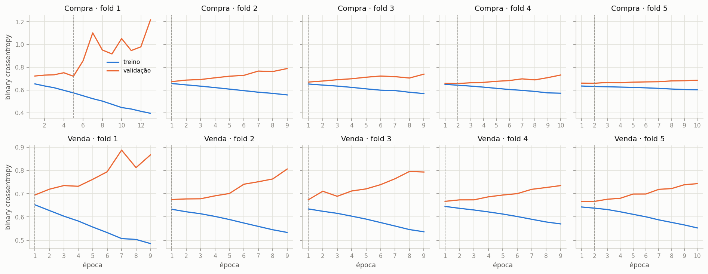

> A loss de **treino** do Keras já incorpora o `class_weight` (ponderada), enquanto a de validação não; por isso as duas não são diretamente comparáveis em nível — o que importa é a forma (quando a validação para de melhorar e sobe).

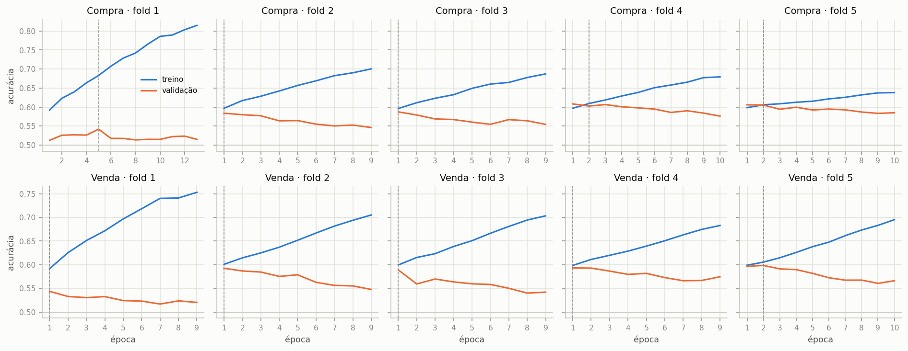

---

## 4. Resultados: validação e teste

| lado | fold | épocas | melhor época | n treino | n val | n teste | AUC val | AUC teste | IC95% teste | AUC só-combo | AUC intra-combo | acc teste | acc majoritária | bal_acc teste | prec teste | rec teste | min treinando |
|---|---|---|---|---|---|---|---|---|---|---|---|---|---|---|---|---|---|
| Compra | 1 | 13 | 5 | 24438 | 33445 | 20301 | 0.571 | 0.551 | [0.526; 0.574] | 0.634 | 0.489 | 0.541 | 0.500 | 0.541 | 0.546 | 0.489 | 0.503 |
| Compra | 2 | 9 | 1 | 57883 | 24987 | 20301 | 0.618 | 0.602 | [0.587; 0.617] | 0.634 | 0.490 | 0.578 | 0.500 | 0.578 | 0.584 | 0.541 | 0.592 |
| Compra | 3 | 9 | 1 | 82870 | 27235 | 20301 | 0.621 | 0.611 | [0.595; 0.624] | 0.634 | 0.500 | 0.581 | 0.500 | 0.581 | 0.573 | 0.639 | 0.820 |
| Compra | 4 | 10 | 2 | 110105 | 33947 | 20301 | 0.648 | 0.592 | [0.577; 0.607] | 0.634 | 0.489 | 0.570 | 0.500 | 0.570 | 0.581 | 0.507 | 1.158 |
| Compra | 5 | 10 | 2 | 144052 | 25431 | 20301 | 0.643 | 0.601 | [0.587; 0.617] | 0.634 | 0.489 | 0.576 | 0.500 | 0.576 | 0.583 | 0.538 | 1.467 |
| Venda | 1 | 9 | 1 | 23461 | 30534 | 18273 | 0.582 | 0.604 | [0.590; 0.617] | 0.640 | 0.495 | 0.575 | 0.504 | 0.575 | 0.579 | 0.575 | 0.348 |
| Venda | 2 | 9 | 1 | 53995 | 25931 | 18273 | 0.622 | 0.632 | [0.619; 0.644] | 0.640 | 0.514 | 0.599 | 0.504 | 0.599 | 0.619 | 0.531 | 0.575 |
| Venda | 3 | 9 | 1 | 79926 | 29182 | 18273 | 0.617 | 0.615 | [0.593; 0.632] | 0.640 | 0.508 | 0.586 | 0.504 | 0.587 | 0.627 | 0.441 | 0.782 |
| Venda | 4 | 9 | 1 | 109108 | 30980 | 18273 | 0.627 | 0.624 | [0.605; 0.642] | 0.640 | 0.514 | 0.588 | 0.504 | 0.588 | 0.594 | 0.576 | 1.040 |
| Venda | 5 | 10 | 2 | 140088 | 24952 | 18273 | 0.632 | 0.631 | [0.616; 0.646] | 0.640 | 0.520 | 0.597 | 0.504 | 0.598 | 0.614 | 0.538 | 1.423 |

`acc majoritária` é a acurácia de um classificador que sempre prevê a classe mais comum no teste — o piso que a acurácia do modelo precisa superar. `IC95%` = bootstrap sobre os pregões do teste.

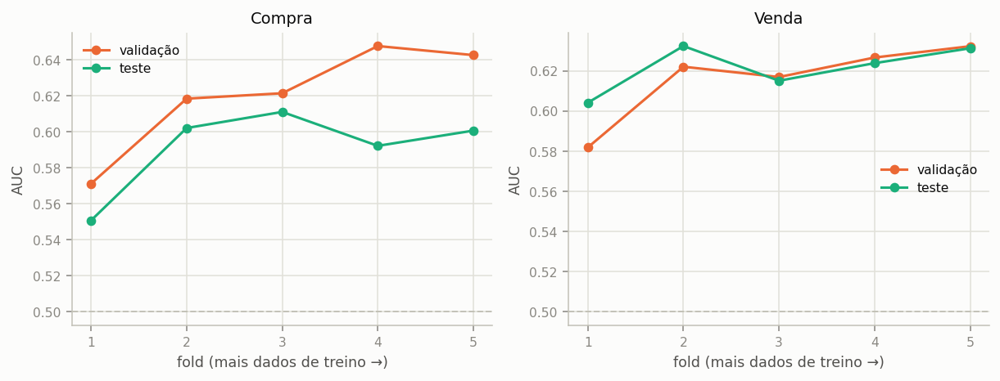

### Curva ROC

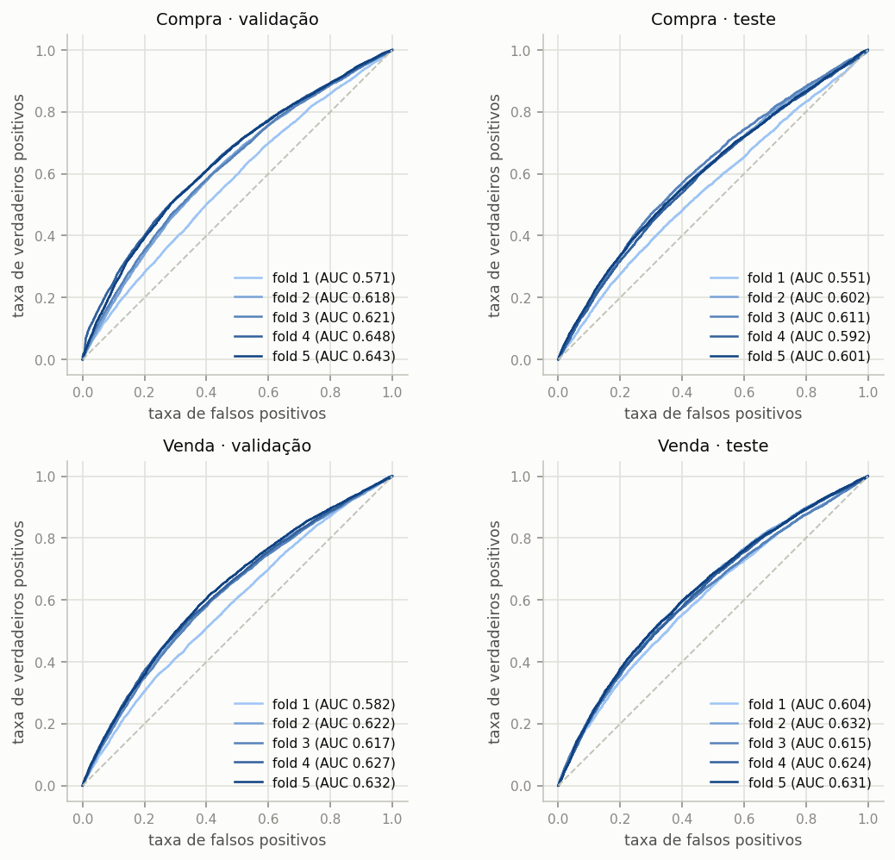

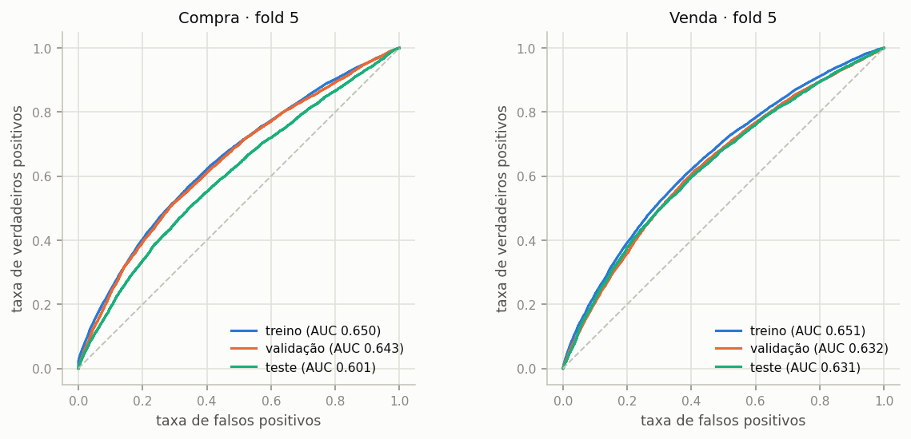

A distância entre a curva de treino e as de validação/teste (último fold) mede o sobreajuste.

### Matriz de confusão (teste, limiar 0,5)

Cada célula: contagem e % da linha (classe real).

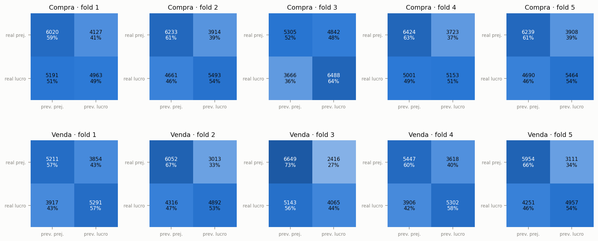

### Utilidade para operar: aceitar só as melhores oportunidades

Ordena as oportunidades do teste pela probabilidade prevista de lucro e mostra a taxa de lucro das aceitas conforme se aceita mais ou menos delas. Se o modelo discrimina, a curva começa acima da taxa base e decai até ela. A linha tracejada laranja é a referência **só-combo**: aceitar as oportunidades na ordem da taxa de lucro histórica de cada combinação (sigma, Re, Ri), sem olhar o mercado. Só o que fica acima dela é informação além do sweep.

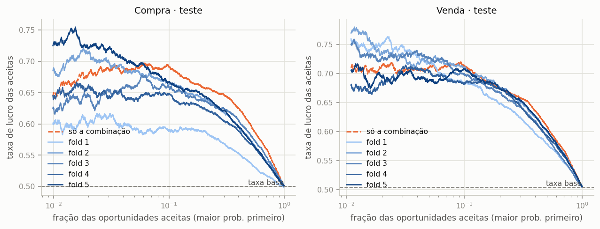

### Calibração

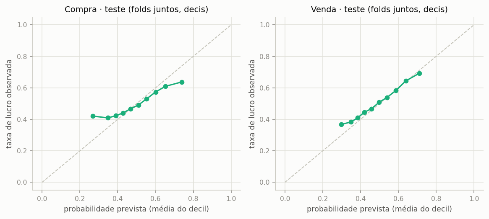

> Com `class_weight` as probabilidades não são calibradas para a taxa real; o que vale é o ranking (AUC/lift), não o limiar 0,5.

---

## 5. Onde o modelo discrimina: AUC por combinação (sigma, Re, Ri)

AUC no teste de cada combinação (média entre folds). Azul > 0,5; laranja < 0,5; células com menos de uma centena de amostras são ruidosas.

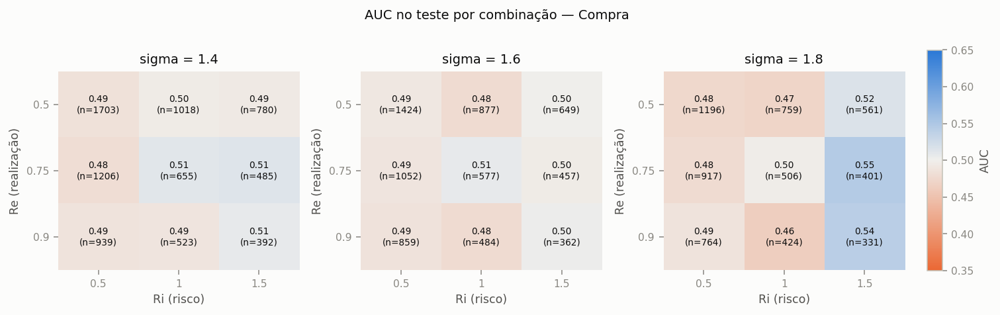

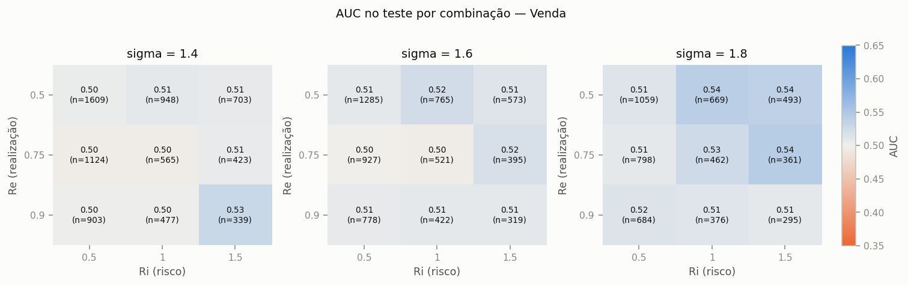

---

## 6. Comparação entre experimentos

Comparação feita nas **27 combinações comuns** a todos os experimentos (as grades diferem, e o conjunto de teste de cada um depende da sua grade; na coluna `todas` cada experimento usa a própria).

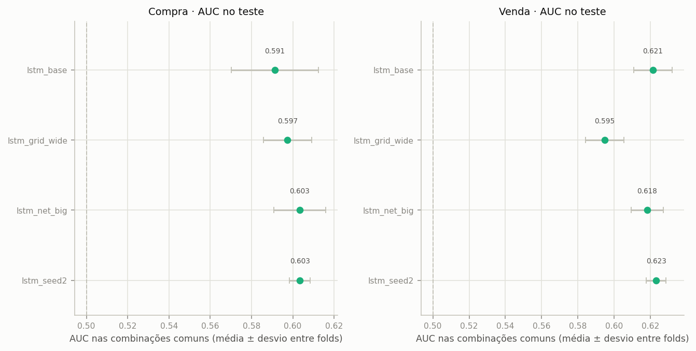

| experimento | lado | folds | combos | AUC teste (todas) | AUC teste (combos comuns) | desvio (folds) | AUC intra-combo (comuns) | bal_acc teste |
|---|---|---|---|---|---|---|---|---|
| lstm_base | Compra | 5 | 27 | 0.591 | 0.591 | 0.024 | 0.491 | 0.569 |
| lstm_base | Venda | 5 | 27 | 0.621 | 0.621 | 0.012 | 0.510 | 0.590 |
| lstm_grid_wide | Compra | 5 | 120 | 0.579 | 0.597 | 0.013 | 0.508 | 0.559 |
| lstm_grid_wide | Venda | 5 | 120 | 0.572 | 0.595 | 0.012 | 0.501 | 0.554 |
| lstm_net_big | Compra | 5 | 27 | 0.603 | 0.603 | 0.014 | 0.495 | 0.578 |
| lstm_net_big | Venda | 5 | 27 | 0.618 | 0.618 | 0.010 | 0.502 | 0.588 |
| lstm_seed2 | Compra | 5 | 27 | 0.603 | 0.603 | 0.006 | 0.490 | 0.577 |
| lstm_seed2 | Venda | 5 | 27 | 0.623 | 0.623 | 0.006 | 0.510 | 0.593 |

**Ruído entre execuções** (`lstm_base` × `lstm_seed2`, só muda a semente): diferença absoluta média da AUC por fold = Compra 0.014 (máx 0.043); Venda 0.010 (máx 0.017). Diferenças entre experimentos menores que isso não devem ser lidas como melhora.

---

## 7. Limitações e ressalvas

- **É classificação, não P/L.** O label vem da regra fixa SG/SL da heurística, sem custos de execução (meio-spread, taxas, atraso). Um bom AUC aqui não implica lucro operável; o passo seguinte seria medir o P/L (com custos) de operar só as oportunidades aceitas pelo modelo.
- **Amostras correlacionadas.** Combinações diferentes da grade no mesmo pregão compartilham quase as mesmas entradas, e janelas de 120 ticks de entradas próximas se sobrepõem; o número efetivo de amostras independentes é bem menor que `n`. Por isso os ICs são por pregão.
- **Um único período de teste** (os últimos pregões, fixos), e poucos folds de validação: a variação entre folds mostra a instabilidade temporal, mas não substitui mais dados.
- **Balanceamento por construção.** A taxa de lucro depende do sweep (sobretudo de Ri); um modelo pode aprender a taxa por combinação a partir das features SL/SG. A seção 5 mostra se há discriminação dentro de cada combinação.

## Apêndice: reprodução

```
python src/report_lstm.py --run-dir sdumont_backup_lstm/lstm_runs --tag lstm_base --compare
```
