# Relatório LSTM — experimento `lstm_net_big`

> Gerado por `src/report_lstm.py` a partir dos artefatos gravados pelo pipeline (`state.json`, `metrics.json`, `predictions.npz`). Tudo aqui é medido; nenhuma interpretação é gerada automaticamente — a leitura dos resultados fica a cargo de quem analisa.

## 0. Resumo

- **Compra**: AUC no teste = **0.603** em média entre 5 fold(s) (desvio 0.014; mín 0.581, máx 0.618); 5 de 5 folds acima de 0,5. Último fold: 0.618 [0.608; 0.628] (IC95% por bootstrap sobre os pregões). Acurácia no teste menos a do classificador majoritário: +0.078 (média). Referências: AUC de um score que só conhece a combinação (sigma, Re, Ri) = 0.634; AUC do modelo apenas dentro de cada combinação = 0.495.
- **Venda**: AUC no teste = **0.618** em média entre 5 fold(s) (desvio 0.010; mín 0.610, máx 0.635); 5 de 5 folds acima de 0,5. Último fold: 0.610 [0.589; 0.628] (IC95% por bootstrap sobre os pregões). Acurácia no teste menos a do classificador majoritário: +0.083 (média). Referências: AUC de um score que só conhece a combinação (sigma, Re, Ri) = 0.640; AUC do modelo apenas dentro de cada combinação = 0.502.

Uma AUC de 0,5 é o acaso; o IC95% que contém 0,5 significa que, com esses dados, não dá para distinguir o modelo do acaso naquele fold. `AUC só-combo` usa como score a taxa de lucro histórica da combinação (sem olhar o mercado): é o que se ganha só por saber quais parâmetros geraram a oportunidade. `AUC intra-combo` compara apenas oportunidades da mesma combinação, então o efeito do sweep é removido.

---

## 1. Configuração e execução

| Item | Valor |
|---|---|
| Objetivo | classificar cada oportunidade (entrada da heurística) como Lucro (1) ou Prejuízo (0); label = sinal do lucro realizado da negociação (SG se atinge o alvo, −SL se atinge o stop, resultado a mercado se fechada no fim do pregão) |
| Sweep (sigma × Re × Ri) | 27 combinações: sigma [1.4, 1.6, 1.8], Re [0.5, 0.75, 0.9], Ri [0.5, 1.0, 1.5] |
| Features (por tick) | 14: bid, ask, Wbjusto, Wajusto, volume, bvolume, SL, spread, volatilidade, SG, day_sin, day_cos, time_sin, time_cos |
| Janela | 120 ticks anteriores à entrada |
| Rede | 2× LSTM(128) + Dense(1, sigmoid), dropout 0.2 |
| Treino | Adam, binary_crossentropy, batch 256, até 50 épocas, early stopping (paciência 8, melhor val_loss); class_weight |
| Validação | TimeSeriesSplit expanding window sobre os pregões (split por dia); scaler e balanceamento ajustados só no treino do fold |

**Janelas** (pregões, com o nº de dias entre parênteses; o teste é o mesmo em todos os folds):

| fold | treino | validação | teste |
|---|---|---|---|
| 1 | 1–69 (69) | 70–138 (69) | 416–488 (72) |
| 2 | 1–138 (138) | 139–207 (69) | 416–488 (72) |
| 3 | 1–207 (207) | 208–276 (69) | 416–488 (72) |
| 4 | 1–276 (276) | 277–346 (69) | 416–488 (72) |
| 5 | 1–346 (345) | 347–415 (69) | 416–488 (72) |

---

## 2. Balanceamento dos labels por combinação

Taxa de lucro de cada combinação (pregões de desenvolvimento). Laranja = maioria de prejuízos, azul = maioria de lucros; o cinza é 50%.

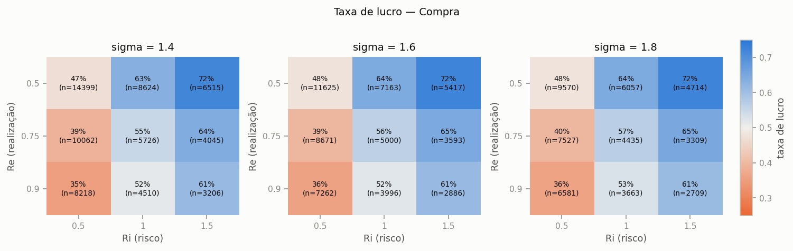

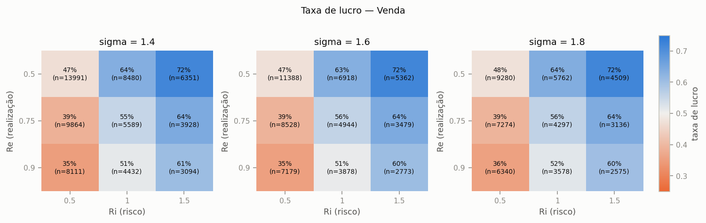

| lado | n | lucros | prejuizos | fechados_forcado | taxa de lucro |
|---|---|---|---|---|---|
| Compra | 169483 | 88284 | 81199 | 4039 | 0.521 |
| Venda | 165040 | 85358 | 79682 | 4756 | 0.517 |

---

## 3. Curvas de treino e validação

Linha tracejada = melhor época (menor `val_loss`, a que o early stopping restaura).

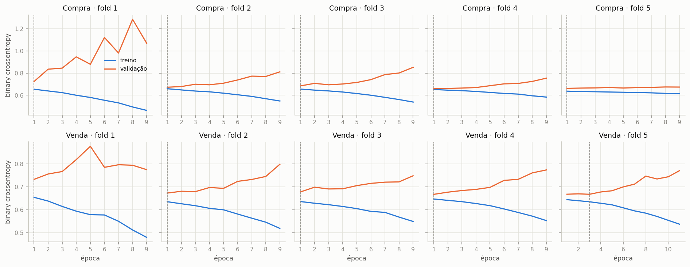

> A loss de **treino** do Keras já incorpora o `class_weight` (ponderada), enquanto a de validação não; por isso as duas não são diretamente comparáveis em nível — o que importa é a forma (quando a validação para de melhorar e sobe).

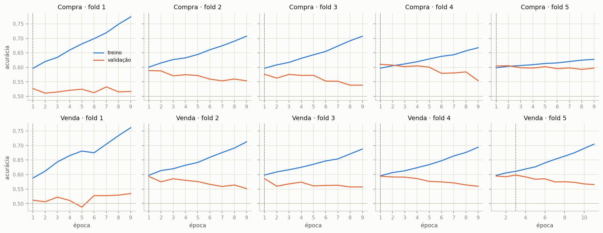

---

## 4. Resultados: validação e teste

| lado | fold | épocas | melhor época | n treino | n val | n teste | AUC val | AUC teste | IC95% teste | AUC só-combo | AUC intra-combo | acc teste | acc majoritária | bal_acc teste | prec teste | rec teste | min treinando |
|---|---|---|---|---|---|---|---|---|---|---|---|---|---|---|---|---|---|
| Compra | 1 | 9 | 1 | 24438 | 33445 | 20301 | 0.602 | 0.581 | [0.557; 0.600] | 0.634 | 0.488 | 0.560 | 0.500 | 0.560 | 0.563 | 0.534 | 0.472 |
| Compra | 2 | 9 | 1 | 57883 | 24987 | 20301 | 0.617 | 0.599 | [0.585; 0.613] | 0.634 | 0.479 | 0.577 | 0.500 | 0.577 | 0.580 | 0.563 | 0.778 |
| Compra | 3 | 9 | 1 | 82870 | 27235 | 20301 | 0.602 | 0.608 | [0.593; 0.622] | 0.634 | 0.505 | 0.579 | 0.500 | 0.579 | 0.610 | 0.441 | 1.033 |
| Compra | 4 | 9 | 1 | 110105 | 33947 | 20301 | 0.657 | 0.611 | [0.596; 0.624] | 0.634 | 0.506 | 0.583 | 0.500 | 0.583 | 0.605 | 0.481 | 1.345 |
| Compra | 5 | 9 | 1 | 144052 | 25431 | 20301 | 0.643 | 0.618 | [0.608; 0.628] | 0.634 | 0.497 | 0.590 | 0.500 | 0.590 | 0.611 | 0.496 | 1.670 |
| Venda | 1 | 9 | 1 | 23461 | 30534 | 18273 | 0.618 | 0.613 | [0.601; 0.625] | 0.640 | 0.498 | 0.585 | 0.504 | 0.585 | 0.591 | 0.573 | 0.453 |
| Venda | 2 | 9 | 1 | 53995 | 25931 | 18273 | 0.623 | 0.635 | [0.618; 0.650] | 0.640 | 0.539 | 0.601 | 0.504 | 0.601 | 0.607 | 0.590 | 0.743 |
| Venda | 3 | 9 | 1 | 79926 | 29182 | 18273 | 0.611 | 0.615 | [0.591; 0.634] | 0.640 | 0.510 | 0.580 | 0.504 | 0.581 | 0.614 | 0.445 | 1.020 |
| Venda | 4 | 9 | 1 | 109108 | 30980 | 18273 | 0.628 | 0.618 | [0.604; 0.631] | 0.640 | 0.477 | 0.585 | 0.504 | 0.585 | 0.586 | 0.602 | 1.322 |
| Venda | 5 | 11 | 3 | 140088 | 24952 | 18273 | 0.633 | 0.610 | [0.589; 0.628] | 0.640 | 0.489 | 0.586 | 0.504 | 0.586 | 0.597 | 0.549 | 1.942 |

`acc majoritária` é a acurácia de um classificador que sempre prevê a classe mais comum no teste — o piso que a acurácia do modelo precisa superar. `IC95%` = bootstrap sobre os pregões do teste.

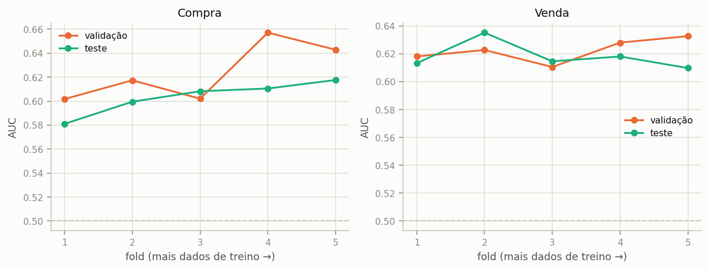

### Curva ROC

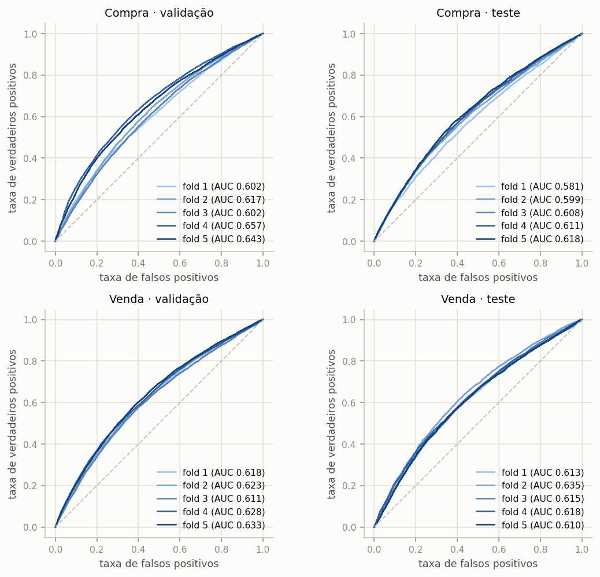

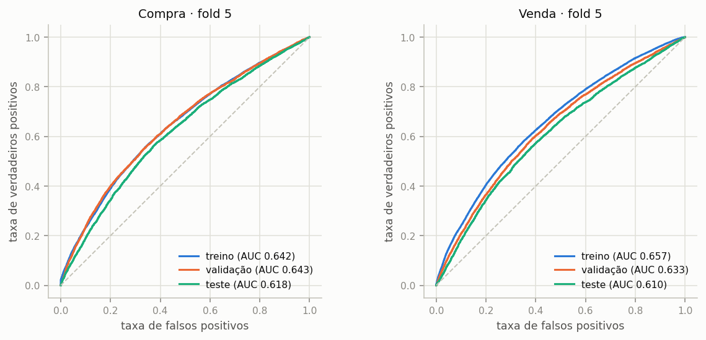

A distância entre a curva de treino e as de validação/teste (último fold) mede o sobreajuste.

### Matriz de confusão (teste, limiar 0,5)

Cada célula: contagem e % da linha (classe real).

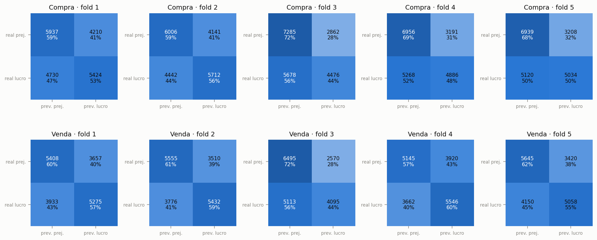

### Utilidade para operar: aceitar só as melhores oportunidades

Ordena as oportunidades do teste pela probabilidade prevista de lucro e mostra a taxa de lucro das aceitas conforme se aceita mais ou menos delas. Se o modelo discrimina, a curva começa acima da taxa base e decai até ela. A linha tracejada laranja é a referência **só-combo**: aceitar as oportunidades na ordem da taxa de lucro histórica de cada combinação (sigma, Re, Ri), sem olhar o mercado. Só o que fica acima dela é informação além do sweep.

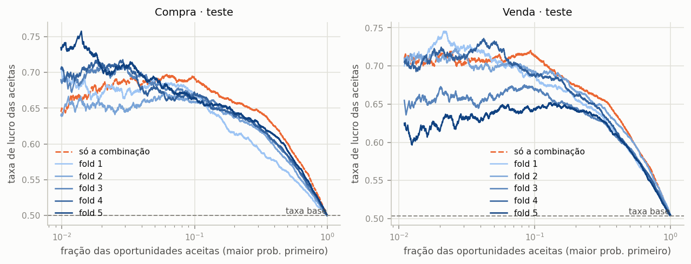

### Calibração

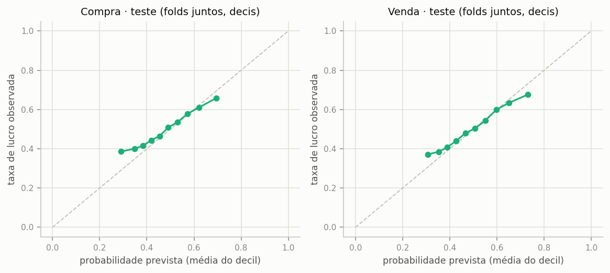

> Com `class_weight` as probabilidades não são calibradas para a taxa real; o que vale é o ranking (AUC/lift), não o limiar 0,5.

---

## 5. Onde o modelo discrimina: AUC por combinação (sigma, Re, Ri)

AUC no teste de cada combinação (média entre folds). Azul > 0,5; laranja < 0,5; células com menos de uma centena de amostras são ruidosas.

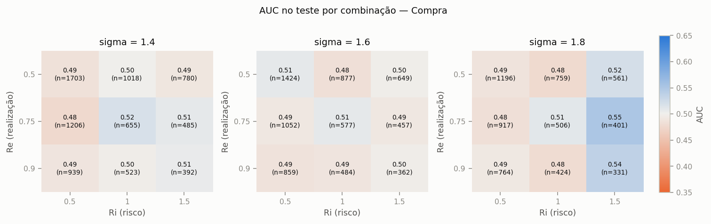

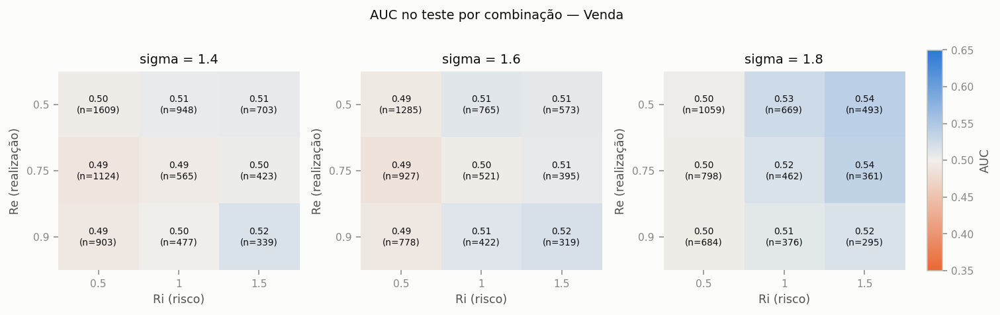

---

## 7. Limitações e ressalvas

- **É classificação, não P/L.** O label vem da regra fixa SG/SL da heurística, sem custos de execução (meio-spread, taxas, atraso). Um bom AUC aqui não implica lucro operável; o passo seguinte seria medir o P/L (com custos) de operar só as oportunidades aceitas pelo modelo.
- **Amostras correlacionadas.** Combinações diferentes da grade no mesmo pregão compartilham quase as mesmas entradas, e janelas de 120 ticks de entradas próximas se sobrepõem; o número efetivo de amostras independentes é bem menor que `n`. Por isso os ICs são por pregão.
- **Um único período de teste** (os últimos pregões, fixos), e poucos folds de validação: a variação entre folds mostra a instabilidade temporal, mas não substitui mais dados.
- **Balanceamento por construção.** A taxa de lucro depende do sweep (sobretudo de Ri); um modelo pode aprender a taxa por combinação a partir das features SL/SG. A seção 5 mostra se há discriminação dentro de cada combinação.

## Apêndice: reprodução

```
python src/report_lstm.py --run-dir sdumont_backup_lstm/lstm_runs --tag lstm_net_big
```
