# Relatório LSTM — experimento `lstm_v2_seed2`

> Gerado por `src/report_lstm.py` a partir dos artefatos gravados pelo pipeline (`state.json`, `metrics.json`, `predictions.npz`). Tudo aqui é medido; nenhuma interpretação é gerada automaticamente — a leitura dos resultados fica a cargo de quem analisa.

## 0. Resumo

- **Compra**: AUC no teste = **0.601** em média entre 5 fold(s) (desvio 0.007; mín 0.594, máx 0.609); 5 de 5 folds acima de 0,5. Último fold: 0.596 [0.582; 0.611] (IC95% por bootstrap sobre os pregões). Acurácia no teste menos a do classificador majoritário: +0.043 (média). Referências: AUC de um score que só conhece a combinação (sigma, Re, Ri) = 0.642; AUC do modelo apenas dentro de cada combinação = 0.497.
- **Venda**: AUC no teste = **0.607** em média entre 5 fold(s) (desvio 0.006; mín 0.598, máx 0.614); 5 de 5 folds acima de 0,5. Último fold: 0.606 [0.595; 0.619] (IC95% por bootstrap sobre os pregões). Acurácia no teste menos a do classificador majoritário: +0.057 (média). Referências: AUC de um score que só conhece a combinação (sigma, Re, Ri) = 0.631; AUC do modelo apenas dentro de cada combinação = 0.510.

Uma AUC de 0,5 é o acaso; o IC95% que contém 0,5 significa que, com esses dados, não dá para distinguir o modelo do acaso naquele fold. `AUC só-combo` usa como score a taxa de lucro histórica da combinação (sem olhar o mercado): é o que se ganha só por saber quais parâmetros geraram a oportunidade. `AUC intra-combo` compara apenas oportunidades da mesma combinação, então o efeito do sweep é removido.

---

## Leitura dos resultados (análise manual, não gerada pelo script)

Campanha v2: sigma 2,2/2,4/2,6 (antes 1,4/1,6/1,8), teste dobrado para os últimos 30% dos pregões (343–488, 146 pregões; antes 15%, 72 pregões), pregões 168/304/336/338/371/463 excluídos por cotação impossível. Números das tabelas e figuras deste relatório (5 folds) e da comparação `lstm_v2_base` × `lstm_v2_seed2`.

**1. Sigma maior não resolveu o problema identificado na campanha anterior.** O AUC de teste é 0,61 (compra) e 0,60 (venda), parecido com o da campanha com sigma 1,4–1,8 (0,59/0,62). E a causa é a mesma:

- Um score que só conhece a combinação (sigma, Re, Ri), sem olhar o mercado, tem AUC **0,642 (compra) e 0,631 (venda)** — igual ou maior que o do modelo.
- Dentro de cada combinação (mesma sigma, Re, Ri, comparando só as oportunidades entre si) o AUC do modelo é **0,513 (compra) e 0,507 (venda)** — acaso. No mapa por combinação (fig. 11–12), nenhuma das 27 passa de 0,54.
- Na curva de lift (fig. 9), aceitar as oportunidades de maior probabilidade segue de perto a linha "só a combinação" (aceitar pela taxa histórica da combinação, sem olhar o mercado); no fold 1 fica abaixo dela.

**2. O balanceamento de labels (pregões de desenvolvimento, 1–342) segue perto do equilíbrio mesmo com sigma maior.** Taxa de equilíbrio = Ri/(Re+Ri); a taxa observada fica em média 1,7 pontos percentuais ABAIXO do equilíbrio (mediana igual). Só 4 das 54 linhas (27 combinações × compra/venda) ficam acima do equilíbrio, e a folga nelas é de no máximo 0,4 pp. Ou seja, a heurística com sigma 2,2–2,6 continua sem edge bruto detectável nesta amostra, antes de qualquer custo.

**3. O ruído entre execuções continua do tamanho das diferenças que importariam.** Trocando só a semente (`lstm_v2_base` × `lstm_v2_seed2`, 27 combinações comuns), a AUC por fold varia em média 0,024 (compra, máx 0,034) e 0,012 (venda, máx 0,030). A diferença observada entre os dois experimentos é 0,011 (compra) e 0,008 (venda) — menor que o ruído entre sementes, portanto não é uma melhora real.

**4. Conclusão preliminar.** As duas mudanças pedidas (sigma maior, teste maior) não alteraram o quadro da campanha anterior: o modelo aprende a taxa de lucro por combinação (sigma, Re, Ri), não a distinguir oportunidades dentro de uma combinação. Isso é consistente com a hipótese já registrada em `docs/lstm_leitura_base.md`: as features `SL` e `SG` revelam Ri/Re, e a rede pode estar devolvendo a taxa base da combinação em vez de ler o mercado.

**5. P/L em pontos (bruto, sem custos) — atualização.** O cache `--stage pl` foi rodado para a grade sigma 2,2–2,6 (`docs/lstm_pl_oportunidades_v2_*.csv`). Escolhendo o limiar de probabilidade que maximiza o P/L médio NA VALIDAÇÃO e aplicando no teste (mesmo protocolo do relatório anterior, 5 folds × 2 experimentos = 10 medidas por lado), o resultado é **positivo na compra** (todas as 10 medidas positivas, de +4,8 a +42,0 pts/trade; média 17,0) e **majoritariamente positivo na venda** (8 de 10 positivas, de −1,9 a +14,6 pts/trade; média 4,4). Isso parece contradizer o achado de que o AUC intra-combinação é acaso (item 1) — mas não contradiz, pelo motivo do item 6.

**6. A causa do P/L positivo não é o sigma maior nem a LSTM: é a composição do teste maior (achado central desta rodada).** Decompondo o P/L bruto da heurística SEM nenhum filtro por janela de tempo:


| janela | pregões | compra (bruto) | venda (bruto) |
|---|---|---|---|
| desenvolvimento | 1–342 | −3,5 pts/trade | −0,9 pts/trade |
| teste, parte NOVA (dobrar o teste incluiu isso) | 343–415 | **+13,7** pts/trade | +1,4 pts/trade |
| teste, parte ANTIGA (era todo o teste da campanha anterior) | 416–488 | **−5,3** pts/trade | −8,2 pts/trade |

A parte 416–488 — que já era o teste inteiro antes de dobrarmos — continua com P/L bruto negativo com a grade sigma 2,2–2,6, na mesma direção da campanha anterior (sigma 1,4–1,8). O ganho positivo do teste inteiro vem quase todo dos 72 pregões novos (343–415), que por algum motivo de mercado favoreceram a compra nesta heurística — sem qualquer filtro, sem LSTM.

O mesmo padrão aparece nas oportunidades que a LSTM aceita: na parte nova, +30 a +35 pts/trade; na parte antiga (416–488, a mesma de antes), **+0,08 a +1,5 pts/trade** — dentro do ruído, não uma melhora real. Ou seja, **o resultado "P/L positivo" da campanha v2 é dominado pela metade nova do teste, não por sigma maior nem por discriminação da LSTM.** Isso é coerente com o item 1: a LSTM não discrimina dentro de combinação; o que muda de uma janela para outra é a taxa de acerto bruta da própria heurística, que a LSTM continua basicamente reproduzindo via a combinação (item 1) mais, aparentemente, uma leve preferência por negociações de alvo maior (correlação p×|P/L| dentro da combinação, tipicamente 0,10–0,20, contra p×acerto, tipicamente 0,00–0,09 — ver nota abaixo).

*Nota técnica:* dentro de uma mesma combinação (sigma, Re, Ri) o modelo quase não separa vitória de derrota (correlação p×acerto ~0,01–0,09 nas amostras do fold 5, compra), mas separa um pouco mais por TAMANHO do resultado (correlação p×|P/L| ~0,10–0,21). Como o sinal do ganho esperado é fixo por combinação (não muda com o tamanho do trade), essa preferência por trades maiores amplifica o resultado — positivo ou negativo — da combinação, sem ser propriamente uma previsão de acerto.

**7. Recomendação para a próxima rodada.** Com o teste maior, separar sempre os dois trechos (343–415 e 416–488) nas conclusões, em vez de só a média: um resultado que só aparece com o trecho novo dentro não deve ser generalizado. Antes de tentar mais sigmas, vale entender por que 343–415 favoreceu a compra (mudança de volatilidade, tendência do WIN, etc. — não investigado aqui).

**8. O que esta campanha ainda NÃO testou.**
- A ablação sem `SL`/`SG` sugerida na campanha anterior — continua sendo o teste mais direto da hipótese do item 6 (preferência por trades maiores).
- Sigma maior que 2,6: a análise `src/analyze_spread_vs_edge.py` (heurística pura, sem LSTM), com um recorte menor de dados, indicava que o edge bruto crescia com sigma no desenvolvimento mas piorava no antigo teste — coerente com a instabilidade entre janelas descrita acima.
- Custos (spread, corretagem): toda a análise desta seção é bruta (custo 0).

---

## 1. Configuração e execução

| Item | Valor |
|---|---|
| Objetivo | classificar cada oportunidade (entrada da heurística) como Lucro (1) ou Prejuízo (0); label = sinal do lucro realizado da negociação (SG se atinge o alvo, −SL se atinge o stop, resultado a mercado se fechada no fim do pregão) |
| Sweep (sigma × Re × Ri) | 27 combinações: sigma [2.2, 2.4, 2.6], Re [0.5, 0.75, 0.9], Ri [0.5, 1.0, 1.5] |
| Features (por tick) | 14: bid, ask, Wbjusto, Wajusto, volume, bvolume, SL, spread, volatilidade, SG, day_sin, day_cos, time_sin, time_cos |
| Janela | 120 ticks anteriores à entrada |
| Rede | 2× LSTM(50) + Dense(1, sigmoid) |
| Treino | Adam, binary_crossentropy, batch 256, até 50 épocas, early stopping (paciência 8, melhor val_loss); class_weight; semente 2 |
| Validação | TimeSeriesSplit expanding window sobre os pregões (split por dia); scaler e balanceamento ajustados só no treino do fold |

**Janelas** (pregões, com o nº de dias entre parênteses; o teste é o mesmo em todos os folds):

| fold | treino | validação | teste |
|---|---|---|---|
| 1 | 1–58 (58) | 59–114 (56) | 343–488 (144) |
| 2 | 1–114 (114) | 115–171 (56) | 343–488 (144) |
| 3 | 1–171 (170) | 172–227 (56) | 343–488 (144) |
| 4 | 1–227 (226) | 228–283 (56) | 343–488 (144) |
| 5 | 1–283 (282) | 284–342 (56) | 343–488 (144) |

---

## 2. Balanceamento dos labels por combinação

Taxa de lucro de cada combinação (pregões de desenvolvimento). Laranja = maioria de prejuízos, azul = maioria de lucros; o cinza é 50%.

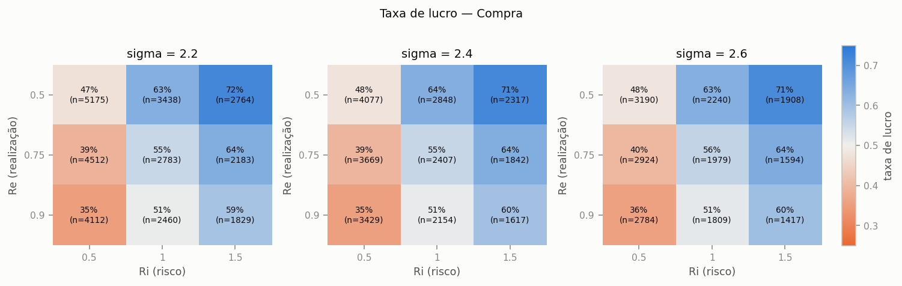

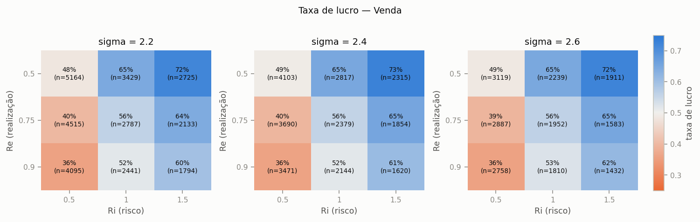

| lado | n | lucros | prejuizos | fechados_forcado | taxa de lucro |
|---|---|---|---|---|---|
| Compra | 73461 | 38081 | 35380 | 2674 | 0.518 |
| Venda | 73167 | 38527 | 34640 | 2991 | 0.527 |

---

## 3. Curvas de treino e validação

Linha tracejada = melhor época (menor `val_loss`, a que o early stopping restaura).

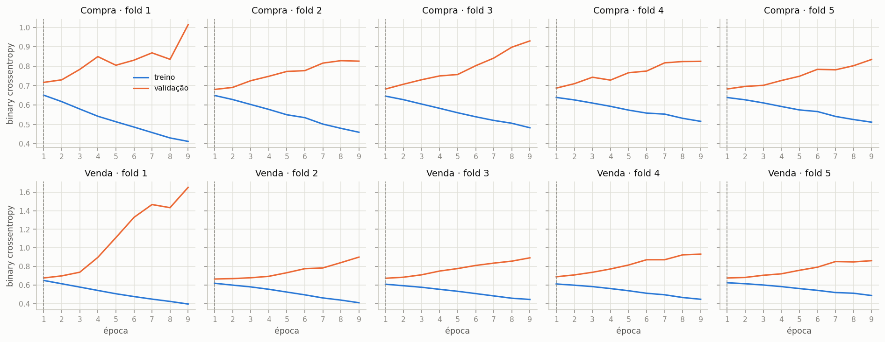

> A loss de **treino** do Keras já incorpora o `class_weight` (ponderada), enquanto a de validação não; por isso as duas não são diretamente comparáveis em nível — o que importa é a forma (quando a validação para de melhorar e sobe).

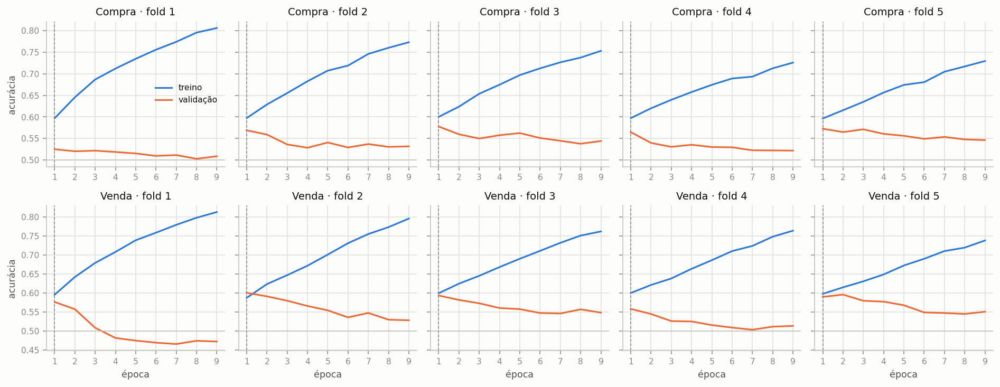

---

## 4. Resultados: validação e teste

| lado | fold | épocas | melhor época | n treino | n val | n teste | AUC val | AUC teste | IC95% teste | AUC só-combo | AUC intra-combo | acc teste | acc majoritária | bal_acc teste | prec teste | rec teste | min treinando |
|---|---|---|---|---|---|---|---|---|---|---|---|---|---|---|---|---|---|
| Compra | 1 | 9 | 1 | 11698 | 14290 | 25286 | 0.596 | 0.609 | [0.592; 0.626] | 0.642 | 0.543 | 0.579 | 0.531 | 0.566 | 0.577 | 0.777 | 0.195 |
| Compra | 2 | 9 | 1 | 25988 | 11469 | 25286 | 0.595 | 0.596 | [0.581; 0.609] | 0.642 | 0.474 | 0.571 | 0.531 | 0.568 | 0.593 | 0.618 | 0.298 |
| Compra | 3 | 9 | 1 | 37457 | 11442 | 25286 | 0.603 | 0.609 | [0.595; 0.623] | 0.642 | 0.506 | 0.579 | 0.531 | 0.582 | 0.619 | 0.541 | 0.392 |
| Compra | 4 | 9 | 1 | 48899 | 10732 | 25286 | 0.582 | 0.594 | [0.579; 0.610] | 0.642 | 0.488 | 0.572 | 0.531 | 0.566 | 0.587 | 0.661 | 0.460 |
| Compra | 5 | 9 | 1 | 59631 | 13830 | 25286 | 0.603 | 0.596 | [0.582; 0.611] | 0.642 | 0.476 | 0.570 | 0.531 | 0.570 | 0.599 | 0.581 | 0.578 |
| Venda | 1 | 9 | 1 | 11221 | 13093 | 23688 | 0.595 | 0.598 | [0.583; 0.614] | 0.631 | 0.511 | 0.563 | 0.518 | 0.555 | 0.557 | 0.762 | 0.195 |
| Venda | 2 | 9 | 1 | 24314 | 11913 | 23688 | 0.625 | 0.608 | [0.593; 0.626] | 0.631 | 0.513 | 0.579 | 0.518 | 0.578 | 0.592 | 0.600 | 0.285 |
| Venda | 3 | 9 | 1 | 36227 | 11827 | 23688 | 0.620 | 0.608 | [0.589; 0.625] | 0.631 | 0.512 | 0.579 | 0.518 | 0.580 | 0.599 | 0.569 | 0.385 |
| Venda | 4 | 9 | 1 | 48054 | 12103 | 23688 | 0.583 | 0.614 | [0.600; 0.629] | 0.631 | 0.517 | 0.578 | 0.518 | 0.581 | 0.615 | 0.499 | 0.485 |
| Venda | 5 | 9 | 1 | 60157 | 13010 | 23688 | 0.631 | 0.606 | [0.595; 0.619] | 0.631 | 0.498 | 0.579 | 0.518 | 0.575 | 0.579 | 0.683 | 0.588 |

`acc majoritária` é a acurácia de um classificador que sempre prevê a classe mais comum no teste — o piso que a acurácia do modelo precisa superar. `IC95%` = bootstrap sobre os pregões do teste.

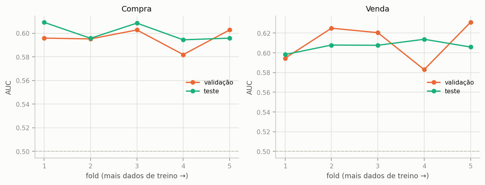

### Curva ROC

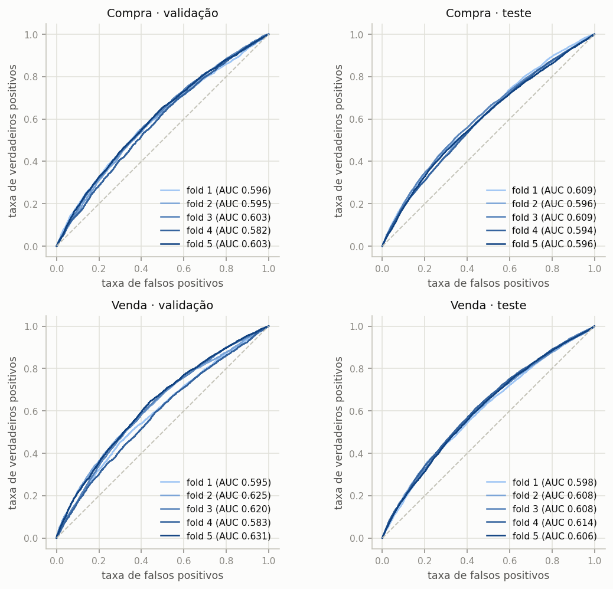

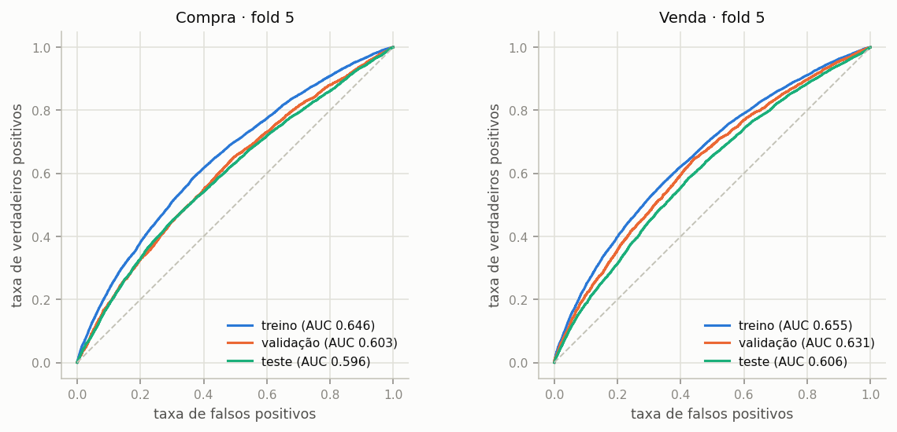

A distância entre a curva de treino e as de validação/teste (último fold) mede o sobreajuste.

### Matriz de confusão (teste, limiar 0,5)

Cada célula: contagem e % da linha (classe real).

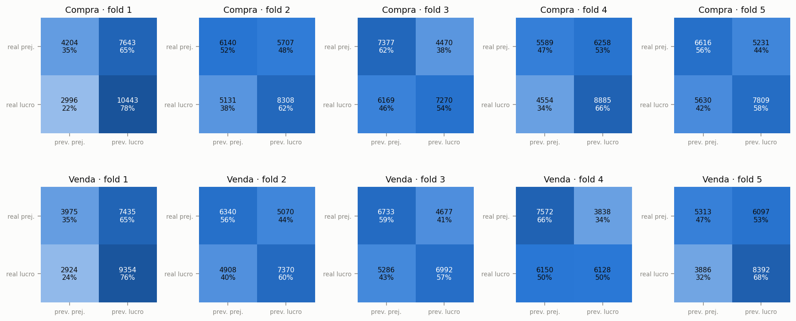

### Utilidade para operar: aceitar só as melhores oportunidades

Ordena as oportunidades do teste pela probabilidade prevista de lucro e mostra a taxa de lucro das aceitas conforme se aceita mais ou menos delas. Se o modelo discrimina, a curva começa acima da taxa base e decai até ela. A linha tracejada laranja é a referência **só-combo**: aceitar as oportunidades na ordem da taxa de lucro histórica de cada combinação (sigma, Re, Ri), sem olhar o mercado. Só o que fica acima dela é informação além do sweep.

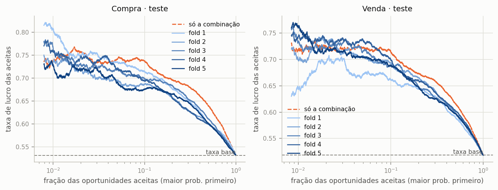

### Calibração

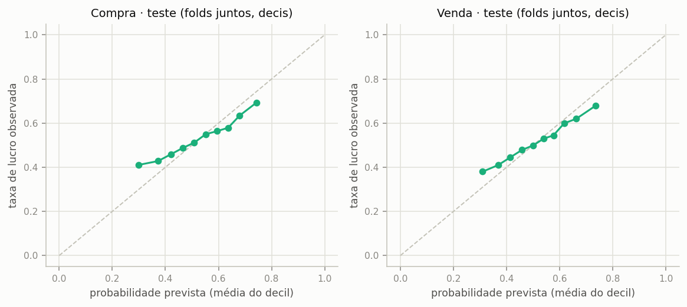

> Com `class_weight` as probabilidades não são calibradas para a taxa real; o que vale é o ranking (AUC/lift), não o limiar 0,5.

---

## 5. Onde o modelo discrimina: AUC por combinação (sigma, Re, Ri)

AUC no teste de cada combinação (média entre folds). Azul > 0,5; laranja < 0,5; células com menos de uma centena de amostras são ruidosas.

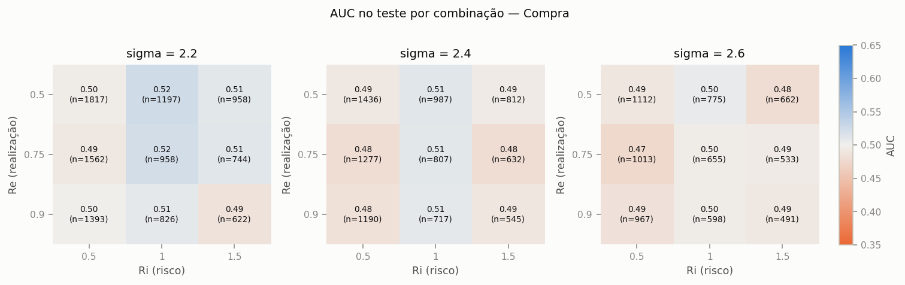

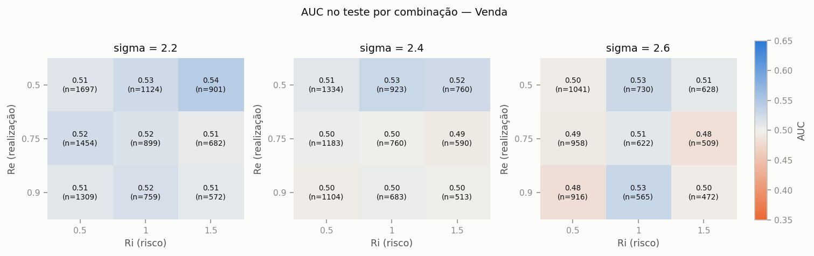

---

## 6. Comparação entre experimentos

Comparação feita nas **27 combinações comuns** a todos os experimentos (as grades diferem, e o conjunto de teste de cada um depende da sua grade; na coluna `todas` cada experimento usa a própria).

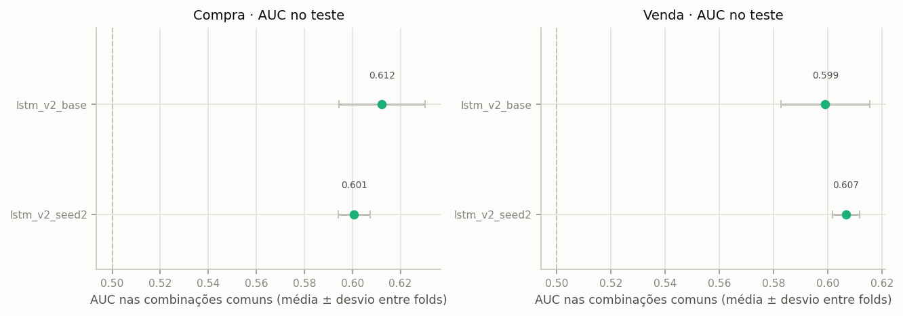

| experimento | lado | folds | combos | AUC teste (todas) | AUC teste (combos comuns) | desvio (folds) | AUC intra-combo (comuns) | bal_acc teste |
|---|---|---|---|---|---|---|---|---|
| lstm_v2_base | Compra | 5 | 27 | 0.612 | 0.612 | 0.020 | 0.513 | 0.583 |
| lstm_v2_base | Venda | 5 | 27 | 0.599 | 0.599 | 0.018 | 0.507 | 0.572 |
| lstm_v2_seed2 | Compra | 5 | 27 | 0.601 | 0.601 | 0.007 | 0.497 | 0.570 |
| lstm_v2_seed2 | Venda | 5 | 27 | 0.607 | 0.607 | 0.006 | 0.510 | 0.574 |

Diferenças menores que o desvio entre folds (ou que a variação entre sementes) não devem ser lidas como melhora.

---

## 7. Limitações e ressalvas

- **É classificação, não P/L.** O label vem da regra fixa SG/SL da heurística, sem custos de execução (meio-spread, taxas, atraso). Um bom AUC aqui não implica lucro operável; o passo seguinte seria medir o P/L (com custos) de operar só as oportunidades aceitas pelo modelo.
- **Amostras correlacionadas.** Combinações diferentes da grade no mesmo pregão compartilham quase as mesmas entradas, e janelas de 120 ticks de entradas próximas se sobrepõem; o número efetivo de amostras independentes é bem menor que `n`. Por isso os ICs são por pregão.
- **Um único período de teste** (os últimos pregões, fixos), e poucos folds de validação: a variação entre folds mostra a instabilidade temporal, mas não substitui mais dados.
- **Balanceamento por construção.** A taxa de lucro depende do sweep (sobretudo de Ri); um modelo pode aprender a taxa por combinação a partir das features SL/SG. A seção 5 mostra se há discriminação dentro de cada combinação.

## Apêndice: reprodução

```
python src/report_lstm.py --run-dir sdumont_backup_lstm/lstm_runs --tag lstm_v2_seed2 --compare
```
