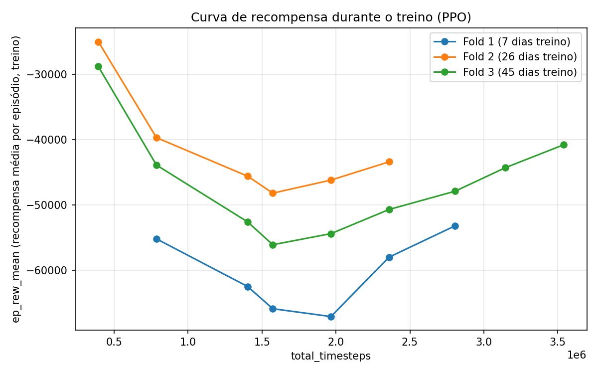

# Relatório de Resultados — RL (PPO) para Pairs Trading BOVA11 x WINM21

Walk-forward com 3 folds, treinado no Santos Dumont (LNCC).

## 1. Metodologia

O agente opera **tick a tick** em um único pregão por episódio
(`ArbitrageTradingEnv`), decidindo a cada instante se fica flat,
comprado ou vendido no par BOVA11/WINM21. O treino usa PPO
(stable-baselines3) com paralelização de 48 ambientes (`SubprocVecEnv`,
um processo por núcleo).

A validação segue **walk-forward com janela expansiva**
(`generate_walk_forward_folds`, via `sklearn.TimeSeriesSplit`): a cada
fold, a janela de treino cresce (usa todos os pregões anteriores),
enquanto validação e teste são sempre os próximos pregões em ordem
cronológica — sem embaralhar dados no tempo.

| Fold | Dias de treino | Dias de validação | Dias de teste |
|---|---|---|---|
| 1 | 7 | 10 | 9 |
| 2 | 26 | 10 | 9 |
| 3 | 45 | 10 | 9 |

Cada fold recebe o mesmo orçamento de treino: **25.254.000 timesteps**
(orçamento calibrado por throughput medido, não por número fixo de
passadas pelos dados).

## 2. Configurações

**Espaço de estado (observação):** janela das últimas `n_ticks=120`
observações de 5 features por tick — spread de mispricing, spread
bid-ask, atribuição de movimento (BOVA vs. WIN), momentum de curto e de
longo prazo — achatada em vetor, concatenada com a posição atual
(one-hot, 3 valores) e o P&L não-realizado normalizado.

**Ações:** `Discrete(3)` — posição-alvo a assumir no tick: `0` = flat,
`1` = comprado, `2` = vendido.

**Função de recompensa:** a cada tick, a recompensa é a variação de
marcação a mercado (mid-price) da posição já aberta desde o tick
anterior, **menos** o custo de execução (metade do spread bid-ask)
sempre que uma perna abre ou fecha, **menos** uma taxa fixa de
corretora (R$0,50) cobrada inteiramente na abertura da posição (não
dividida no fechamento — de propósito, para não penalizar
adicionalmente a decisão de realizar uma posição perdedora). No fim do
pregão, qualquer posição aberta é fechada automaticamente.

**PPO — hiperparâmetros:**

| Parâmetro | Valor |
|---|---|
| Política | `MlpPolicy` |
| Taxa de aprendizado (`learning_rate`) | 3e-4 |
| `n_steps` (por ambiente) | 8192 |
| `batch_size` | 1024 |
| `gamma` | 0.999 |
| Ambientes paralelos (`n_train_envs`) | 48 |

## 3. Curvas de treino

A recompensa média por episódio (`ep_rew_mean`, medida durante o
treino, não durante avaliação) **não cresce de forma monotônica** em
nenhum dos 3 folds — o padrão observado é um formato de "U": a
recompensa piora na primeira metade do treino (o agente parece
aumentar a atividade de negociação, pagando mais custos de
execução/spread antes de aprender a filtrar melhor as entradas), e
melhora na segunda metade, terminando mais próxima (mas ainda abaixo)
do valor inicial em todos os folds. Nenhum dos 3 folds chegou a superar
seu próprio valor inicial de `ep_rew_mean` dentro do orçamento de
timesteps usado — sinal de que o treino provavelmente se beneficiaria
de mais timesteps/tempo de treino do que o orçamento atual permite.

## 4. Resultados de avaliação

| Fold | Conjunto | Lucro total | Taxa de acerto | Negócios | Lucro médio/negócio |
|---|---|---|---|---|---|
| 1 | Validação | 2.291,0 | 56,1% | 578 | 3,96 |
| 1 | Teste | -953,0 | 45,2% | 496 | -1,92 |
| 2 | Validação | 535,5 | 53,6% | 649 | 0,82 |
| 2 | Teste | 1.276,0 | 51,3% | 838 | 1,52 |
| 3 | Validação | 3.551,5 | 47,7% | 1.657 | 2,14 |
| 3 | Teste | 6.597,0 | 49,4% | 1.196 | 5,52 |

### Distribuição de P&L por negócio (líquida de custos)

| Fold | Conjunto | Ganho médio | Perda média | Perda/Ganho | P5 | P50 (mediana) | P95 |
|---|---|---|---|---|---|---|---|
| 1 | Validação | 28,73 | -27,63 | 0,96x | -60,50 | 7,00 | 54,50 |
| 1 | Teste | 27,67 | -26,35 | 0,95x | -60,50 | -0,50 | 49,50 |
| 2 | Validação | 22,04 | -23,71 | 1,08x | -60,50 | 4,50 | 44,50 |
| 2 | Teste | 23,38 | -21,52 | 0,92x | -56,25 | 4,50 | 44,50 |
| 3 | Validação | 26,33 | -19,95 | 0,76x | -50,50 | -0,50 | 50,50 |
| 3 | Teste | 27,85 | -16,30 | 0,59x | -40,50 | -0,50 | 54,50 |

## 5. Observações

- **Taxa de acerto sempre próxima ou abaixo de 50%** em todos os
  folds/conjuntos — quando há lucro, ele vem do tamanho médio do ganho
  superar o da perda (razão perda/ganho entre 0,59x e 1,08x), não de
  acertar a maioria das operações.
- **Fold 1 teve teste negativo** (-953,0; -1,92/negócio) mesmo com
  validação positiva — é também o fold com menos dias de treino (7),
  consistente com uma hipótese de overfitting à janela de validação
  nesse fold específico.
- **Fold 3 negocia muito mais** (1.657 + 1.196 = 2.853 negócios) que o
  Fold 1 (578 + 496 = 1.074) nos mesmos ~19 dias de val+teste — mas
  também é o fold com o melhor lucro médio por negócio no teste
  (5,52), então o volume maior de negociação não parece estar vindo de
  overtrading improdutivo, pelo menos nesse conjunto.
- **A curva de treino em "U" sem recuperação total** (seção 3) sugere
  que o orçamento de timesteps atual pode estar interrompendo o treino
  antes da política convergir — um próximo passo natural seria testar
  com mais timesteps/tempo de treino por fold.
