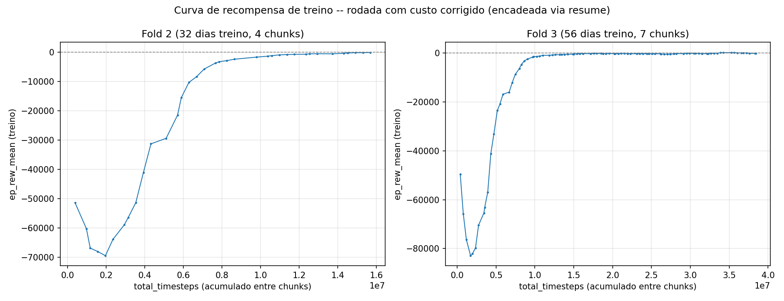

# Relatório de Resultados v2 — RL (PPO) para Pairs Trading BOVA11 x WINM21

Segunda rodada completa no Santos Dumont (LNCC), com o **custo de
transação corrigido desde o treino** e um **plano de treino em chunks
encadeados** diferente por fold. Ver
[relatorio_resultados.md](relatorio_resultados.md) para a rodada
anterior — lá a política ainda foi **treinada** com o custo antigo
(bugado), e só a avaliação foi corrigida retroativamente depois. Os
dois documentos ficam separados de propósito, não são comparáveis
diretamente ponto a ponto (metodologia mudou em vários pontos, ver
seção 1, e a política do v1 nunca "viu" o custo real durante o
treino).

## 0. O que mudou desde a v1

| | v1 (relatorio_resultados.md) | v2 (este documento) |
|---|---|---|
| Taxa de corretora | 0,5 pontos (bug — deveria ser 2,5) | **2,5 pontos = R$0,50** (corrigido) |
| Orçamento de treino/fold | fixo, igual pra todos os folds (25,25M timesteps) | **`target_n_passadas=20` igual pra todos** — timesteps crescem com o nº de dias de treino de cada fold |
| Duração do treino/fold | 1 job de ~20min | **1 a 7 jobs encadeados** (checkpoint+resume), conforme `n_chunks_needed` de cada fold |
| Pregões usados | 64 de 480 | **80 de 480** (`MAX_PREGOES=80`) |
| Jobs totais | 3 | **12** (+ 1 job extra de recuperação, ver seção 4) |

A mudança de orçamento fixo → `target_n_passadas` fixo foi motivada
pela v1: o fold 1 (poucos dias de treino) tinha sido visitado ~128x/dia
contra ~20x/dia do fold 3 com o orçamento antigo — suspeita de
overfitting, já que foi o único fold com teste negativo na v1. Essa
mudança elimina esse desbalanceamento especificamente — mas, como a
seção 3 mostra, não eliminou o overfitting; ele voltou por outro
caminho.

## 1. Metodologia

Ambiente, ação, espaço de estado e PPO são os mesmos da v1 (ver
[relatorio_resultados.md](relatorio_resultados.md#2-configurações) —
não repetido aqui). O que muda:

**Walk-forward** (`generate_walk_forward_folds`, `MAX_PREGOES=80`):

| Fold | Dias treino | Dias validação | Dias teste | `total_timesteps` (target) | `total_timesteps` real atingido | Chunks (jobs) |
|---|---|---|---|---|---|---|
| 1 | 8 | 12 | 12 | 4.425.920 | ~4,4M (não completou 1 rollout inteiro a mais) | 1 |
| 2 | 32 | 12 | 12 | 17.703.680 | ~15,7M | 4 |
| 3 | 56 | 12 | 12 | 30.981.440 | **~38,4M (24% acima do planejado)** | 7 |

O "target" é calculado com `throughput_steps_per_sec=4209` (medido no
PC doméstico, não recalibrado pro Santos Dumont) -- como o cluster é
mais rápido, cada chunk avança mais timesteps reais do que o
planejamento assumia, e como `n_chunks_needed` é um número FIXO de
jobs decidido de antemão (não um "pare quando atingir o alvo"), folds
com mais chunks (2 e 3) acabam recebendo MAIS passes sobre os dados de
treino do que os 20/dia pretendidos -- fold 3 chegou a ~24,8
passadas/dia em vez de 20. Isso é relevante para a seção 3.

**Treino em chunks (checkpoint+resume)**: cada chunk é um job Slurm de
até 20min; `RESUME_TRAINING=1` carrega o checkpoint do chunk anterior
(`PPO.load` + `reset_num_timesteps=False`) em vez de treinar do zero;
só o último chunk de cada fold roda a avaliação de validação/teste.

## 2. Curvas de treino

Diferente da v1 (formato de "U" sem recuperação total), aqui a
recompensa média por episódio de treino (`ep_rew_mean`) **converge de
forma clara para perto de zero** em ambos os folds plotados (fold 1 não
gerou dados suficientes -- seu único chunk foi cortado pelo limite de
tempo antes de completar um rollout inteiro, então nunca chegou a
imprimir `ep_rew_mean`). Isso parece, à primeira vista, um sinal de
treino bem-sucedido -- mas a seção 3 mostra que essa convergência da
recompensa DE TREINO não se traduz em lucro na validação/teste; pelo
contrário.

## 3. Resultados de avaliação

*(valores em pontos do WIN; multiplique por 0,20 para R$ -- ver nota de
unidades na v1)*

| Fold | Conjunto | Lucro total | Taxa de acerto | Negócios | Lucro médio/negócio |
|---|---|---|---|---|---|
| 1 | Validação | 550,0 pts (R$ 110,00) | 50,00% | 60 | 9,17 |
| 1 | Teste | -207,5 pts (R$ -41,50) | 18,37% | 49 | -4,23 |
| 2 | Validação | -17.417,5 pts (R$ -3.483,50) | 40,92% | 4.717 | -3,69 |
| 2 | Teste | -21.970,0 pts (R$ -4.394,00) | 40,58% | 7.920 | -2,77 |
| 3 | Validação | -17.365,0 pts (R$ -3.473,00) | 39,07% | 7.428 | -2,34 |
| 3 | Teste | -43.367,5 pts (R$ -8.673,50) | 37,16% | 11.673 | -3,71 |

### Distribuição de P&L por negócio (líquida de custos)

| Fold | Conjunto | Ganho médio | Perda média | Perda/Ganho | P5 | P50 (mediana) | P95 |
|---|---|---|---|---|---|---|---|
| 1 | Validação | 31,33 | -13,00 | 0,41x | -22,75 | 0,00 | 52,50 |
| 1 | Teste | 31,39 | -12,25 | 0,39x | -17,50 | -7,50 | 22,50 |
| 2 | Validação | 19,56 | -19,80 | 1,01x | -42,50 | -2,50 | 42,50 |
| 2 | Teste | 21,37 | -19,26 | 0,90x | -42,50 | -2,50 | 42,50 |
| 3 | Validação | 21,19 | -17,42 | 0,82x | -37,50 | -7,50 | 42,50 |
| 3 | Teste | 20,04 | -17,76 | 0,89x | -42,50 | -7,50 | 39,50 |

## 4. Nota metodológica: avaliação do fold 1 recuperada

O job final do fold 1 pulou a avaliação de teste por falta de reserva
de tempo (`137s restantes, menos que a reserva de 150s` -- faltaram
13s). O checkpoint (`ppo_arbitrage_fold1.zip`) já estava salvo, então
os números de teste do fold 1 nesta tabela vêm de um job de recuperação
separado (`EVAL_ONLY_FOLD=1`, ~9min, carrega o checkpoint e só avalia,
sem retreinar) -- não de um retreino.

## 5. Observações

- **Achado principal: mais chunks (mais treino) correlacionou com
  resultado MUITO pior, não melhor.** Fold 1 (1 chunk, ~20
  passadas/dia, dentro do planejado) teve o único resultado
  perto-de-neutro (validação positiva, teste levemente negativo). Os
  folds 2 e 3 (4 e 7 chunks, este último com ~24,8 passadas/dia --
  ACIMA do planejado, ver seção 1) tiveram perdas líquidas de milhares
  de pontos e volume de negócios extremamente alto (até ~1.000
  negócios/dia no fold 3) -- é overfitting ao conjunto de treino, não
  mérito de mais treino.
- **A recompensa de treino convergir para perto de zero (seção 2)
  mascarou esse overfitting** em vez de sinalizá-lo -- é evidência de
  que a política aprendeu a operar quase sem perdas nos MESMOS dias
  que treinou repetidamente (20-25 passadas/dia), mas isso não
  generaliza: nos dias de validação/teste (nunca vistos), o
  comportamento aprendido (alta frequência de negociação) produziu
  prejuízo consistente.
- **Taxa de acerto caiu em relação à v1** (37-41% nos folds 2 e 3,
  contra 40-56% na v1) -- consistente com a hipótese de overfitting:
  mais passadas sobre um conjunto de treino fixo tende a piorar
  generalização, não melhorar.
- **Implicação prática**: `target_n_passadas=20` (e sobretudo o
  overshoot de facto pra ~25 no fold 3, por causa do throughput
  desatualizado) parece ALTO demais pra esse ambiente/dataset.
  Próximo passo natural: testar `target_n_passadas` bem menor (ex.:
  5-10) em vez de mais alto, e recalibrar `THROUGHPUT_STEPS_PER_SEC`
  pro valor real do Santos Dumont antes de confiar em
  `n_chunks_needed` de novo.
