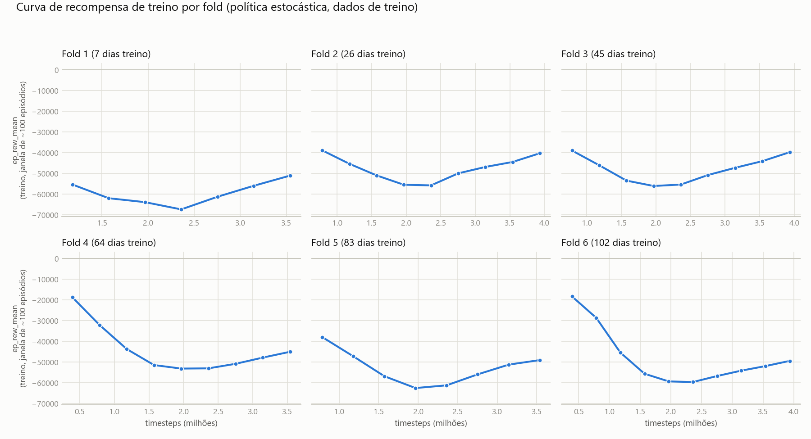
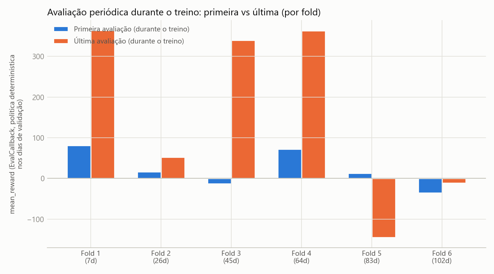
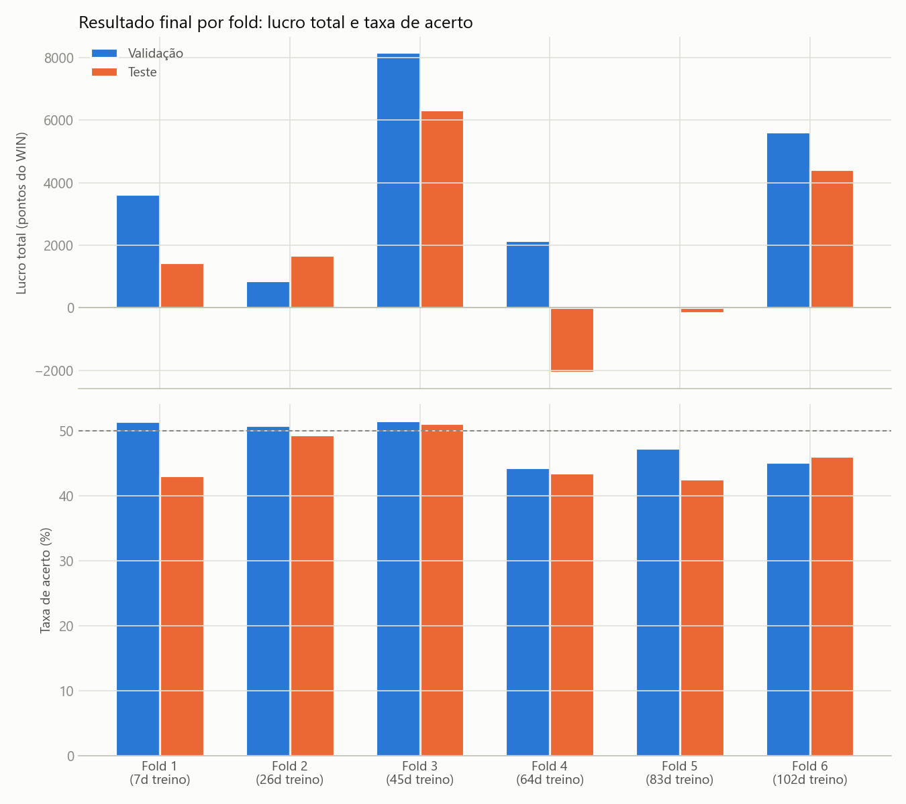

# Relatório de Resultados v3 — RL (PPO) para Pairs Trading BOVA11 x WINM21 (walk-forward estendido, 6 folds)

Terceira rodada completa no Santos Dumont (LNCC). Retoma a abordagem
**v1** (treino single-shot por fold, orçamento de timesteps fixo via
throughput medido, sem chunking) e estende o walk-forward de 3 para
**6 folds**, preservando os folds 1/2/3 originais sem recalculá-los.

## 0. O que mudou desde a v1

- **Metodologia de treino**: idêntica à v1 — PPO single-shot por fold
  (sem checkpoint+resume em chunks, ao contrário da v2), mesmo
  orçamento de timesteps (25.254.000/fold, calibrado pelo throughput
  medido de 4.209 steps/s).
- **Walk-forward estendido, não recalculado**: os folds 1/2/3 são
  **byte a byte idênticos** à rodada v1 (mesmos dias de
  treino/validação/teste). Os folds 4/5/6 são novos, cada um somando
  mais um bloco de 19 dias (10 validação + 9 teste) de treino em
  relação ao anterior — a mesma progressão que já existia entre os
  folds 1→2→3.
  > Descoberta no caminho: gerar os 6 folds do zero via
  > `TimeSeriesSplit` com `n_folds=6` (em vez de estender manualmente)
  > degrada o fold 1 para **1 dia de treino** — consequência matemática
  > da proporção treino/val+teste (70%/30%) combinada com mais de 3
  > folds, independente do orçamento de tempo escolhido. Um fold assim
  > treinado ficou catastrófico (prejuízo de ~-40 mil pontos, mais de
  > 1.000 negócios/dia — subtreinamento severo, mesmo padrão já visto
  > no sweep de `target_n_passadas` da v2). Por isso os folds 1-3 foram
  > preservados manualmente em vez de deixar o `TimeSeriesSplit`
  > recalcular tudo.
- **Custo de transação mantido em 0,5 pontos (o valor antigo/incorreto),
  de propósito** — decisão consciente para manter os folds 1-3
  consistentes com a rodada v1 original, sem misturar duas mudanças de
  metodologia na mesma rodada. A correção para 2,5 pontos (já aplicada
  no código-fonte desde a v2, mas não usada nesta rodada) fica para uma
  rodada seguinte dedicada.

## 1. Metodologia

O agente opera **tick a tick** em um único pregão por episódio
(`ArbitrageTradingEnv`), decidindo a cada instante se fica flat,
comprado ou vendido no par BOVA11/WINM21. O treino usa PPO
(stable-baselines3) com paralelização de 48 ambientes (`SubprocVecEnv`,
um processo por núcleo), 1 job Slurm por fold (fila `sequana_cpu_dev`,
limite de 20min/job).

| Fold | Dias de treino | Dias de validação | Dias de teste |
|---|---|---|---|
| 1 | 7 | 10 | 9 |
| 2 | 26 | 10 | 9 |
| 3 | 45 | 10 | 9 |
| 4 | 64 | 10 | 9 |
| 5 | 83 | 10 | 9 |
| 6 | 102 | 10 | 9 |

Cada fold recebe o mesmo orçamento nominal de treino: **25.254.000
timesteps** — na prática, o treino real de cada fold é limitado pelo
`TRAIN_MAX_SECONDS` do job Slurm (não pelo orçamento nominal, que nunca
chega a ser atingido), então todos os 6 folds treinam por
aproximadamente o mesmo tempo de parede (~13min de `model.learn()`
efetivo por fold).

## 2. Configurações

**Espaço de estado (observação):** janela das últimas `n_ticks=120`
observações de 5 features por tick — spread de mispricing, spread
bid-ask, atribuição de movimento (BOVA vs. WIN), momentum de curto e de
longo prazo — achatada em vetor, concatenada com a posição atual
(one-hot, 3 valores) e o P&L não-realizado normalizado.

**Ações:** `Discrete(3)` — posição-alvo a assumir no tick: `0` = flat,
`1` = comprado, `2` = vendido.

**Função de recompensa:** a cada tick, a recompensa é a variação de
marcação a mercado (mid-price) da posição já aberta desde o tick
anterior, **menos** o custo de execução (metade do spread bid-ask)
sempre que uma perna abre ou fecha, **menos** uma taxa fixa de
corretora cobrada inteiramente na abertura da posição. No fim do
pregão, qualquer posição aberta é fechada automaticamente.

> **Nota sobre unidades e custo de transação:** toda a recompensa, P&L
> e "Lucro total" deste relatório estão em **PONTOS do WIN**, não em
> R$ — multiplique por **0,20** para converter (1 ponto do WIN =
> R$0,20). A política foi **treinada e avaliada** com a taxa fixa de
> corretora de **0,5 pontos** (== R$0,10) — o valor antigo/incorreto,
> mantido de propósito nesta rodada (ver seção 0). Diferente do
> relatório v1, aqui **não há correção retroativa** nos números abaixo
> — tudo (treino e avaliação) usa o mesmo custo de 0,5 de ponta a
> ponta, então os valores são internamente consistentes entre si,
> mesmo não refletindo o custo real de mercado.

**PPO — hiperparâmetros:**

| Parâmetro | Valor |
|---|---|
| Política | `MlpPolicy` |
| Taxa de aprendizado (`learning_rate`) | 3e-4 |
| `n_steps` (por ambiente) | 8192 |
| `batch_size` | 1024 |
| `gamma` | 0.999 |
| Ambientes paralelos (`n_train_envs`) | 48 |

## 3. Curvas de treino

O formato de "U" já observado na v1 se repete em **todos os 6 folds**:
a recompensa média por episódio (`ep_rew_mean`, medida durante o
treino com a política ainda estocástica/explorando) piora na primeira
metade do orçamento de tempo e recupera parte na segunda metade, sem
nenhum fold superar seu valor inicial dentro do tempo de treino
disponível (~13min reais por fold). Isso reforça a hipótese já
levantada na v1: o treino provavelmente se beneficiaria de mais
tempo/timesteps do que o limite de 20min por job permite hoje.

## 4. Avaliação periódica durante o treino

Diferente da curva de treino (seção 3, política estocástica nos dados
de TREINO), esta é a avaliação determinística do `EvalCallback` nos
dias de **validação** — mostra se o "melhor modelo" (`best_model`)
melhorou ou piorou ao longo do treino de cada fold. Folds 1-4 melhoram
claramente entre a primeira e a última avaliação. **Fold 5 é a exceção
que já aparece nos resultados finais (seção 5): piora de +12,8 para
-145,0** — o treino literalmente regrediu na validação dentro da
própria janela de tempo disponível. Fold 6 permanece negativo nas duas
medições, com leve melhora.

## 5. Resultados finais

| Fold | Conjunto | Lucro total | Taxa de acerto | Negócios | Lucro médio/negócio |
|---|---|---|---|---|---|
| 1 | Validação | 3.624,5 | 51,45% | 931 | 3,89 |
| 1 | Teste | 1.448,0 | 43,05% | 734 | 1,97 |
| 2 | Validação | 858,5 | 50,83% | 1.143 | 0,75 |
| 2 | Teste | 1.677,5 | 49,32% | 1.395 | 1,20 |
| 3 | Validação | 8.159,5 | 51,56% | 2.021 | 4,04 |
| 3 | Teste | 6.328,5 | 51,07% | 1.353 | 4,68 |
| 4 | Validação | 2.142,5 | 44,36% | 3.025 | 0,71 |
| 4 | Teste | -2.078,0 | 43,49% | 1.766 | -1,18 |
| 5 | Validação | -44,0 | 47,33% | 1.048 | -0,04 |
| 5 | Teste | -162,0 | 42,52% | 4.459 | -0,04 |
| 6 | Validação | 5.614,5 | 45,15% | 2.926 | 1,92 |
| 6 | Teste | 4.410,0 | 46,02% | 1.895 | 2,33 |

### Distribuição de P&L por negócio (líquida de custos)

| Fold | Conjunto | Ganho médio | Perda média | Perda/Ganho | P95 | P99 |
|---|---|---|---|---|---|---|
| 1 | Validação | 27,23 | -20,85 | 0,77x | 54,50 | 78,00 |
| 1 | Teste | 28,30 | -17,94 | 0,63x | 49,50 | 86,20 |
| 2 | Validação | 26,03 | -25,38 | 0,98x | 49,50 | 69,50 |
| 2 | Teste | 25,87 | -22,81 | 0,88x | 49,50 | 69,50 |
| 3 | Validação | 30,26 | -23,88 | 0,79x | 59,50 | 89,50 |
| 3 | Teste | 30,53 | -22,29 | 0,73x | 59,50 | 86,90 |
| 4 | Validação | 23,65 | -17,59 | 0,74x | 44,50 | 74,50 |
| 4 | Teste | 23,09 | -19,85 | 0,86x | 44,50 | 64,50 |
| 5 | Validação | 30,52 | -27,50 | 0,90x | 59,50 | 79,50 |
| 5 | Teste | 30,07 | -22,31 | 0,74x | 59,50 | 99,50 |
| 6 | Validação | 29,98 | -21,16 | 0,71x | 59,50 | 94,50 |
| 6 | Teste | 31,48 | -22,52 | 0,72x | 59,50 | 109,50 |

## 6. Observações

- **"Cada fold fica melhor" não se confirma** — a hipótese que motivou
  estender pra 6 folds. A progressão não é monotônica: fold 3 (45 dias
  de treino) é de longe o melhor resultado (val +8.159,5 / teste
  +6.328,5), e os folds seguintes com MAIS dados de treino (fold 4, 64
  dias; fold 5, 83 dias) **pioram**, não melhoram — fold 4 tem teste
  negativo (-2.078,0), fold 5 é o pior de todos (praticamente zero nos
  dois conjuntos, mas com sinal de instabilidade forte: só 1.048
  negócios na validação contra 4.459 no teste). Fold 6 recupera parte
  do resultado (val +5.614,5 / teste +4.410,0), mas ainda abaixo do
  fold 3.
- **Fold 5 é o ponto de maior atenção.** Além do resultado fraco, é o
  único fold cuja avaliação de validação **piora** durante o próprio
  treino (seção 4) e cujo volume de negócios dispara entre validação e
  teste (4,3x mais negócios) — sinal de comportamento instável da
  política nesse período específico do mercado, não apenas de
  desempenho abaixo da média.
- **Taxa de acerto seguindo o mesmo padrão de sempre**: sempre entre
  ~42% e ~52%, nunca solidamente acima de 50% — quando há lucro, vem do
  tamanho médio do ganho superar o da perda (razão perda/ganho entre
  0,63x e 0,98x), não de acertar a maioria das operações.
- **Interpretação mais provável**: o desempenho parece mais ligado ao
  **período de mercado coberto por cada fold** (regime de volatilidade,
  tendência etc. daqueles dias específicos de teste) do que à
  quantidade de dias de treino disponíveis. Mais dados de treino não
  vem mostrando ser, por si só, garantia de melhora nesta tarefa — pelo
  menos não dentro do orçamento de tempo de treino real disponível por
  fold (~13min).
- **Fold 1 (7 dias) continua saudável** mesmo sendo o menor — confirma
  que preservar os folds 1-3 originais (em vez de deixar o
  `TimeSeriesSplit` recalcular e degradar o fold 1 pra 1 dia, ver seção
  0) foi a decisão certa.

## 7. Próximos passos sugeridos

- **Correção do custo de transação** (0,5 → 2,5 pontos) fica pendente
  para uma rodada dedicada — os números aqui usam o valor antigo de
  ponta a ponta, então não são diretamente comparáveis aos da v2 (que já
  usa o custo correto).
- **Investigar fold 4/5 especificamente** antes de assumir que "mais
  dados" não ajuda em geral — vale checar se há algo atípico nesses
  períodos de mercado (nos dados brutos, não no treino) que explique a
  queda de desempenho.
- Considerar mais tempo de treino real por fold (chunking/resume, como
  na v2) especificamente para os folds problemáticos, antes de
  descartar a hipótese de que mais dados ajudam.
