# Relatório v4 — estado simplificado (4 dimensões), γ = 0,999999, 3 folds de 100/150/200 pregões

> Resultados das duas rodadas no Santos Dumont em 18–19/09/2026: **`v4`** (50M timesteps por fold) e **`v4-long`** (100M por fold), 30 jobs no total, sem falhas. Todos os números vêm de arquivos gravados pelo pipeline (`sdumont_backup_v4/`); as figuras e tabelas são geradas por `src/analyze_v4.py`. Valores em **pontos do WIN** (1 ponto = R$ 0,20, 1 contrato) com custo de 2,5 pontos por negócio mais meio-spread na entrada e na saída.

## 0. Resumo

1. **A infraestrutura funciona e ficou ~5× mais rápida.** ~28 mil steps/s no nó (a v3 fazia ~5,5 mil). Um fold de 100M timesteps leva ~66 min de treino em 4 jobs de 20 min. O treino encadeado, o resume, o melhor checkpoint de validação e os 12 jobs de avaliação rodaram sem erro.
2. **O agente aprendeu a operar pouco, não a lucrar de forma estável.** No início ele fazia 2,9–4,9 mil negócios por episódio e perdia 22–37 mil pontos; em ~7M timesteps já fazia menos de 50 negócios e ao fim faz 3–13 por pregão. A recompensa de treino nos últimos 10M timesteps fica entre −45 e +180 pts por episódio, muito ruidosa.
3. **Fora da amostra não há lucro distinguível de zero.** Melhor-de-validação nos 45 pregões de teste (3 folds): **v4 −12.745 pts (−R$ 2.549)**, **v4-long −982 pts (−R$ 196)**; último modelo: −3.610 e +1.648 pts. Nenhum tem p < 0,10 (t-test, média diária = 0). Na validação os mesmos modelos mostram +18.062 e +33.438 pts, mas esse número está inflado pela escolha do melhor entre 9–18 checkpoints; a correlação de ranking validação × teste entre checkpoints é **ρ = +0,14 (p = 0,26)**.
4. **O comportamento não é arbitragem.** O P/L diário do modelo acompanha o movimento do WIN no dia (v4-long, fold 1, teste: correlação −0,95, exposição líquida −68%), as posições duram horas (duração mediana de 7–16% do pregão, 32% dos pregões do v4-long têm um único negócio) e a direção acerta ~50% dos dias (v4-long). No teste, o modelo não supera nem "comprar e segurar" nem "vender e segurar" o dia todo (§4).
5. **Existe um sinal real, mas ele está no lado que o agente não opera.** Depois das entradas o desalinhamento WIN × BOVA converge (+8 a +57 pts em 50 ticks, contra ~7,5 pts de custo por negócio). Só que, na regra de limiar, **apenas 2–18% da convergência acontece no preço do WIN**; o resto vem do preço justo (lado BOVA11) se movendo até o WIN. Um agente que opera só o WIN captura pouco disso e fica exposto ao movimento do mercado (§6).
6. **O teste de latência de 1 tick não mede latência real.** Com 1 tick de atraso o modelo passa a fazer 5–32 mil negócios/dia (comportamento de política aleatória). O mecanismo foi verificado em um pregão: a política "mantém a posição que enxerga" e, como o estado não informa a ordem pendente, qualquer discrepância vira uma oscilação buy/sell a cada tick (§7).

**Leitura geral:** a v4 resolveu o problema de treino da v3 (poucas atualizações e throughput baixo), mas o resultado mostra que a política aprendida é uma aposta direcional diária. Antes de gastar mais treino, vale corrigir o que impede a captura do sinal de convergência (perna hedgeada/BOVA, estado com ordem pendente, entropia) e usar os pregões nunca vistos (231–488) como teste final (§9).

---

## 1. Configuração e execução

| Item | Valor |
|---|---|
| Estado (4 dim.) | `spread_compra = ask_WIN − Wbjusto`, `spread_venda = bid_WIN − Wajusto` (z-score do treino), posição (−1/0/+1), P/L não realizado ÷ spread do tick |
| Ações | 3: flat / comprado / vendido (posição-alvo a cada tick) |
| Episódio | 1 pregão ≈ 32,3 mil ticks em média (7,6–65 mil) nos 230 pregões usados; γ^32.000 ≈ 0,97 |
| Recompensa | marcação a mercado do mid do WIN − meio-spread na abertura/fechamento − fee de 2,5 pts na abertura |
| PPO | lr 3e-4, `n_steps` 2048 × 48 envs (98.304 steps por atualização), batch 4096, 10 épocas, **γ = 0,999999**, λ = 0,95, `ent_coef` = 0, MLP [64, 64], `DummyVecEnv`, 8 threads torch |
| Orçamento | `v4`: 50M timesteps/fold (~509 atualizações) · `v4-long`: 100M/fold (~1.017 atualizações) |
| Seleção | a cada 5M timesteps avalia validação (15 pregões) e 10 pregões fixos de treino; guarda o melhor checkpoint **só pela validação** |
| Avaliação | 2 jobs por fold: modelos + baselines + sensibilidade a custo; latência + curva de checkpoints no teste |
| Seed | 0 nas duas rodadas |

**Janelas (expansivas; o teste nunca foi usado para escolher nada):**

| Fold | Treino | Validação | Teste |
|---|---|---|---|
| 1 | pregões 1–100 (100 dias) | 101–115 (2021-10-26 a 2021-11-17) | 116–130 (2021-11-18 a 2021-12-21) |
| 2 | pregões 1–150 (150 dias) | 151–165 (2022-01-21 a 2022-02-23) | 166–180 (2022-02-24 a 2022-03-18) |
| 3 | pregões 1–200 (200 dias) | 201–215 (2022-04-25 a 2022-05-13) | 216–230 (2022-05-16 a 2022-06-03) |

**Execução (por fold):**

| Run | Fold | Timesteps | Chunks (jobs de treino) | Steps/s (médio) | Tempo de treino (min) | Tempo de validação periódica (min) | Melhor validação (pts) | Passo do melhor ckpt (M) |
|---|---|---|---|---|---|---|---|---|
| v4 (50M) | 1 | 50,1M | 2 | 28.446 | 33 | 4 | 4.685,0 | 45M |
| v4 (50M) | 2 | 50,0M | 2 | 28.148 | 33 | 4 | 6.115,0 | 45M |
| v4 (50M) | 3 | 50,1M | 2 | 28.467 | 34 | 4 | 7.262,5 | 20M |
| v4-long (100M) | 1 | 100,1M | 4 | 28.517 | 66 | 8 | 17.712,5 | 60M |
| v4-long (100M) | 2 | 100,0M | 4 | 27.658 | 68 | 8 | 8.462,5 | 100M |
| v4-long (100M) | 3 | 100,0M | 4 | 28.424 | 66 | 7 | 7.262,5 | 20M |

Tempo de parede: `v4` 18:38 → 20:57 de 18/09 (2h19); `v4-long` 20:58 de 18/09 → 01:12 de 19/09 (4h14).

> **As duas rodadas não são réplicas independentes.** Ambas usam `seed = 0`, então as curvas de validação e teste coincidem exatamente nos primeiros ~25M timesteps (Fig. 3) e só divergem depois, quando os pontos de retomada dos chunks diferem. No fold 3 o melhor checkpoint é o mesmo (20M) nas duas rodadas. Trate `v4-long` como a continuação mais longa da mesma trajetória, não como segunda amostra.

---

## 2. Curvas de treino

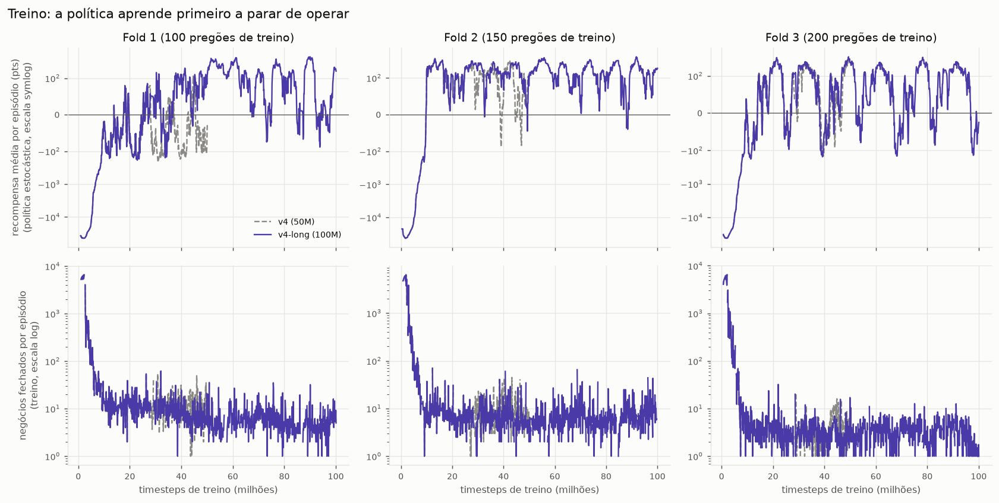

**Fig. 1.** Recompensa média por episódio (política estocástica, eixo symlog) e negócios fechados por episódio de treino.

| Run | Fold | Recompensa/episódio no início (pts) | Recompensa/episódio, últimos 10M (pts) | Negócios/episódio no início | Negócios/episódio, últimos 10M | Passo em que negócios/ep. < 50 (M) | Passo em que recompensa > 0 (M) | Entropia @10M (máx. 1,10) | Var. explicada 10–25M | Var. explicada, últimos 10M |
|---|---|---|---|---|---|---|---|---|---|---|
| v4 (50M) | 1 | -37.082 | -45 | 4.909 | 13,2 | 7M | 18M | 0,0020 | 0,69 | 0,46 |
| v4 (50M) | 2 | -22.318 | 110 | 2.941 | 9,4 | 7M | 10M | 0,0012 | 0,67 | 0,32 |
| v4 (50M) | 3 | -32.372 | 64 | 4.067 | 5,2 | 6M | 14M | 0,0025 | 0,42 | 0,16 |
| v4-long (100M) | 1 | -37.082 | 71 | 4.909 | 5,3 | 7M | 18M | 0,0020 | 0,69 | 0,34 |
| v4-long (100M) | 2 | -22.318 | 180 | 2.941 | 9,9 | 7M | 10M | 0,0012 | 0,67 | 0,20 |
| v4-long (100M) | 3 | -32.372 | 82 | 4.067 | 3,0 | 6M | 14M | 0,0025 | 0,42 | 0,10 |

- **Fase 1 (até ~7M timesteps): aprender a não operar.** A política inicial é quase aleatória: 2,9–4,9 mil negócios por episódio, cada um custando ~7,5 pts, o que dá −22 mil a −37 mil pts por pregão. Em 6–7M timesteps o número de negócios já cai abaixo de 50.
- **Fase 2 (7M em diante): recompensa oscila em torno de zero a +200.** A recompensa média passa a ser positiva entre 10M e 18M, mas não estabiliza: há quedas recorrentes para valores negativos até o fim dos 100M.
- **Negócios por episódio no fim:** 3–10 (v4-long), 5–13 (v4).

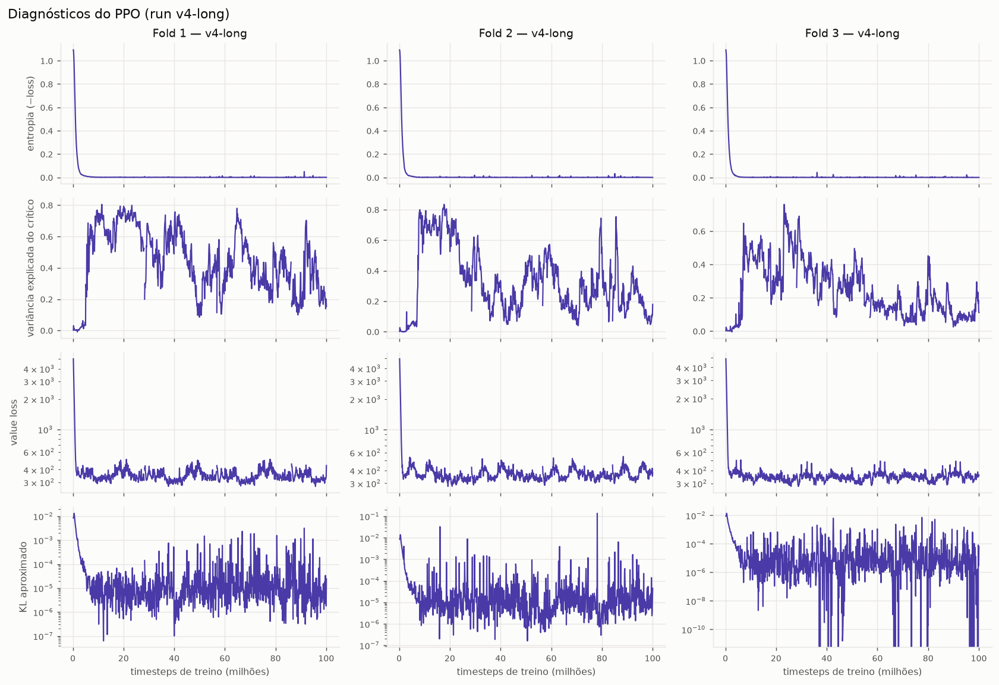

**Fig. 2.** Diagnósticos do PPO (`v4-long`).

- **A entropia colapsa cedo.** Aos 10M timesteps já está em 0,001–0,0025 nats (máximo 1,10). Com `ent_coef = 0`, os ~90M timesteps seguintes são praticamente exploração nula; o KL aproximado fica em ~1e-5, ou seja, a política quase não muda.
- **A variância explicada do crítico cai com o tempo:** 0,42–0,69 entre 10M e 25M, e 0,10–0,34 nos últimos 10M (v4-long). O crítico explica cada vez menos o retorno, coerente com uma política que troca de "lado do dia" e cujo retorno depende do movimento do mercado.
- O *value loss* fica plano em ~300–400 depois dos primeiros milhões.

---

## 3. Treino × validação × teste

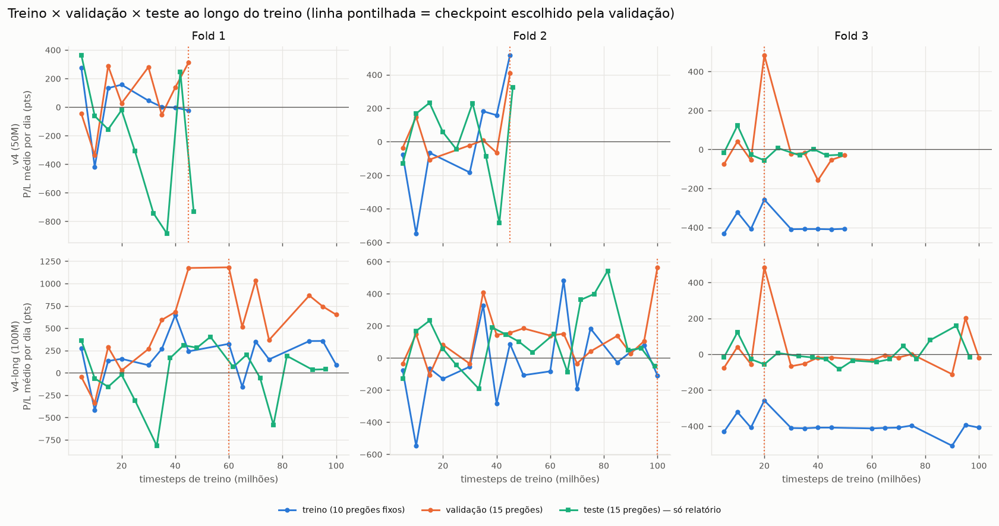

**Fig. 3.** P/L médio por dia (pts) da política determinística a cada checkpoint: 10 pregões fixos de treino, 15 de validação e 15 de teste. **A curva de teste é só para relatório** — não foi usada para escolher checkpoint.

| Run | Fold | Pontos de validação | Pontos de teste | Treino (10 pregões), P/L/dia | Validação, P/L/dia | Teste, P/L/dia | Validação: pontos > 0 | Teste: pontos > 0 |
|---|---|---|---|---|---|---|---|---|
| v4 (50M) | 1 | 8 | 9 | 21 | 76 | -255 | 5/8 | 2/9 |
| v4 (50M) | 2 | 7 | 9 | -2 | 48 | 29 | 3/7 | 5/9 |
| v4 (50M) | 3 | 9 | 9 | -385 | 12 | -6 | 2/9 | 3/9 |
| v4-long (100M) | 1 | 15 | 17 | 191 | 533 | 3 | 13/15 | 10/17 |
| v4-long (100M) | 2 | 17 | 18 | -28 | 122 | 110 | 13/17 | 13/18 |
| v4-long (100M) | 3 | 15 | 17 | -400 | 17 | 1 | 4/15 | 5/17 |

- **Validação > teste nas 6 combinações (média dos checkpoints).** v4-long, fold 1: +533 pts/dia na validação contra +3 no teste; v4, fold 1: +76 contra −255.
- **A curva de teste é volátil:** no v4-long, fold 1, ela vai de −12.238 a +6.048 pts entre checkpoints vizinhos, enquanto a validação fica entre +8.093 e +20.438 depois de 33M.
- **Fold 3:** a média de validação e teste fica perto de 0 pts/dia (+12/−6 no v4, +17/+1 no v4-long), e o subconjunto de treino (10 pregões) fica em ~−400 pts/dia. São só 10 pregões (erro padrão de ~±300 pts/dia), então não dá para concluir mais do que "não há sinal".

### A validação prevê o teste?

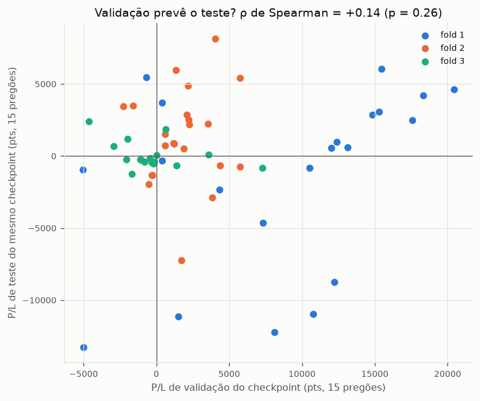

**Fig. 4.** Cada ponto é um checkpoint (duplicatas entre as duas rodadas removidas).

| Escopo | Checkpoints | ρ de Spearman (val × teste) | p-valor |
|---|---|---|---|
| fold 1 | 21 | +0,50 | 0,02 |
| fold 2 | 22 | +0,15 | 0,51 |
| fold 3 | 21 | -0,34 | 0,14 |
| todos | 64 | +0,14 | 0,26 |

Só o fold 1 tem correlação positiva significativa (+0,50); o fold 3 é negativo (−0,34). No fold 1, validação e teste ocorreram com o WIN caindo (−6.578 e −4.922 pts, Fig. 5), então qualquer checkpoint com viés vendido ganha nos dois — a correlação reflete o regime, não uma habilidade que se transfere.

| Run | Fold | Val do escolhido | Val médio dos checkpoints | Teste do escolhido | Teste médio dos checkpoints | Checkpoints com teste > 0 |
|---|---|---|---|---|---|---|
| v4 (50M) | 1 | 4.685 | 1.548 | -11.342 | -3.829 | 2/9 |
| v4 (50M) | 2 | 6.115 | 777 | -562 | 442 | 5/9 |
| v4 (50M) | 3 | 7.262 | 974 | -840 | -93 | 3/9 |
| v4-long (100M) | 1 | 17.712 | 10.387 | 3.808 | 48 | 10/17 |
| v4-long (100M) | 2 | 8.462 | 2.126 | -3.950 | 1.652 | 13/18 |
| v4-long (100M) | 3 | 7.262 | -279 | -840 | 21 | 5/17 |

O checkpoint escolhido pela validação teve, no teste, P/L **pior que a média dos checkpoints em 5 das 6 combinações**; só o v4-long do fold 1 foi melhor (+3.808 contra +48). Escolher o máximo de 9–18 pontos de validação seleciona também o ruído. (A média dos checkpoints usa os modelos da curva de checkpoints, que são ligeiramente diferentes dos pontos de 5M em 5M da validação, então a comparação é aproximada.)

---

## 4. Resultados finais

### Por fold (IC 95% por bootstrap sobre os pregões)

| Run | Fold | Modelo | Conjunto | P/L total (pts) | R$ | P/L médio/dia | IC95% médio/dia | Dias + | Negócios/dia | Acerto |
|---|---|---|---|---|---|---|---|---|---|---|
| v4 (50M) | 1 | melhor-de-validação | validação | 4.685 | 937 | 312 | [-519; 1.184] | 7/15 | 8,0 | 54% |
| v4 (50M) | 1 | melhor-de-validação | teste | -11.342 | -2.268 | -756 | [-1.377; -140] | 3/15 | 5,9 | 42% |
| v4 (50M) | 1 | último | validação | 4.395 | 879 | 293 | [-452; 1.056] | 8/15 | 6,5 | 54% |
| v4 (50M) | 1 | último | teste | -7.140 | -1.428 | -476 | [-1.170; 198] | 6/15 | 5,5 | 46% |
| v4 (50M) | 2 | melhor-de-validação | validação | 6.115 | 1.223 | 408 | [30; 824] | 11/15 | 5,1 | 55% |
| v4 (50M) | 2 | melhor-de-validação | teste | -562 | -112 | -38 | [-587; 532] | 6/15 | 4,2 | 51% |
| v4 (50M) | 2 | último | validação | 4.468 | 894 | 298 | [-148; 741] | 10/15 | 4,6 | 57% |
| v4 (50M) | 2 | último | teste | 4.068 | 814 | 271 | [-143; 691] | 10/15 | 3,4 | 63% |
| v4 (50M) | 3 | melhor-de-validação | validação | 7.262 | 1.452 | 484 | [-215; 1.164] | 9/15 | 2,5 | 59% |
| v4 (50M) | 3 | melhor-de-validação | teste | -840 | -168 | -56 | [-464; 388] | 6/15 | 1,9 | 46% |
| v4 (50M) | 3 | último | validação | -435 | -87 | -29 | [-615; 571] | 8/15 | 2,5 | 68% |
| v4 (50M) | 3 | último | teste | -538 | -108 | -36 | [-430; 391] | 6/15 | 2,2 | 58% |
| v4-long (100M) | 1 | melhor-de-validação | validação | 17.712 | 3.542 | 1.181 | [675; 1.719] | 14/15 | 3,5 | 81% |
| v4-long (100M) | 1 | melhor-de-validação | teste | 3.808 | 762 | 254 | [-293; 814] | 9/15 | 1,4 | 57% |
| v4-long (100M) | 1 | último | validação | 13.685 | 2.737 | 912 | [212; 1.562] | 11/15 | 7,3 | 74% |
| v4-long (100M) | 1 | último | teste | 6.140 | 1.228 | 409 | [-122; 964] | 10/15 | 1,9 | 71% |
| v4-long (100M) | 2 | melhor-de-validação | validação | 8.462 | 1.692 | 564 | [223; 905] | 12/15 | 5,8 | 63% |
| v4-long (100M) | 2 | melhor-de-validação | teste | -3.950 | -790 | -263 | [-728; 208] | 4/15 | 4,9 | 46% |
| v4-long (100M) | 2 | último | validação | 8.582 | 1.716 | 572 | [235; 918] | 12/15 | 5,8 | 63% |
| v4-long (100M) | 2 | último | teste | -4.080 | -816 | -272 | [-677; 131] | 4/15 | 4,9 | 47% |
| v4-long (100M) | 3 | melhor-de-validação | validação | 7.262 | 1.452 | 484 | [-215; 1.164] | 9/15 | 2,5 | 59% |
| v4-long (100M) | 3 | melhor-de-validação | teste | -840 | -168 | -56 | [-464; 388] | 6/15 | 1,9 | 46% |
| v4-long (100M) | 3 | último | validação | -272 | -54 | -18 | [-607; 587] | 8/15 | 1,0 | 53% |
| v4-long (100M) | 3 | último | teste | -412 | -82 | -28 | [-424; 402] | 6/15 | 1,0 | 40% |

### Agregado nos 3 folds (45 pregões de validação e 45 de teste)

| Run | Modelo | Conjunto | Dias | P/L total (pts) | P/L médio/dia | IC95% médio/dia | p-valor (t, média=0) | Negócios/dia |
|---|---|---|---|---|---|---|---|---|
| v4 (50M) | melhor-de-validação | validação | 45 | 18.062 | 401 | [5; 785] | 0,05 | 5,2 |
| v4 (50M) | melhor-de-validação | teste | 45 | -12.745 | -283 | [-605; 37] | 0,10 | 4,0 |
| v4 (50M) | último | validação | 45 | 8.428 | 187 | [-177; 553] | 0,32 | 4,6 |
| v4 (50M) | último | teste | 45 | -3.610 | -80 | [-391; 225] | 0,62 | 3,7 |
| v4-long (100M) | melhor-de-validação | validação | 45 | 33.438 | 743 | [427; 1.073] | 0,00 | 3,9 |
| v4-long (100M) | melhor-de-validação | teste | 45 | -982 | -22 | [-309; 267] | 0,88 | 2,7 |
| v4-long (100M) | último | validação | 45 | 21.995 | 489 | [146; 839] | 0,01 | 4,7 |
| v4-long (100M) | último | teste | 45 | 1.648 | 37 | [-235; 318] | 0,80 | 2,6 |

- **Validação:** o melhor-de-validação mostra +18.062 (v4, p = 0,05) e +33.438 pts (v4-long, p < 0,01). Esse número é otimista por construção (foi o máximo de 9–18 avaliações).
- **Teste:** −12.745 pts (v4, p = 0,10) e −982 pts (v4-long, p = 0,88). Com desvio diário de ~1.000 pts e 15 pregões por janela, o erro padrão da média é ~260 pts/dia: só diferenças muito grandes seriam detectáveis.
- **Último modelo (sem seleção):** −3.610 (v4) e +1.648 pts (v4-long), também indistinguíveis de zero.

### Referências: baselines

| Fold | Conjunto | Comprar e segurar | Vender e segurar | Variação do WIN no período (pts) | Regra de limiar (z=1) | Aleatório | Modelo v4 (50M) | Modelo v4-long (100M) |
|---|---|---|---|---|---|---|---|---|
| 1 | validação | -6.708 | 6.478 | -6.578 | -69.175 | -2.074.208 | 4.685 | 17.712 |
| 1 | teste | -5.042 | 4.802 | -4.922 | -71.430 | -2.109.932 | -11.342 | 3.808 |
| 2 | validação | -1.308 | 1.078 | -1.218 | -67.738 | -1.595.002 | 6.115 | 8.462 |
| 2 | teste | 2.642 | -2.872 | 2.778 | -63.280 | -1.694.342 | -562 | -3.950 |
| 3 | validação | 42 | -272 | 142 | -4.902 | -2.008.560 | 7.262 | 7.262 |
| 3 | teste | 172 | -412 | 268 | -6.730 | -1.539.482 | -840 | -840 |

"Comprar/vender e segurar" abre uma posição no primeiro tick e só fecha no fim do pregão, com os mesmos custos (calculado com o mesmo ambiente, `src/hold_baselines.py`).

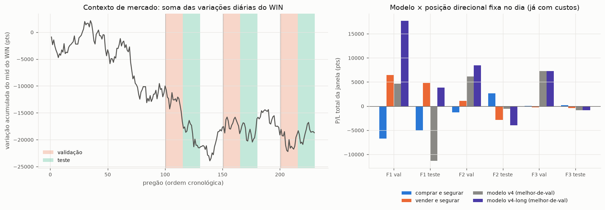

**Fig. 5.** À esquerda: variação acumulada do WIN e janelas de validação/teste. À direita: P/L de cada janela para o modelo e para as posições direcionais fixas.

- **Nos 45 pregões de teste:** vender e segurar = +1.518 pts, comprar e segurar = −2.228 pts. O melhor-de-validação do v4-long (−982) e do v4 (−12.745) ficam abaixo da posição vendida fixa.
- **Nos 45 de validação:** vender e segurar = +7.284, comprar e segurar = −7.974; os modelos (+18.062 e +33.438) ficam bem acima, mas com o viés de seleção descrito acima.
- **Regra de limiar (|z| > 1) e política aleatória** perdem muito (−4.902 a −71.430 e −1,5 a −2,1 milhões de pts por janela) porque fazem 62–1.187 e 13–18 mil negócios por dia, respectivamente; a política aprendida está longe disso (§5).

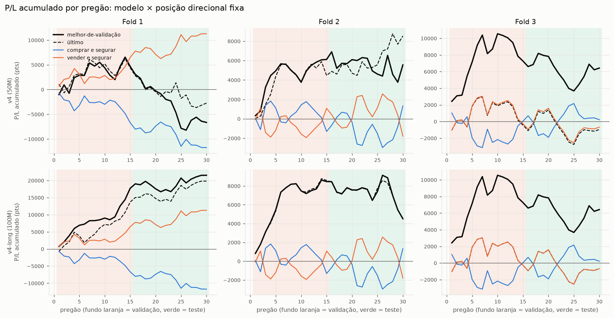

**Fig. 6.** P/L acumulado por pregão (fundo laranja = validação, verde = teste). No fold 3 o "último" modelo coincide com "vender e segurar".

---

## 5. Quantidade de negociações

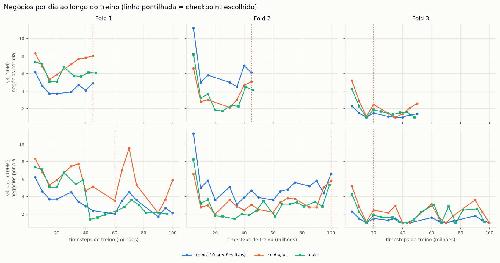

**Fig. 7.** Negócios por dia a cada checkpoint (treino, validação e teste).

Negócios por dia no teste, melhor-de-validação, comparados às referências:

| Fold | Aleatório | Regra de limiar | Modelo v4 (50M) | Modelo v4-long (100M) |
|---|---|---|---|---|
| 1 | 17.683,4 | 1.187,2 | 5,9 | 1,4 |
| 2 | 14.264,5 | 1.062,1 | 4,2 | 4,9 |
| 3 | 13.191,1 | 61,7 | 1,9 | 1,9 |

Perfil dos negócios (melhor-de-validação, validação + teste dos 3 folds, 90 pregões):

| Run | Negócios | Pregões | Pregões com exatamente 1 negócio | Pregões com ≥ 10 negócios | Entradas às 10h–11h | Negócios < 5% do pregão | Negócios ≥ 95% do pregão | Duração mediana (% do pregão) | P/L médio por negócio (pts) | Ganho médio | Perda média |
|---|---|---|---|---|---|---|---|---|---|---|---|
| v4 (50M) | 413 | 90 | 16 (18%) | 12 (13%) | 65% | 43% | 5% | 6,8% | 13 | 370 | -360 |
| v4-long (100M) | 300 | 90 | 29 (32%) | 3 (3%) | 51% | 22% | 10% | 16,1% | 108 | 461 | -414 |

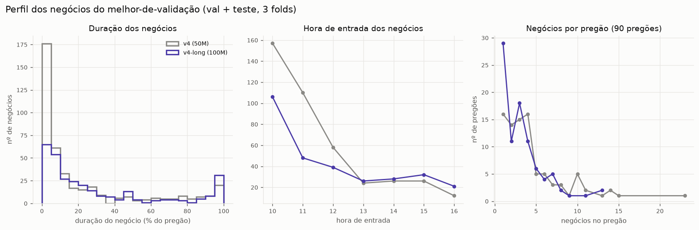

**Fig. 8.** Duração (% do pregão), hora de entrada e negócios por pregão.

- **O modelo negocia 1–6 vezes por dia no teste** (1,4–5,9), de 30 a 850 vezes menos que a regra de limiar e milhares de vezes menos que a política aleatória. Os custos (~7,5 pts por negócio) somam 195–1.030 pts por janela de 15 pregões, bem menos que as oscilações direcionais (até ±13 mil pts); passar a fee de 2,5 para 0 muda o resultado em no máximo ~300 pts por janela (§7).
- **v4-long:** 32% dos pregões têm um único negócio (entrar cedo e sair no fim do dia) e só 3% têm 10 ou mais. **v4:** opera mais e mais curto (43% dos negócios duram menos de 5% do pregão).
- **Metade ou mais das entradas acontece entre 10h e 11h59** (65% no v4, 51% no v4-long) — o agente decide a direção do dia logo no começo do pregão.
- **Ganho médio e perda média por negócio são parecidos em módulo** (v4: +370/−360; v4-long: +461/−414): a taxa de acerto, e não a assimetria, decide o resultado.

---

## 6. O modelo está arbitrando?

**Resposta curta: não.** O que ele faz é uma aposta direcional de horas, com uma parte de convergência do desalinhamento que ele captura mal.

### 6.1 Decomposição do P/L bruto

O P/L bruto de uma posição no WIN se separa exatamente em (a) a **convergência do spread** (posição × variação do mispricing `mid_WIN − justo`) e (b) o **efeito do preço justo** (posição × variação do justo). Uma arbitragem hedgeada teria (a) > 0 e (b) ≈ 0.

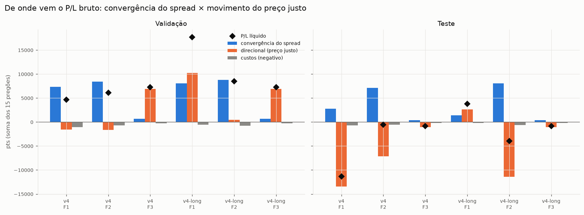

**Fig. 9.** Decomposição por janela (soma de 15 pregões).

| Run | Fold | Conjunto | P/L bruto | Convergência do spread | Direcional (preço justo) | Custos | Exposição líquida média | Corr. P/L × mov. WIN | Dias com ≤1 negócio | Duração média (% do pregão) |
|---|---|---|---|---|---|---|---|---|---|---|
| v4 (50M) | 1 | validação | 5.715 | 7.312 | -1.597 | 1.030 | +10% | -0,37 | 7% | 23% |
| v4 (50M) | 1 | teste | -10.668 | 2.786 | -13.453 | 675 | +47% | +0,47 | 0% | 23% |
| v4 (50M) | 2 | validação | 6.782 | 8.394 | -1.612 | 668 | -4% | +0,31 | 7% | 30% |
| v4 (50M) | 2 | teste | -8 | 7.127 | -7.134 | 555 | +16% | +0,10 | 7% | 35% |
| v4 (50M) | 3 | validação | 7.542 | 650 | 6.893 | 280 | -47% | -0,46 | 33% | 57% |
| v4 (50M) | 3 | teste | -622 | 412 | -1.035 | 218 | -77% | -0,81 | 53% | 71% |
| v4-long (100M) | 1 | validação | 18.300 | 8.063 | 10.237 | 588 | -74% | -0,67 | 27% | 47% |
| v4-long (100M) | 1 | teste | 4.002 | 1.398 | 2.605 | 195 | -68% | -0,95 | 73% | 84% |
| v4-long (100M) | 2 | validação | 9.262 | 8.792 | 470 | 800 | -55% | -0,13 | 7% | 26% |
| v4-long (100M) | 2 | teste | -3.312 | 8.071 | -11.383 | 638 | -46% | -0,60 | 0% | 24% |
| v4-long (100M) | 3 | validação | 7.542 | 650 | 6.893 | 280 | -47% | -0,46 | 33% | 57% |
| v4-long (100M) | 3 | teste | -622 | 412 | -1.035 | 218 | -77% | -0,81 | 53% | 71% |

- **A convergência do spread é positiva nas 12 janelas** (todas as combinações de rodada, fold e conjunto); o P/L bruto fica negativo no teste porque o componente do preço justo é negativo e grande (−13.453 no fold 1 do v4; −11.383 no fold 2 do v4-long).
- **Nos 45 pregões de teste:** v4 = convergência +10.325, preço justo −21.622, custos −1.448 → −12.745; v4-long = +9.881, −9.813, −1.051 → −982. A convergência (~+10 mil) compensaria os custos, mas não a exposição ao mercado.
- **Exposição líquida de −77% a +47%, correlação com o movimento do WIN de até −0,95** e posições que duram de 23% a 84% do pregão. Isso é viés direcional, não neutralidade de mercado.

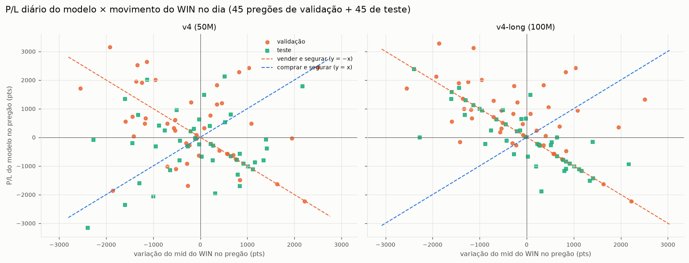

**Fig. 10.** P/L diário do modelo × variação do WIN no pregão. No v4-long os pontos de teste se alinham à reta y = −x (vender e segurar).

### 6.2 O modelo acerta a direção do dia?

| Run | Conjunto | Dias com posição ≥90% do pregão numa direção | Direção correta | Taxa | p-valor (binomial, 50%) |
|---|---|---|---|---|---|
| v4 (50M) | validação | 10 | 2 | 20% | 0,11 |
| v4 (50M) | teste | 16 | 4 | 25% | 0,08 |
| v4-long (100M) | validação | 15 | 8 | 53% | 1,00 |
| v4-long (100M) | teste | 20 | 10 | 50% | 1,00 |

Nos pregões em que o modelo fica ≥ 90% do tempo numa direção, o v4-long acerta o sinal do movimento do WIN em 50–53% (moeda) e o v4 em 20–25% (n = 10 e 16; p = 0,08–0,11, sem significância com tão poucos dias).

### 6.3 O sinal de convergência é real

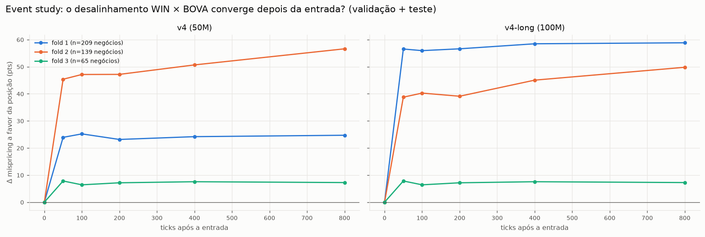

**Fig. 11.** Variação do mispricing a favor da posição, ticks após a entrada (validação + teste). O número de negócios por fold está na legenda (v4: 209, 139, 65; v4-long: 74, 161, 65).

Depois de uma entrada do modelo, o desalinhamento anda a favor da posição **+24 (fold 1), +45 (fold 2) e +8 pts (fold 3)** já nos primeiros 50 ticks no v4 e **+57, +39 e +8** no v4-long, e depois quase não muda (a média chega a +25, +57 e +7 no v4 e +59, +50 e +7 no v4-long em 800 ticks). O custo de um negócio é ~7,5 pts, então a convergência bruta é de 1 a 8 vezes o custo. Nas faixas de sinal na entrada:

| Run | Faixa do sinal na entrada (z) | Negócios | P/L médio (pts) | Convergência média (pts) |
|---|---|---|---|---|
| v4 (50M) | z<0 | 74 | -97 | 35 |
| v4 (50M) | 0<=z<1 | 112 | 40 | 32 |
| v4 (50M) | 1<=z<2 | 70 | 45 | 54 |
| v4 (50M) | z>=2 | 157 | 31 | 107 |
| v4-long (100M) | z<0 | 44 | 142 | 54 |
| v4-long (100M) | 0<=z<1 | 69 | 180 | 39 |
| v4-long (100M) | 1<=z<2 | 33 | 73 | 68 |
| v4-long (100M) | z>=2 | 154 | 74 | 131 |

A convergência média cresce com |z| (v4: 35, 32, 54, 107 pts; v4-long: 54, 39, 68, 131), mas o **P/L por negócio não cresce junto** (v4: −97, +40, +45, +31; v4-long: +142, +180, +73, +74). O ganho de convergência não vira P/L.

### 6.4 Por que a convergência não vira P/L: quem se move é o lado do preço justo

Na regra de limiar (que entra sempre que |z| > 1 e sai quando o spread volta a zero) a convergência total é enorme, mas quase toda ela vem do movimento do preço justo, não do WIN:

| Fold | Conjunto | Negócios | Convergência total do spread | Efeito do preço justo na posição | P/L bruto (movimento do WIN) | Custos | % da convergência capturada no WIN | Convergência por negócio (pts) | Custo por negócio (pts) |
|---|---|---|---|---|---|---|---|---|---|
| 1 | validação | 20392 | 520.737 | -427.174 | 93.562 | 162.738 | 18% | 25,5 | 8,0 |
| 1 | teste | 17808 | 432.084 | -362.887 | 69.198 | 140.628 | 16% | 24,3 | 7,9 |
| 2 | validação | 15009 | 333.811 | -284.701 | 49.110 | 116.848 | 15% | 22,2 | 7,8 |
| 2 | teste | 15931 | 356.785 | -295.208 | 61.578 | 124.858 | 17% | 22,4 | 7,8 |
| 3 | validação | 2054 | 85.269 | -73.596 | 11.672 | 16.575 | 14% | 41,5 | 8,1 |
| 3 | teste | 926 | 34.776 | -34.156 | 620 | 7.350 | 2% | 37,6 | 7,9 |

- **Só 14–18% da convergência é capturada no movimento do WIN** (2% no teste do fold 3). O restante é o preço justo (derivado do BOVA11 e da razão média móvel de 3.000 ticks) se aproximando do WIN.
- **A convergência por negócio (22–42 pts) é 3–5× o custo (~8 pts).** Capturar a convergência inteira exigiria operar também o lado que se move, o BOVA11 — que tem custo próprio: com BOVA11 a ~R$ 100, 1 tick (R$ 0,01) equivale a ~0,01% ≈ 10 pts de WIN, do mesmo tamanho do custo do WIN.
- **Isto é uma hipótese a testar, não um resultado:** o justo é construído com uma média móvel e com quotes do BOVA11 propagadas por *forward fill*, então parte da convergência pode ser mecânica ou vir de cotações defasadas, e o P/L de uma perna hedgeada não foi simulado.

---

## 7. Robustez: custo e latência

| Run | Fold | Conjunto | fee 0 | fee 0,5 | fee 2,5 (treino) | latência 1 tick: P/L | latência 1 tick: negócios/dia |
|---|---|---|---|---|---|---|---|
| v4 (50M) | 1 | validação | 4.985 | 4.925 | 4.685 | -3.420.640 | 28.868 |
| v4 (50M) | 1 | teste | -11.120 | -11.164 | -11.342 | -3.802.632 | 31.853 |
| v4 (50M) | 2 | validação | 6.305 | 6.267 | 6.115 | -2.076.962 | 17.731 |
| v4 (50M) | 2 | teste | -405 | -436 | -562 | -1.572.032 | 13.344 |
| v4 (50M) | 3 | validação | 7.355 | 7.336 | 7.262 | -1.348.965 | 11.434 |
| v4 (50M) | 3 | teste | -770 | -784 | -840 | -642.670 | 5.493 |
| v4-long (100M) | 1 | validação | 17.845 | 17.818 | 17.712 | -1.095.125 | 9.262 |
| v4-long (100M) | 1 | teste | 3.860 | 3.850 | 3.808 | -740.670 | 6.333 |
| v4-long (100M) | 2 | validação | 8.680 | 8.636 | 8.462 | -1.335.600 | 11.335 |
| v4-long (100M) | 2 | teste | -3.765 | -3.802 | -3.950 | -1.711.618 | 14.381 |
| v4-long (100M) | 3 | validação | 7.355 | 7.336 | 7.262 | -1.348.965 | 11.434 |
| v4-long (100M) | 3 | teste | -770 | -784 | -840 | -642.670 | 5.493 |

- **Custo:** fee 0 / 0,5 / 2,5 alteram o P/L de uma janela em no máximo ~300 pontos (ex.: v4, fold 1, validação: 4.985 / 4.925 / 4.685). O modelo não é limitado por custo; é limitado pela direção.
- **Latência de 1 tick:** o P/L vai para −0,6 a −3,8 milhões de pts por janela, com 5,5–32 mil negócios/dia, semelhante à política aleatória (13–18 mil/dia).

**Mecanismo verificado (pregão 117, v4-long fold 1, melhor-de-validação).** Com latência 0 o modelo faz 3 negócios no dia; com latência 1, 2.091. Por volta do tick 15.710 as decisões passam a alternar `1, 2, 1, 2…` a cada tick. Em cada tick a política escolhe **exatamente a posição que enxerga** (posição = +1 → ação 1; posição = −1 → ação 2), ou seja, "manter o que tenho". Com a ordem executada 1 tick depois, a posição observada fica um passo atrás da última decisão, a política reage ao lado errado e o ciclo de período 2 nunca se desfaz.

Portanto o resultado mostra fragilidade do **desenho do estado** (não há informação de ordem pendente nem de tempo em posição), não latência de mercado realista: um sistema real sabe quais ordens enviou. A correção é incluir a última ação/ordem pendente no estado ou impor um tempo mínimo em posição.

> **Nota:** os números de latência acima vêm do harness do commit `abee69a`, usado nas rodadas. O working tree atual de `src/rl_trading_pipeline.py` já tem uma versão do teste em que o agente enxerga a **posição pretendida** (a do alvo da última ordem decidida, inclusive as em voo). Ela ainda não foi rodada no cluster, então o resultado da latência de 1 tick precisa ser refeito antes de ser interpretado como robustez de mercado.

---

## 8. Limitações e ressalvas

- **Uma seed, e rodadas não independentes** (§1). Não dá para separar habilidade de sorte de inicialização.
- **Janelas curtas e regimes diferentes.** 15 pregões de validação/teste, desvio diário de ~1.000 pts, erro padrão de ~260 pts/dia. Fold 1 aconteceu com o WIN caindo forte (−6.578 e −4.922 pts); o fold 2 teve regime de validação e teste com sinais opostos (−1.218 e +2.778).
- **Viés de seleção na validação** (máximo de 9–18 checkpoints) e viés de seleção de *rodada* (duas rodadas, escolhidas depois de ver os números). O teste de cada fold já foi visto neste relatório; qualquer ajuste guiado por ele contamina o teste. Os pregões 231–488 seguem virgens.
- **Só a perna WIN, sem hedge no BOVA11.** Execução no preço cotado, sem fila nem slippage; marcação a mercado pelo mid. O P/L reportado não é o de uma arbitragem hedgeada.
- **Dados.** Os arquivos se chamam `WINM21`, mas as datas vão de 2021-04-26 a 2022-06-03 nos pregões usados (e até 2024-03 nos demais): vale confirmar como a rolagem de contrato foi tratada. Há lacunas de calendário (ex.: pregão 127 = 03/12/2021 e 128 = 17/12/2021) e pregões curtos (7,6 mil ticks contra 27–65 mil). O pregão 168 (02/03/2022) abre com mispricing de −1.190 pts, contra |mispricing| ≤ 102 na abertura dos demais, o que parece um artefato de dados e responde por ~1,2 mil dos ~7–8 mil pts de convergência do fold 2 no teste (a convergência continua positiva nos outros 14 pregões).
- **Comparação com a v3.** Não é direta: a v3 usava fee de 0,5, 6 folds, estado de 604 dimensões e apenas ~10 atualizações PPO por fold.

---

## 9. Próximos passos

Pedidos por você (ainda não feitos):

1. **Visualizar negociações.** Os arquivos `*_trades.csv` (melhor-de-validação, val e teste de cada fold, em `src/runs/<run>/fold<N>/eval/`) já trazem dia, entrada/saída em ticks, direção, spreads e P/L de cada negócio; os ticks estão em `C:\Users\HugoV\tick_data`. Dá para plotar preço do WIN, preço justo, mispricing e marcar entradas e saídas.
2. **Testar em pregões mais recentes.** Os pregões **231–488 (2022-06-06 a 2024-03-22, 258 dias)** nunca foram usados. Sugestão: definir *antes* de rodar qual modelo entra (o melhor-de-validação de cada fold, escolhido só pela validação) e o critério (superar "comprar e segurar" e "vender e segurar", com IC), e usar o `scaler.npz` de cada fold.

Sugestões que decorrem dos resultados (hipóteses, a discutir):

3. **Refazer o teste de latência** com a correção que já está no working tree (posição pretendida) e, para o treino, incluir a última ação/ordem pendente e o tempo em posição no estado.
4. **Atacar o viés direcional:** recompensa/posição hedgeada (perna BOVA11 ou remoção do componente do preço justo da recompensa) para o agente aprender só a convergência.
5. **Evitar o colapso precoce da política:** `ent_coef` > 0 e mais de uma seed; comparar com `n_steps` diferentes.
6. **Baselines e seleção mais robustos:** manter "comprar/vender e segurar" em todo relatório; janelas de validação maiores ou validação cruzada purgada.

---

## Apêndice: arquivos e reprodução

- **Resultados brutos:** `sdumont_backup_v4/` (logs SLURM em `pairs-rl-logs/`, checkpoints e CSVs em `src/runs/{v4,v4-long}/fold{1,2,3}/`).
- **Tabelas/figuras:** `python src/analyze_v4.py` (saída em `sdumont_backup_v4/analysis/tab_*.md|csv` e `docs/img/v4_*.png`).
- **Baselines direcionais:** `python src/hold_baselines.py 1 230 sdumont_backup_v4/analysis/hold_baselines.csv` (roda no WSL com os dados de tick).
- **Configuração das rodadas:** `sdumont_backup_v4/pairs-rl-logs/run_full_v4.sh` e `run_long_v4.sh` (`TOTAL_TIMESTEPS` 50M e 100M, `VEC_ENV=dummy`, `TORCH_THREADS=8`, `BATCH_SIZE=4096`, avaliação e checkpoint a cada 5M).
- **Código:** branch `estado-simplificado-v4`, commit `abee69a` (pipeline das rodadas) + `src/analyze_v4.py` e `src/hold_baselines.py` desta análise. O working tree de `src/rl_trading_pipeline.py` tem alterações posteriores às rodadas (padrões `N_VAL`/`N_TEST` = 30 e `THROUGHPUT_STEPS_PER_SEC` = 27000, além do ajuste do teste de latência); as rodadas usaram 15/15 pregões de validação/teste.
