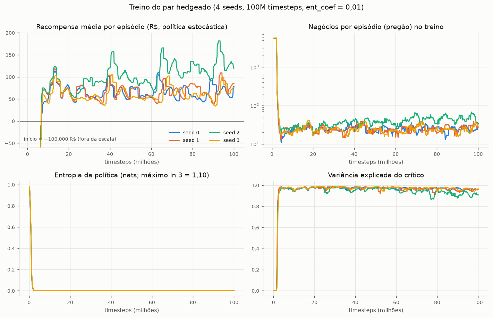
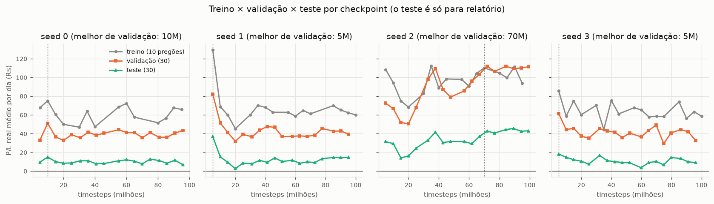
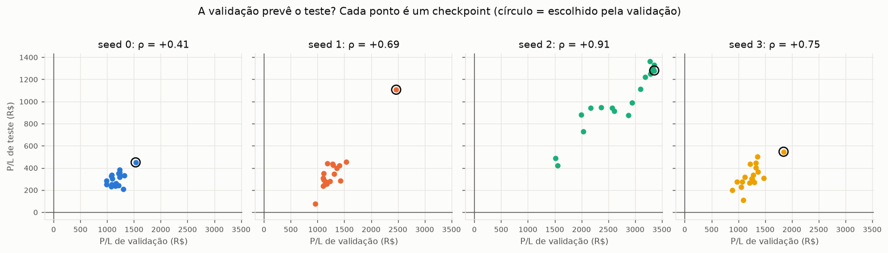
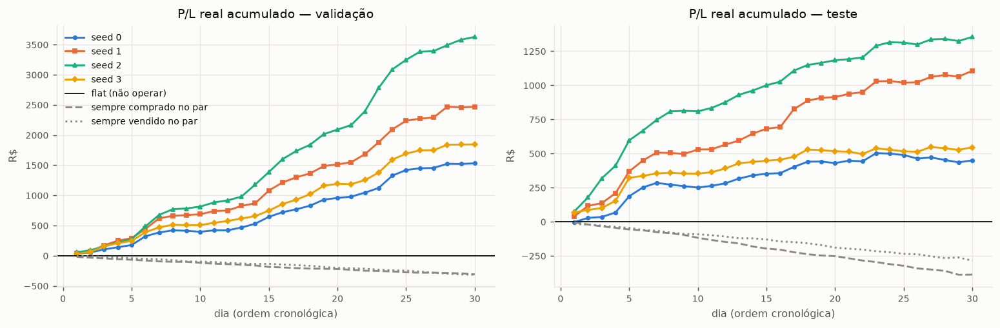
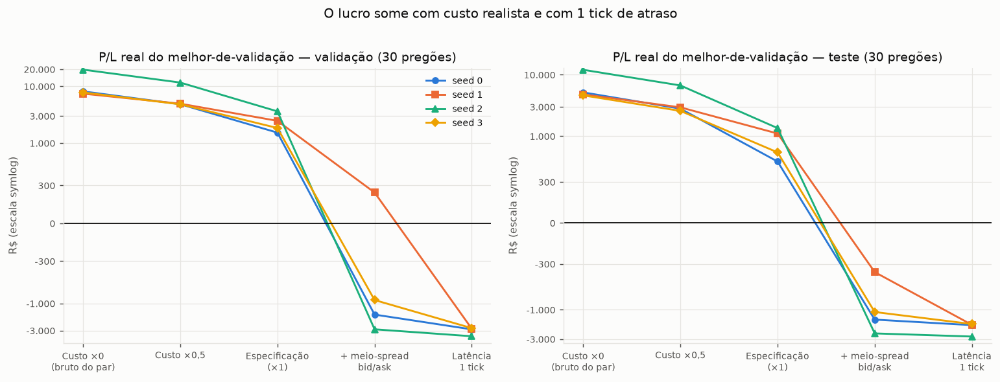
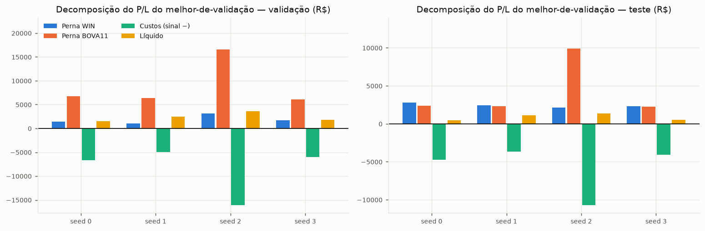
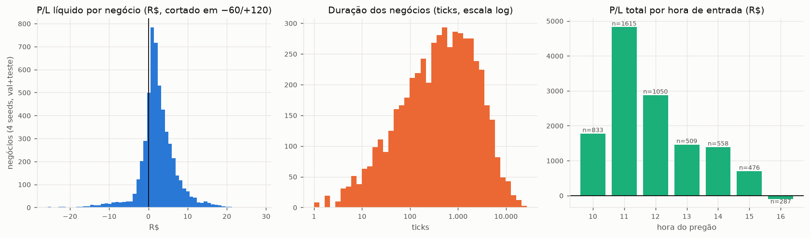
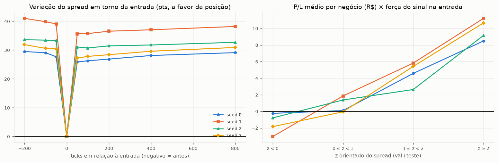
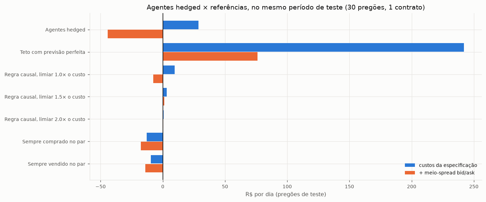
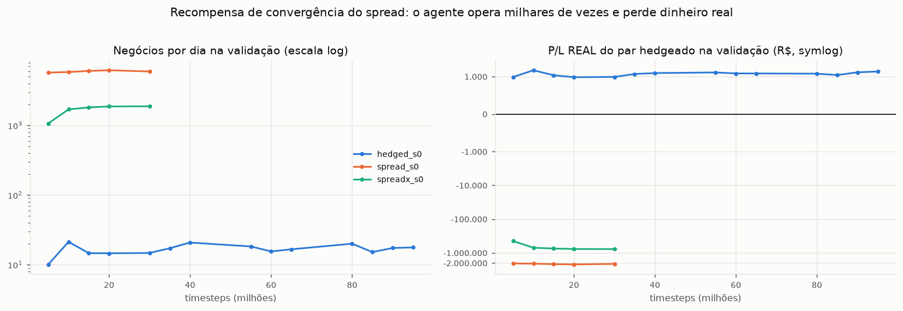

# Relatório v5 — recompensa do par hedgeado (WIN + BOVA11) e recompensa de convergência do spread

> Resultados da campanha adaptativa no Santos Dumont em 19–20/09/2026: **4 seeds do par hedgeado** (`hedged_s0..s3`, 100M timesteps) e **2 pilotos de recompensa de convergência do spread** (`spread_s0` e `spreadx_s0`, 30M). 32 jobs, todos `COMPLETED`, em 411 min de relógio. Todos os números vêm de arquivos gravados pelo pipeline (`sdumont_backup_campanha/`); tabelas e figuras são geradas por `src/analyze_campanha.py`. **Valores em R$** (1 contrato de WIN + a perna de BOVA11), a menos que a unidade esteja indicada.

## 0. Resumo

1. **A recompensa hedgeada resolveu o problema que a v4 tinha.** Com a recompensa igual ao P/L real do par (perna WIN + perna BOVA11 − custos), o agente abandona a aposta direcional: a correlação do P/L diário com o movimento do WIN é ≈ 0 (−0,14 a +0,16 no teste), ele faz 11–32 negócios por pregão no teste (no início do treino eram ~5.000) e o P/L é **positivo em validação e teste nas 4 seeds e em todos os 72 checkpoints avaliados**. No teste (30 pregões): **+450, +1.106, +1.355 e +546 R$** (média +864; +28,8 R$/dia; IC95% por bootstrap sobre os dias [17,4; 41,9]; 25 de 30 dias positivos).
2. **Esse lucro só existe com as premissas de custo da especificação.** Somando o meio-spread bid/ask das duas pernas, o P/L de teste vira **−1.447, −360, −2.429 e −1.089 R$** (negativo nas 4 seeds; na validação, 3 de 4 negativas). Com **1 tick de atraso** na execução, o lucro bruto cai 68–80% e o líquido fica entre −1.710 e −2.729 R$ no teste. Os custos da especificação já consomem 77–91% do bruto.
3. **A convergência que o agente captura parece de curtíssimo prazo.** Ele entra logo depois de um deslocamento adverso de ~30 pts do spread e o spread reverte ~26–36 pts nos 50 ticks seguintes (Fig. 8). Isso é compatível com a extrema sensibilidade à latência e com colher oscilação de cotação (em um pregão de amostra, o BOVA11 mudou de preço em só ~32% dos ticks); é uma hipótese coerente com os dados, não uma prova.
4. **Contexto no mesmo período de teste.** O teto com previsão perfeita é de 242 R$/dia com as taxas da especificação (76 R$/dia com meio-spread). Os agentes (+28,8 R$/dia) capturam ~12% do teto e superam a regra causal "spread − custos" (+9,5 R$/dia), mas com meio-spread os agentes perdem 44 R$/dia, contra +76 R$/dia do teto. Segurar o par o dia todo perde 10–13 R$/dia.
5. **A recompensa de convergência do spread é explorável.** Nos dois pilotos o agente aprende a fazer milhares de negócios de 3–12 ticks (5.709 e 1.065 por dia na validação) com ~97% de acerto *na recompensa*, e o P/L real do par é **−2,07 milhões e −449 mil R$** na validação. O meio-spread no custo de treino (`spreadx`) reduz, mas não elimina, a exploração.
6. **A entropia da política colapsa em ~1,7M timesteps mesmo com `ent_coef` = 0,01.** Depois disso, os ~98M timesteps restantes refinam uma política quase determinística: em 3 das 4 seeds o melhor checkpoint de validação está em 5–10M. Treinar mais não é o que falta; o que falta é exploração e mais seeds.

**Leitura geral:** o desenho hedgeado produz um agente estável, market-neutral e consistentemente positivo *na contabilidade da especificação*, mas essa contabilidade é otimista (execução a preço mid, sem cruzar o book, sem atraso). Ao trocar para uma execução mais realista, o edge desaparece. Não há evidência, nesta campanha, de arbitragem operável.

---

## 1. Configuração e execução

| Item | Valor |
|---|---|
| Estado (4 dim.) | `spread_compra = ask_WIN − Wbjusto`, `spread_venda = bid_WIN − Wajusto` (z-score do treino), posição (−1/0/+1), P/L não realizado do par ÷ custo nominal de ida e volta |
| Ações | 3: flat / comprado no par / vendido no par (posição-alvo a cada tick) |
| Recompensa `hedged` | 1 WIN + `N_BOVA = P_WIN / (5 · P_BOVA)` ações de BOVA11 em sentido oposto, N fixo desde a abertura; R = P&L_WIN (pontos × R$ 0,20) + P&L_BOVA − custos; custo por lado = R$ 0,25 (WIN) + 0,0230% × valor da perna BOVA11; preços mid, sem meio-spread; recompensa × 5 só para o PPO |
| Recompensa `spread` | só o WIN é executado; R = \|s(t−1)\| − \|s(t)\| (s_buy se comprado, s_sell se vendido) − R$ 0,25 por transação (1,25 pts); o P/L real do par é calculado em paralelo (diagnóstico) |
| Recompensa `spreadx` | igual à `spread` + meio-spread bid/ask do WIN por transação |
| PPO | lr 3e-4, `n_steps` 2048 × 48 envs, batch 4096, 10 épocas, γ = 0,999999, λ = 0,95, **`ent_coef` = 0,01**, MLP [64, 64], `DummyVecEnv`, 8 threads torch |
| Seleção | a cada 5M timesteps avalia validação (30 pregões) e 10 pregões fixos de treino; guarda o melhor checkpoint **só pela validação** (P/L real do par) |
| Avaliação | 2 jobs por execução: modelos + baselines + sensibilidade a custo; latência + curva de checkpoints |
| Seeds | `hedged`: 0–3; pilotos de spread: seed 0 |

**Janelas** (1 fold; os pregões 338 e 463 foram excluídos por conterem erros):

| Conjunto | Pregões | Datas | Dias |
|---|---|---|---|
| Treino | 1–361 (sem 338) | 26/04/2021 – 18/01/2023 | 360 |
| Validação | 362–391 | 19/01/2023 – 17/04/2023 | 30 |
| Teste | 392–421 | 18/04/2023 – 14/07/2023 | 30 |
| Não usados | 422–488 (sem 463) | 17/07/2023 – 22/03/2024 | 66 |

O WIN caiu 490 pts na soma dos 30 dias de validação e subiu 3.055 pts na soma dos 30 dias de teste (regimes diferentes).

**Execução** (`tab_execucao`):

| Execução | Env | Timesteps (M) | Chunks | Steps/s (mediana) | Treino puro (min) | Validações periódicas (min) | Melhor ckpt de validação (M) | Métrica de seleção |
|---|---|---|---|---|---|---|---|---|
| hedged_s0 | hedged | 100,1 | 4 | 26.115 | 64,0 | 7,1 | 10,0 | P/L real do par |
| hedged_s1 | hedged | 100,1 | 4 | 27.199 | 61,4 | 8,6 | 5,0 | P/L real do par |
| hedged_s2 | hedged | 100,0 | 4 | 27.262 | 62,5 | 8,4 | 70,0 | P/L real do par |
| hedged_s3 | hedged | 100,1 | 4 | 27.479 | 60,7 | 8,8 | 5,0 | P/L real do par |
| spread_s0 | spread | 30,1 | 2 | 26.426 | 19,2 | 2,7 | 5,0 | P/L real do par |
| spreadx_s0 | spreadx | 30,1 | 2 | 27.985 | 18,1 | 2,6 | 5,0 | P/L real do par |

Cada execução `hedged` levou 85–89 min de relógio (4 chunks de treino + 2 jobs de avaliação); cada piloto, ~30 min. O pico de memória foi ~185 GiB no job de treino (360 dias × 48 envs), dentro dos 384 GB do nó, mas com pouca folga se o universo crescer. Uma primeira tentativa de `hedged_s0` foi cancelada a pedido (chunk 1, ~9 min) e sua pasta foi renomeada; a `hedged_s0` reportada é a execução limpa. O commit executado no cluster foi `6190072` (o campo `git_hash` do `metadata.json` ficou nulo porque o `git` não estava acessível no job).

---

## 2. Treino do par hedgeado

**Fig. 1.** Recompensa por episódio (política estocástica), negócios por episódio, entropia e variância explicada do crítico.

| Execução | 1º episódio com recompensa > 0 | Negócios/ep. < 50 | Entropia < 0,05 | Recompensa/ep. inicial (R$) | Recompensa/ep., últimos 10M (R$) | Negócios/ep., últimos 10M |
|---|---|---|---|---|---|---|
| hedged_s0 | 6,8M | 2,5M | 1,7M | −57.554 | 68 | 27 |
| hedged_s1 | 6,7M | 2,5M | 1,6M | −58.567 | 78 | 33 |
| hedged_s2 | 6,7M | 2,5M | 1,7M | −57.993 | 138 | 57 |
| hedged_s3 | 6,8M | 3,0M | 1,7M | −59.892 | 68 | 29 |

- **Fase 1 (até ~7M): aprender a não operar.** A política inicial é quase aleatória (~5.000 negócios por pregão, cada um custando ~R$ 11 de ida e volta: −58 mil R$ por episódio). Em 2,5–3M timesteps os negócios já caem abaixo de 50 por episódio e a recompensa fica positiva em ~6,7M.
- **Fase 2 (7M–100M): platô ruidoso.** A recompensa por episódio oscila entre ~40 e ~160 R$ sem tendência de alta; a seed 2 é a única com melhora lenta (de ~90 para ~138 R$/episódio) e a que mais opera.
- **A entropia colapsa em ~1,7M** (de ~1,0 para < 0,05 nats), apesar de `ent_coef` = 0,01, e fica em ~1e-4 até o fim. A recompensa por passo (em R$ × 5) é grande demais em comparação com o bônus de entropia. Com a política quase determinística, a variância explicada do crítico fica em 0,91–0,96 e o treino restante quase não explora.

---

## 3. Treino × validação × teste

**Fig. 2.** P/L real médio por dia (R$) da política determinística em cada checkpoint: 10 pregões de treino, 30 de validação e 30 de teste. **A curva de teste é só para relatório**; a linha pontilhada marca o checkpoint escolhido pela validação.

- **Em geral treino ≥ validação > teste**: os checkpoints ficam em ~45–130 R$/dia no treino, ~30–115 na validação e ~3–45 no teste. O gap para o teste é o de sempre: parte da validação vem de escolher o melhor entre 18–20 pontos, parte de um regime diferente (o teste subiu 102 pts/dia em média, a validação ficou parada).
- **As curvas são planas.** Três seeds têm o melhor ponto de validação em 5–10M timesteps e não melhoram depois; só a seed 2 sobe de forma consistente (de ~50 para ~110 R$/dia na validação entre 20M e 70M).

**Fig. 3.** Cada ponto é um checkpoint (círculo = escolhido pela validação).

| Execução | Checkpoints | ρ de Spearman (val × teste) | p | Teste do escolhido (R$) | Teste médio dos checkpoints (R$) | Checkpoints com val > 0 / teste > 0 |
|---|---|---|---|---|---|---|
| hedged_s0 | 18 | +0,41 | 0,090 | 450,0 | 302,9 | 18/18 e 18/18 |
| hedged_s1 | 18 | +0,69 | 0,002 | 1.106,4 | 368,8 | 18/18 e 18/18 |
| hedged_s2 | 18 | +0,91 | < 0,001 | 1.280,2 | 1.014,2 | 18/18 e 18/18 |
| hedged_s3 | 18 | +0,75 | < 0,001 | 546,0 | 326,0 | 18/18 e 18/18 |
| todos | 72 | +0,85 | < 0,001 | — | 503,0 | 72/72 e 72/72 |

- **Diferente da v4** (ρ = +0,14 entre validação e teste), aqui a validação ordena razoavelmente os checkpoints dentro de cada seed (ρ = +0,41 a +0,91) e o escolhido supera a média dos checkpoints no teste nas 4 seeds. O ρ agregado (+0,85) está inflado pela diferença *entre* seeds (a seed 2 é melhor nos dois conjuntos).
- **Todos os 72 checkpoints têm P/L positivo na validação e no teste.** Isso reforça que o resultado é consistente *dentro da contabilidade da especificação*; não diz nada sobre a execução realista (§5).
- Os 18 checkpoints por seed (em vez de 20) vêm de os checkpoints serem salvos por contagem de chamadas dentro de cada chunk; o valor do "escolhido" na tabela pode diferir levemente do resultado final do melhor-de-validação (ex.: seed 2, 1.280 contra 1.355 R$) porque o checkpoint mais próximo em passos não é exatamente o mesmo modelo.

---

## 4. Resultados finais

### Por execução (P/L real, 30 pregões cada)

| Execução | Modelo | Conjunto | P/L real (R$) | R$/dia | Perna WIN | Perna BOVA11 | Bruto do par | Custos | Negócios/dia | Acerto | Duração média (ticks) |
|---|---|---|---|---|---|---|---|---|---|---|---|
| hedged_s0 | melhor-de-validação | validação | 1.531,3 | 51,0 | 1.423,5 | 6.733,2 | 8.156,7 | 6.625,4 | 21,2 | 73% | 1.485 |
| hedged_s0 | melhor-de-validação | teste | 450,0 | 15,0 | 2.809,0 | 2.358,9 | 5.167,9 | 4.717,9 | 14,1 | 62% | 1.843 |
| hedged_s0 | último | teste | 339,0 | 11,3 | 3.574,0 | 1.048,1 | 4.622,1 | 4.283,1 | 12,8 | 68% | 2.025 |
| hedged_s1 | melhor-de-validação | validação | 2.468,2 | 82,3 | 1.063,5 | 6.375,5 | 7.439,0 | 4.970,8 | 15,9 | 83% | 1.981 |
| hedged_s1 | melhor-de-validação | teste | 1.106,4 | 36,9 | 2.458,0 | 2.333,8 | 4.791,8 | 3.685,4 | 11,0 | 76% | 2.363 |
| hedged_s1 | último | teste | 455,0 | 15,2 | 3.125,0 | 1.238,2 | 4.363,2 | 3.908,3 | 11,7 | 71% | 2.228 |
| hedged_s2 | melhor-de-validação | validação | 3.627,1 | 120,9 | 3.119,5 | 16.577,7 | 19.697,2 | 16.070,1 | 51,8 | 92% | 609 |
| hedged_s2 | melhor-de-validação | teste | 1.354,8 | 45,2 | 2.122,5 | 9.922,5 | 12.045,0 | 10.690,3 | 32,2 | 80% | 806 |
| hedged_s2 | último | teste | 1.263,8 | 42,1 | 2.114,5 | 11.116,1 | 13.230,6 | 11.966,8 | 36,0 | 76% | 723 |
| hedged_s3 | melhor-de-validação | validação | 1.845,5 | 61,5 | 1.753,0 | 6.063,5 | 7.816,5 | 5.971,0 | 19,1 | 77% | 1.650 |
| hedged_s3 | melhor-de-validação | teste | 546,0 | 18,2 | 2.334,5 | 2.284,9 | 4.619,4 | 4.073,4 | 12,2 | 64% | 2.136 |
| hedged_s3 | último | teste | 252,0 | 8,4 | 3.016,0 | 1.118,1 | 4.134,1 | 3.882,1 | 11,5 | 71% | 2.253 |

(A tabela completa, incluindo os "últimos" na validação, está em `sdumont_backup_campanha/analysis/tab_resultados_hedged.md`.) O melhor-de-validação supera o último modelo no teste nas 4 seeds (a diferença é maior nas seeds 1 e 3).

**Fig. 4.** P/L real acumulado dia a dia do melhor-de-validação (validação e teste). A linha preta é "não operar" (0).

### Significância por dia (melhor-de-validação)

| Execução | Conjunto | R$/dia | IC95% (bootstrap) | Dias positivos | p (média = 0) | 3 melhores dias / total | corr(P/L do dia, movimento do WIN) |
|---|---|---|---|---|---|---|---|
| hedged_s0 | teste | 15,0 | [5,0; 26,3] | 19/30 | 0,012 | 54% | −0,01 |
| hedged_s1 | teste | 36,9 | [23,3; 51,6] | 26/30 | < 0,001 | 34% | −0,14 |
| hedged_s2 | teste | 45,2 | [29,9; 62,2] | 26/30 | < 0,001 | 32% | +0,12 |
| hedged_s3 | teste | 18,2 | [7,2; 31,9] | 19/30 | 0,009 | 53% | +0,16 |
| média das 4 seeds | teste | 28,8 | [17,4; 41,9] | 25/30 | < 0,001 | 34% | +0,04 |
| média das 4 seeds | validação | 78,9 | [58,6; 100,2] | 30/30 | < 0,001 | 25% | −0,25 |

- **O P/L não depende da direção do mercado.** A correlação do P/L do dia com o movimento do WIN é ~0 em todas as seeds, incluindo o teste, em que o WIN subiu.
- **Cuidados com o p-valor:** os 30 dias são os mesmos para as 4 seeds (as seeds não são réplicas independentes em relação aos dias), os dias têm autocorrelação, e o intervalo só cobre a variação entre dias, não entre regimes. Em duas seeds, os 3 melhores dias respondem por ~54% do P/L de teste.

---

## 5. Robustez: custo, execução e latência

**Fig. 5.** P/L real do melhor-de-validação em 5 cenários (escala symlog). "Custo ×0" é o bruto do par; "Especificação" é o cenário de treino; "+ meio-spread" soma metade do spread bid/ask do WIN e do BOVA11 em cada lado; "Latência 1 tick" executa a ordem 1 tick depois da decisão (o agente enxerga a posição pretendida).

| Execução | Conjunto | Custo ×0 (bruto) | Custo ×0,5 | Especificação (×1) | + meio-spread bid/ask | Latência de 1 tick |
|---|---|---|---|---|---|---|
| hedged_s0 | validação | 8.156,7 | 4.844,0 | 1.531,3 | −1.568,8 | −2.858,3 |
| hedged_s0 | teste | 5.167,9 | 2.808,9 | 450,0 | −1.447,1 | −1.780,7 |
| hedged_s1 | validação | 7.439,0 | 4.953,6 | 2.468,2 | 244,0 | −2.785,3 |
| hedged_s1 | teste | 4.791,8 | 2.949,1 | 1.106,4 | −359,9 | −1.761,6 |
| hedged_s2 | validação | 19.697,2 | 11.662,1 | 3.627,1 | −2.851,1 | −3.775,5 |
| hedged_s2 | teste | 12.045,0 | 6.699,9 | 1.354,8 | −2.428,5 | −2.729,4 |
| hedged_s3 | validação | 7.816,5 | 4.831,0 | 1.845,5 | −870,1 | −2.718,3 |
| hedged_s3 | teste | 4.619,4 | 2.582,7 | 546,0 | −1.089,1 | −1.709,6 |

- **Os custos da especificação já comem 77–91% do bruto no teste** (custos de 3.685–10.690 R$ contra bruto de 4.619–12.045 R$). Qualquer atrito adicional é suficiente para zerar o resultado.
- **Meio-spread bid/ask:** o P/L de teste fica negativo nas 4 seeds (−360 a −2.429 R$) e, na validação, em 3 de 4. A especificação de recompensa não cobra a travessia do book, então o agente nunca foi treinado contra esse custo.
- **Latência de 1 tick:** o lucro bruto cai 68–80% no teste (77–88% na validação) e a taxa de acerto vai de 62–80% para 6–11%. O resultado depende de acertar o tick exato de entrada e saída. Este teste usa a correção em que o agente enxerga a posição pretendida (ordens em voo); a versão anterior (v4) produzia um colapso artificial de milhares de negócios por dia, que não ocorre aqui (9–20 negócios/dia).

---

## 6. De onde vem o lucro

**Fig. 6.** Decomposição do P/L do melhor-de-validação: perna WIN, perna BOVA11, custos e líquido.

- **Nas duas pernas.** No teste, as pernas WIN e BOVA11 contribuem de forma parecida nas seeds 0, 1 e 3 (WIN 2.335–2.809; BOVA11 2.285–2.359); na seed 2, a perna BOVA11 domina (9.923 contra 2.123). Na validação, a perna BOVA11 é bem maior que a WIN (6.064–16.578 contra 1.064–3.120). Isso é compatível com o achado da v4 de que a convergência do spread acontece em boa parte pelo lado do preço justo (BOVA11).
- **Concentração no início da manhã.** Somando as 4 seeds na validação e no teste, 11h responde por 37% do P/L (4.824 de 12.929 R$), 10h–12h por 73%, e a entrada às 16h dá prejuízo (−94 R$).

**Fig. 7.** Distribuição do P/L líquido por negócio, da duração e do P/L por hora de entrada (4 seeds, validação + teste).

| Conjunto | Negócios (4 seeds) | P/L médio por negócio (R$) | Mediana (R$) | Acerto | Ganho médio | Perda média | Duração mediana (ticks) | p10–p90 (ticks) | Comprado no par | Convergência média (pts) |
|---|---|---|---|---|---|---|---|---|---|---|
| validação | 3.243 | 2,9 | 2,3 | 84% | 4,0 | −2,9 | 386 | 25–3.112 | 51% | 70,0 |
| teste | 2.085 | 1,7 | 1,6 | 73% | 3,6 | −3,5 | 580 | 35–3.942 | 51% | 68,0 |

- **Muitos ganhos pequenos:** ~R$ 2–3 por negócio, contra um custo de ida e volta de ~R$ 10–12 (depende do preço do WIN no período). O bruto por negócio (~68–70 pts ≈ R$ 14) é só um pouco maior que o custo.
- **Os agentes ficam posicionados quase o tempo todo** (flat < 0,2% dos ticks), alternando entre comprado e vendido no par (51% comprado).

**Fig. 8.** Esquerda: variação do spread (pts, a favor da posição) em torno da entrada, por número de ticks antes/depois. Direita: P/L médio por negócio conforme a força do sinal na entrada (z orientado; val + teste).

- **A entrada acontece depois de um deslocamento adverso e o spread reverte logo.** Nos 50–200 ticks *antes* da entrada, o spread já andou ~28–41 pts contra a posição; nos 50 ticks *depois*, ele volta ~26–36 pts e fica aí até 800 ticks.
- **O P/L por negócio cresce com a força do sinal:** de −0,2 a −3,0 R$ (z < 0) para +8,5 a +11,3 R$ (z ≥ 2) nas 4 seeds. O agente encontrou uma relação de reversão à média no spread, e não ruído.
- **Junto com a latência (§5), o quadro é o de uma reversão muito rápida.** Se a reversão acontece em poucos ticks, perder 1 tick de execução consome a maior parte do ganho. Isso é o que os dados mostram; se essa reversão é operável na prática ou vem de oscilação de cotações (em um pregão de amostra, o BOVA11 ficou sem mudar de preço em ~68% dos ticks) não foi testado.

---

## 7. Referências no mesmo período (contexto)

**Fig. 9.** R$ por dia nos 30 pregões de teste (1 contrato).

| Referência | Validação: especificação | Validação: + meio-spread | Teste: especificação | Teste: + meio-spread |
|---|---|---|---|---|
| **Agentes hedged (média das 4 seeds)** | **78,9** | **−42,1** | **28,8** | **−44,4** |
| Teto com previsão perfeita (oráculo, não operável) | 445,1 | 127,6 | 242,1 | 76,1 |
| Regra causal "spread − custos", limiar 1,0× o custo | 26,4 | −11,0 | 9,5 | −7,7 |
| Regra causal, limiar 1,5× | 12,4 | 4,4 | 3,3 | 1,2 |
| Regra causal, limiar 2,0× | 4,6 | 2,5 | 0,8 | 0,3 |
| Sempre comprado no par (segurar o dia) | −10,3 | −15,1 | −12,9 | −17,5 |
| Sempre vendido no par (segurar o dia) | −10,5 | −15,3 | −9,5 | −14,1 |
| Regra de limiar \|z\| > 1 do pipeline | −531,1 | — | −524,2 | — |
| Flat (não operar) | 0 | 0 | 0 | 0 |

- O **oráculo** é uma programação dinâmica de negócios não sobrepostos com previsão perfeita dos preços dentro de 2.000 ticks: é um teto, não uma estratégia.
- A **regra causal** entra quando |spread| supera o custo de ida e volta em pontos de WIN (~52–56 pts) e sai quando o spread volta a zero, usando só informação do tick atual.
- Com as taxas da especificação, os agentes ficam **~3× acima da regra causal e ~12% do teto** no teste. Com meio-spread, o teto encolhe para 76 R$/dia e os agentes ficam em −44 R$/dia: há oportunidade líquida com custos realistas (o teto é +76 R$/dia), mas a política aprendida nunca foi treinada contra esse custo e opera com uma frequência e um timing que só se pagam a preço mid.

---

## 8. Variantes de recompensa de convergência do spread

**Fig. 10.** Negócios/dia (log) e P/L real do par na validação, ao longo do treino, para `hedged_s0`, `spread_s0` e `spreadx_s0`.

| Execução | Conjunto | Recompensa de treino (pts) | P/L real do par (R$) | Convergência bruta (pts) | Custo de treino (pts) | Negócios/dia | Acerto (na recompensa) | Duração média (ticks) |
|---|---|---|---|---|---|---|---|---|
| spread_s0 | validação | 1.113.698 | **−2.066.936** | 1.541.896 | 428.198 | 5.709 | 97% | 3 |
| spread_s0 | teste | 828.279 | **−1.676.592** | 1.155.571 | 327.293 | 4.364 | 96% | 4 |
| spreadx_s0 | validação | 341.904 | **−449.478** | 590.519 | 248.615 | 1.065 | 97% | 10 |
| spreadx_s0 | teste | 248.628 | **−349.651** | 434.890 | 186.263 | 788 | 97% | 12 |
| hedged_s0 (referência) | validação | 1.531 R$ | 1.531 | — | — | 21 | 73% | 1.485 |

- **Reward hacking claro.** Na `spread`, a recompensa de treino é altamente positiva (+1,1 milhão de pts na validação), com 5.709 negócios por dia de ~3 ticks e 97% de acerto na recompensa; o P/L real do par é −2,07 milhões de R$, ou seja, **−R$ 12,07 por negócio**, quase exatamente o custo de ida e volta na janela (~R$ 10,4) somado a um P/L bruto real de −R$ 1,7 por negócio, ou seja, ≈ 0 antes dos custos. A convergência que a recompensa mede (~9 pts por negócio) não existe no P/L do par.
- **Por que:** a fórmula usa |spread| sem sinal e a perna do BOVA11 é conceitual (sem custo), então o agente é pago por oscilações do spread de tick a tick (o desvio-padrão da variação de |spread| por tick é ~7 pts, e 31% da convergência de 1.000 ticks já ocorre no tick seguinte quando |spread| passa de 25 pts). Uma parte provável disso é o quique bid-ask, já que o spread é medido no ask nas duas pontas (hipótese, não isolada).
- **`spreadx`** (custo de treino com meio-spread) reduz os negócios de 5.709 para 1.065/dia e aumenta a convergência por negócio (18,5 pts, duração de ~10 ticks), mas o P/L real continua muito negativo (−R$ 14,07 por negócio). O meio-spread sozinho não impede a exploração.
- **O crítico não explica os retornos** nas variantes de spread (variância explicada ≈ 0,02) e a entropia não colapsa (0,10 no fim da `spread`, 0,03 na `spreadx`), ao contrário do `hedged`.
- A campanha adaptativa marcou os dois pilotos como "exploráveis" (mediana de negócios/dia na validação > 1.000 com P/L real negativo) e **não os estendeu**.

---

## 9. Limitações e ressalvas

- **A contabilidade é otimista.** Preços mid, sem cruzar o book, sem atraso; `N_BOVA` fracionário (na prática, lotes inteiros de BOVA11); 1 contrato. O resultado positivo depende exatamente dessas premissas (§5).
- **1 fold; 30 + 30 pregões não contíguos.** Os 30 dias de validação abrangem 19/01–17/04/2023 e os de teste 18/04–14/07/2023 (há lacunas de calendário no conjunto de dados). Val e teste têm regimes diferentes de mercado (WIN −490 pts contra +3.055 pts).
- **As seeds compartilham as mesmas janelas** e o intervalo de confiança é sobre dias, não sobre regimes. O p-valor não corrige autocorrelação.
- **O teste entrou em uma decisão da campanha:** a regra adaptativa usou o P/L de teste do `hedged` para decidir rodar a seed 3. O efeito é pequeno (a seed 3 foi mais uma seed), mas o teste não é mais virgem nesse sentido. Os **66 pregões 422–488 (sem o 463) continuam sem uso**.
- **Seleção da recompensa:** o `ent_coef` = 0,01 não evitou o colapso de entropia (§2); a comparação com a v4 (`ent_coef` = 0) não é direta porque mudaram o estado do agente, a recompensa e as janelas.
- **A hipótese de que o lucro vem de oscilação de cotação de curtíssimo prazo** (§5–6) é compatível com os dados, mas não foi testada diretamente (por exemplo, treinando com atraso ou com meio-spread no custo).
- **Dados:** os arquivos se chamam `WINM21`, mas cobrem 2021–2024; a rolagem do contrato ainda não foi verificada (pendência já apontada na v4). O BOVA11 tem cotações propagadas por *forward fill* (em um pregão de amostra, preço inalterado em ~68% dos ticks).

---

## 10. Próximos passos (hipóteses, a discutir)

1. **Treinar com o custo realista dentro da recompensa.** O ambiente hedgeado já aceita `HEDGE_SPREAD_COST=1` (meio-spread das duas pernas) e o pipeline tem o teste de latência; treinar com esse custo (e, se possível, com ordem pendente no estado) é o teste direto de se sobra algo quando a execução é realista.
2. **Consertar a exploração.** `ent_coef` maior (0,05–0,1) ou normalização de recompensa, execuções mais curtas (20–30M bastam; 3 de 4 seeds tiveram o melhor ponto em 5–10M) e **mais seeds** em vez de mais timesteps.
3. **Validar em pregões virgens (422–488)**, com regra definida antes: por exemplo, usar o melhor-de-validação de cada seed e exigir P/L positivo *com meio-spread*.
4. **Restringir a frequência de operação.** O oráculo com custos realistas faz ~20–36 negócios/dia, com duração mediana de ~420–610 ticks; os agentes fazem 11–52 e ficam sempre posicionados. Limitar a reentrada ou mascarar ações sem sinal forte é uma via.
5. **Medir a qualidade do hedge por horizonte** e considerar lotes inteiros de BOVA11: o hedge só reduz a variância do par em horizontes de ≥ 10 ticks (correlação por tick ≈ 0).
6. **Manter a variante `spread` fora do treino principal**, a não ser que a recompensa seja redesenhada (por exemplo, com sinal e custo do lado BOVA11); os pilotos mostram que, como especificada, ela é explorável.

---

## 11. Follow-up: as features causais conseguem escolher entradas lucrativas? (custo realista)

Teste feito depois da campanha, sem RL: `src/learnability_rich.py`. Para cada horizonte fixo h (50, 200 e 600 ticks) um regressor (gradient boosting) prevê o P/L líquido de entrar no par em t e sair em t+h, com a contabilidade **ask/bid nas duas pernas** (idêntica ao `HedgedPairEnv` com `HEDGE_SPREAD_COST=1`; conferida por autoteste). Treino: pregões 1–150 (todos os ticks com |spread| ≥ 0,4× o custo, mais 1/10 dos demais, com pesos); o limiar de entrada é escolhido na validação (362–391) e a estratégia sequencial (entra, fica h ticks, não reentra) é medida no teste (392–421). Três conjuntos de features causais: `base` (equivalente ao estado do agente), `rich` (+ dinâmica do spread em 1–500 ticks, estatísticas móveis, "quem moveu", tempo em episódio extremo, idade e atividade das cotações) e `rich_noage` (sem idade/atividade das cotações).

| Horizonte | Features | Negócios/dia (teste) | P/L médio por negócio (R$) | Acerto | P/L no teste (R$/dia) |
|---|---|---|---|---|---|
| 50 | base | 8,0 | −4,78 | 11% | −38,3 |
| 50 | rich | 6,0 | −4,69 | 15% | −28,2 |
| 50 | rich sem idade | 3,5 | −4,04 | 23% | −14,0 |
| 200 | base | 6,7 | −5,26 | 12% | −35,4 |
| 200 | rich | 5,3 | −5,04 | 15% | −26,5 |
| 200 | rich sem idade | 5,1 | −4,68 | 15% | −23,9 |
| 600 | base | 5,3 | −4,63 | 13% | −24,6 |
| 600 | rich | 5,4 | −4,73 | 12% | −25,5 |
| 600 | rich sem idade | 5,5 | −4,75 | 12% | −26,1 |

- **Nenhuma combinação é positiva**, nem no limiar escolhido na validação nem em nenhum limiar da grade (a grade completa está em `analysis/contexto/learnability/`). Entrar em um tick qualquer perde ~R$ 13 por entrada (mesmo escolhendo a melhor direção em retrospecto); mesmo os 0,05% de ticks com maior previsão perdem R$ 4–5 por negócio.
- **Features mais ricas ajudam pouco** (de −38 para −28 R$/dia no horizonte de 50 ticks; sem ganho em 600) e **a idade da cotação não ajuda**: a hipótese de que o edge vinha de cotação defasada não é sustentada por este teste.
- **O que este teste não cobre:** a saída é por horizonte fixo (uma regra de saída adaptativa, como "sair quando o spread volta a zero", ganha R$ 1–4/dia só nos limiares mais estritos, §7); não há volume, fluxo de ordens nem profundidade do book; o treino usa pregões de 2021 e o teste é de 2023; e execução passiva (ordens limitadas, que não cruzam o book) muda a equação de custo e não foi avaliada.

## Apêndice: arquivos e reprodução

- **Resultados brutos:** `sdumont_backup_campanha/` (logs em `pairs-rl-logs/`; `src/runs/<execução>/fold1/` com `state.json`, `metadata.json`, `val_curve.csv`, `logs/chunk*/progress.csv`, `eval/*` e checkpoints). Os `*_trades.csv` acima de 5 MB não foram copiados (lista em `EXCLUIDOS_maiores_que_5MB.txt`).
- **Tabelas e figuras:** `python src/analyze_campanha.py` (no WSL/venv; saída em `sdumont_backup_campanha/analysis/tab_*.md|csv` e `docs/img/v5_*.png`).
- **Previsibilidade com features ricas (§11):** `python src/learnability_rich.py --train 1-150 --val 362-391 --test 392-421 --stride 10 --costs realistic` (~20 min; `--selftest` confere a contabilidade).
- **Contexto (oráculo, regra causal, segurar o par):** `python src/opportunity_analysis.py --first 362 --last 391` (e `--first 392 --last 421`, com e sem `--spread-cost`) e `python src/hold_baselines_hedged.py 362 421 <saida.csv>`; resultados em `sdumont_backup_campanha/analysis/contexto/`.
- **Configuração:** `slurm/submit_adaptive.sh` + `src/campaign_decide.py` (regras de decisão), variáveis em `sdumont_backup_campanha/pairs-rl-logs/campanha_env.sh` (`TRAIN_SIZES=360 N_VAL=30 N_TEST=30 ENT_COEF=0.01 EVAL/CKPT_EVERY_STEPS=5M VEC_ENV=dummy TORCH_THREADS=8 BATCH_SIZE=4096 N_STEPS=2048`).
- **Código:** branch `estado-simplificado-v4`, commit `6190072` (executado no cluster), mais `src/analyze_campanha.py` e `src/hold_baselines_hedged.py` desta análise.
