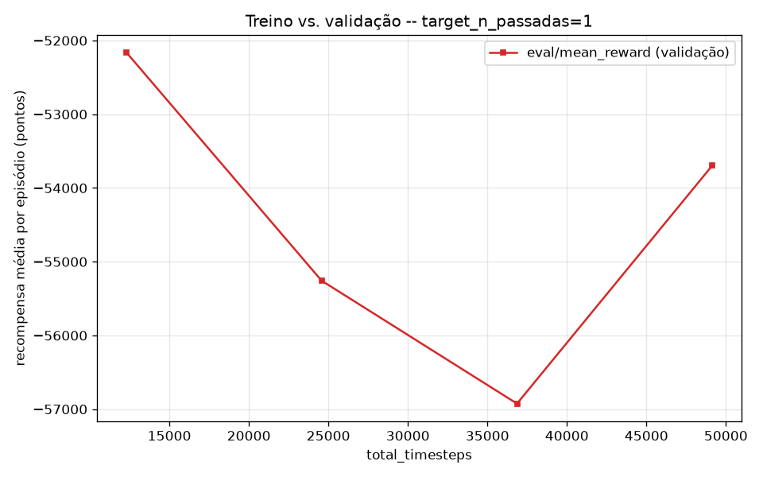
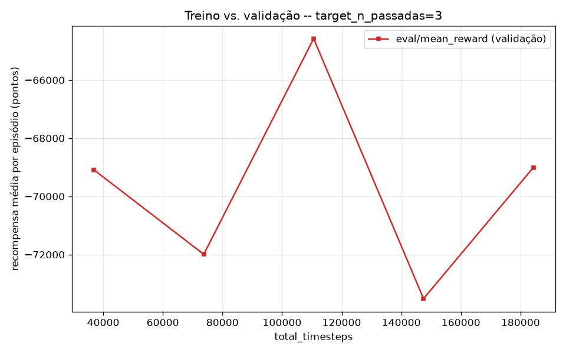
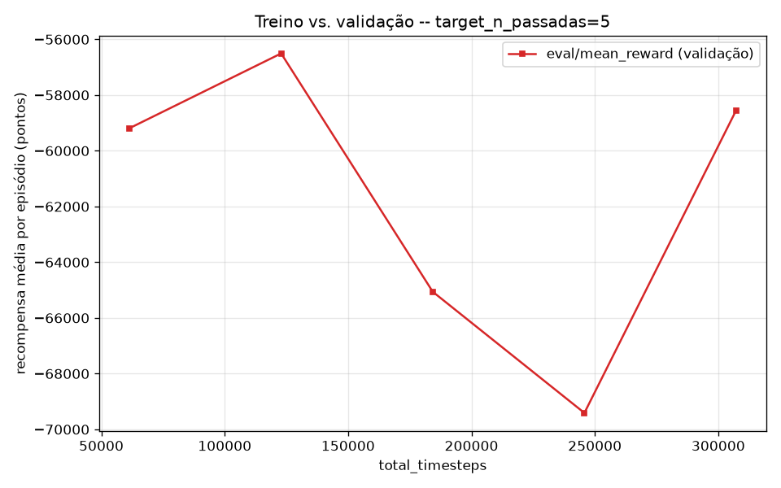
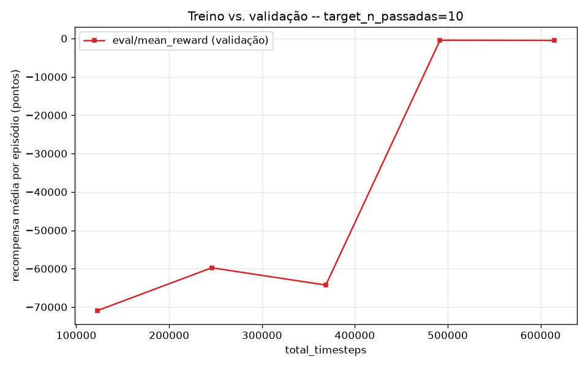
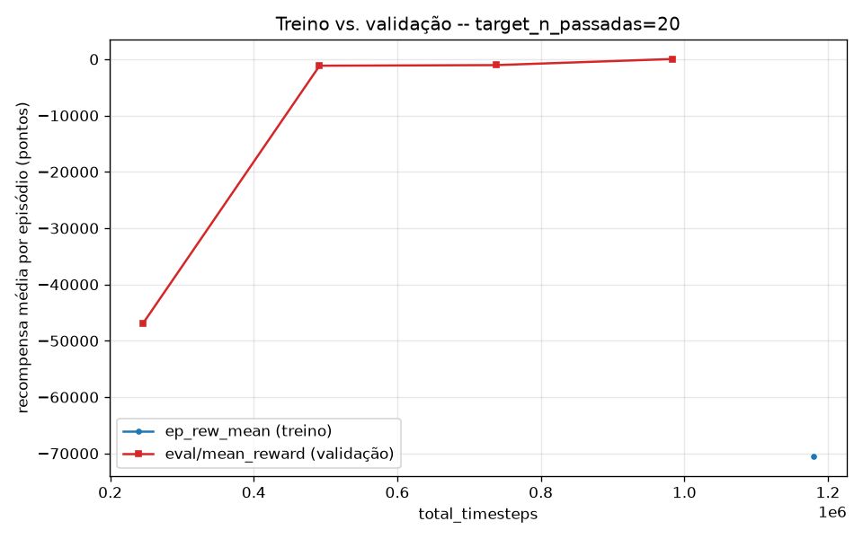

# Sweep de `target_n_passadas` (fold 1) — RL (PPO) para Pairs Trading BOVA11 x WINM21

> **Status: executado.** Rodada completa no Santos Dumont em 17/09/2026
> (13:11-14:42, 5 jobs sequenciais). **Resultado principal: o sweep
> CONTRADIZ a hipótese da v2** (seção 0) — dentro do fold 1, MENOS
> passadas não reduziu o problema, produziu um resultado muito PIOR.
> Ver seção 5.

## 0. Motivação

A [v2](relatorio_resultados_v2.md) treinou com `target_n_passadas=20`
fixo nos 3 folds e encontrou overfitting severo: mais chunks/mais treino
(folds 2 e 3) correlacionou com prejuízo muito maior em validação/teste
do que o fold 1 (só 1 chunk, resultado quase neutro) — apesar da
recompensa média de treino (`ep_rew_mean`) convergir suavemente para
perto de zero em todos os folds, o que **mascarou** o overfitting em vez
de sinalizá-lo. A conclusão explícita da v2 foi testar
`target_n_passadas` mais baixo.

Este documento cobre um sweep controlado de `target_n_passadas` ∈
{1, 3, 5, 10, 20}, com **tudo mais fixo**: mesma função de folds
walk-forward (`generate_walk_forward_folds`), mesmo `MAX_PREGOES=80`,
mesmo custo de transação (2,5 pontos, já correto desde o treino como na
v2), mesmos hiperparâmetros PPO (`learning_rate=3e-4`, `n_steps=8192`,
`batch_size=1024`, `gamma=0.999`, `n_train_envs=48`). O objetivo central
é medir overfitting **explicitamente**: plotar `ep_rew_mean` de treino
contra `eval/mean_reward` de validação no mesmo eixo de timesteps — a
distância entre as duas curvas é a métrica de overfitting.

## 1. Metodologia e escopo

**Ajuste de escopo (decisão explícita, não um efeito colateral):** rodar
os 5 valores do sweep nos 3 folds da v2 ficaria em torno de 8h de Santos
Dumont (a conta `ppg-lncc` tem `MaxSubmit=1`, então as rodadas são
sequenciais por construção, não só por escolha). Para caber em até ~2h,
**o sweep roda só no fold 1** — 8 dias de treino / 12 validação / 12
teste, exatamente os mesmos limites do fold 1 da v2 (mesma
`generate_walk_forward_folds`, mesmo `MAX_PREGOES=80` — só não treinamos
os folds 2 e 3 desta vez).

Verificado localmente antes de subir pro cluster (`PRINT_FOLD_PLAN=1`,
`MAX_PREGOES=80`, `FOLDS=1`, ver comando em
`slurm/submit_all_folds.sh`/`src/analyze_sweep.py`):

| `target_n_passadas` | `total_timesteps` (fold 1) | Chunks (jobs) | ~ Atualizações PPO* |
|---|---|---|---|
| 1  | 221.296    | 1 | 0,6  |
| 3  | 663.888    | 1 | 1,7  |
| 5  | 1.106.480  | 1 | 2,8  |
| 10 | 2.212.960  | 1 | 5,6  |
| 20 | 4.425.920  | 1 | 11,3 |

*\* Atualizações PPO ≈ `total_timesteps / (n_steps × n_train_envs)` =
`total_timesteps / (8192 × 48)` = `total_timesteps / 393.216`.*

**Ressalva metodológica importante:** com fold 1 (8 dias de treino) e o
tamanho de rollout fixo (`n_steps=8192 × n_train_envs=48 = 393.216`
timesteps por atualização), `target_n_passadas=1` gera menos de 1
atualização PPO completa — a política nesse ponto está muito perto de
uma rede recém-inicializada, não de um "treino leve real". `passadas=3`
também é bem abaixo de 2 atualizações. Os pontos 1 e 3, portanto, devem
ser lidos como uma referência de baseline "quase não-treinado", não como
pontos plenamente comparáveis aos de 5/10/20 em termos de "quanto a
política aprendeu". Essa é uma limitação direta da redução de escopo pra
caber em ~2h — o sweep completo nos 3 folds (fold 2/3 têm bem mais dias
de treino, logo mais atualizações por `target_n_passadas`) não teria essa
ressalva, mas custaria ~8h.

Infraestrutura nova/alterada para viabilizar o sweep (código já
implementado e com sanity check local, ver commit):

- `RUN_TAG` (env var) em `src/rl_trading_pipeline.py`: namespacea
  checkpoint (`ppo_arbitrage_fold{N}_{TAG}.zip`), `best_model` e log CSV
  por valor do sweep, sem colidir artefatos. Vazio por padrão (reproduz
  os caminhos de v1/v2 sem mudança).
- Log estruturado (`progress.csv`, formato CSV nativo do SB3) com
  `rollout/ep_rew_mean` (treino) e `eval/mean_reward` (validação) na
  mesma linha/eixo de `time/total_timesteps` — não existia antes (só
  stdout); é o que alimenta o gráfico de overfitting da seção 4.
- `FOLDS` (env var) em `slurm/submit_all_folds.sh`: permite pedir só
  `FOLDS="1"` sem duplicar a lógica de planejamento de chunks/resume já
  validada.
- `slurm/submit_sweep.sh`: itera `TARGET_N_PASSADAS` ∈ {1,3,5,10,20},
  chamando `submit_all_folds.sh` com `RUN_TAG=p<N>` `FOLDS=1` por
  iteração.
- `src/analyze_sweep.py`: parseia os `.out` (tabela final de
  lucro/negócios/taxa de acerto) e os `progress.csv` (curvas), gera as
  tabelas/figuras deste documento.

## 2. Configurações

Idêntico à v2 em tudo que não é `target_n_passadas`/fold — ver
[relatorio_resultados_v2.md §1-2](relatorio_resultados_v2.md) e
[relatorio_resultados.md §2](relatorio_resultados.md#2-configurações)
para o detalhamento completo (espaço de estado, ações, recompensa, custo
de transação, hiperparâmetros PPO).

## 3. Resultados de avaliação

*(valores em pontos do WIN; multiplique por 0,20 para R$)*

| `target_n_passadas` | Conjunto | Lucro total | Taxa de acerto | Negócios | Lucro médio/negócio |
|---|---|---|---|---|---|
| 1 | Validação | -625.790,0 pts (R$ -125.158,00) | 12,0% | 84.366 | -7,42 |
| 1 | Teste | -380.875,0 pts (R$ -76.175,00) | 10,5% | 50.794 | -7,50 |
| 3 | Validação | -803.782,5 pts (R$ -160.756,50) | 10,3% | 102.423 | -7,85 |
| 3 | Teste | *(pulado — ver nota abaixo)* | — | — | — |
| 5 | Validação | -757.107,5 pts (R$ -151.421,50) | 10,9% | 96.616 | -7,84 |
| 5 | Teste | -440.745,0 pts (R$ -88.149,00) | 10,2% | 57.090 | -7,72 |
| 10 | Validação | -6.822,5 pts (R$ -1.364,50) | 19,6% | 1.185 | -5,76 |
| 10 | Teste | -3.935,0 pts (R$ -787,00) | 18,3% | 678 | -5,80 |
| 20 | Validação | 505,0 pts (R$ 101,00) | 50,0% | 36 | 14,03 |
| 20 | Teste | 160,0 pts (R$ 32,00) | 44,1% | 34 | 4,71 |

*Nota: o teste de `passadas=3` foi pulado pelo mesmo mecanismo de
reserva de tempo da v2 (`121s restantes, menos que a reserva de 150s`)
— o checkpoint está salvo (`ppo_arbitrage_fold1_p3.zip`), recuperável
com `EVAL_ONLY_FOLD` se precisar do número exato; dado o padrão dos
vizinhos (p1 e p5 também catastróficos), não deve mudar a leitura.*

Note a escala: **84 mil a 102 mil negócios** em 12 dias de validação
(≈7-8 mil/dia) para passadas ≤5 — a política não aprendeu nada
utilizável, está essencialmente entrando/saindo de posição a cada
poucos ticks. Em `passadas=10` isso já cai pra ~100/dia, e em
`passadas=20` pra ~3/dia (comparável a um trader discricionário).

## 4. Curvas de treino vs. validação — gap de overfitting

Em `passadas=1` a validação fica achatada entre -52.000 e -57.000 do
início ao fim — nenhum aprendizado visível. `passadas=10` mostra uma
transição abrupta: estável por ~370k timesteps em torno de -60.000/
-70.000, e então salta pra perto de 0 nos últimos pontos. `passadas=20`
mostra a mesma subida, começando de um ponto melhor (-47.000) e
terminando bem perto de 0. **Padrão consistente**: existe algo como uma
transição de fase — a política fica "destreinada" (efetivamente
aleatória, com custo de transação dominando) até um certo número de
updates PPO, e só depois disso aprende a operar com parcimônia.

**Gráfico-resumo (`sweep_overfitting_gap.png`) não foi gerado**: o
cálculo do gap (`compute_overfitting_gap`) faz um merge "backward" do
ponto de treino (`rollout/ep_rew_mean`) mais recente contra cada ponto
de validação -- mas em `passadas=20` (o único caso com pelo menos 1
ponto de treino completo, ver seção 1) esse único ponto de treino cai
DEPOIS do último ponto de validação no eixo de timesteps (comparar
`sweep_p20.png`: o ponto azul solto fica à direita de toda a curva
vermelha) -- não há nenhum ponto de validação "anterior" a ele pra
comparar, e o merge fica vazio. Não é um bug no sentido de dar número
errado -- é a limitação real do desenho do log (só 1 rollout completo
disponível) tornando essa métrica específica não-computável aqui. As
curvas brutas acima (seção 4) já mostram a mesma informação
qualitativa sem depender dela.

## 5. Observações

- **Resultado central, e ele CONTRADIZ a hipótese da v2.** A v2 sugeriu
  que menos passadas reduziria overfitting. O sweep mostra o oposto na
  faixa testada: `passadas` baixo (1, 3, 5) não é "menos overfitting" —
  é **subtreinamento severo**. A política nesses pontos executa menos
  de 3 atualizações PPO completas (ver seção 1) e se comporta
  essencialmente como uma rede aleatória, que aqui significa
  negociar sem parar e perder pro custo de transação a cada operação.
  Só a partir de `passadas=10` a política começa a aprender a parar de
  operar tanto, e só em `passadas=20` (o maior valor testado) o
  resultado fica perto-de-neutro/levemente positivo.
- **Isso não invalida necessariamente o diagnóstico de overfitting da
  v2 nos folds 2 e 3** -- mas mostra que o sweep, restrito ao fold 1 (1
  chunk único em todos os pontos testados), não isola a causa real do
  problema da v2. Fold 1 nunca precisou de resume/encadeamento de jobs
  em nenhum ponto deste sweep; os folds 2 e 3 da v2 precisaram de 4 e 7
  chunks encadeados MESMO em `passadas=20`. Ou seja, este sweep testou
  "quantidade de treino" isoladamente dentro de um regime de 1 chunk só
  -- não testou se o mecanismo de checkpoint+resume entre múltiplos
  jobs, ou o tamanho do fold (8 vs. 32/56 dias de treino), contribui
  pro prejuízo dos folds maiores da v2. Essas duas variáveis (nº de
  chunks, tamanho do fold) ficaram confundidas com `passadas` na v2 e
  não foram isoladas aqui.
- **Implicação prática imediata**: não vale reduzir `target_n_passadas`
  abaixo de 20 -- os dados mostram claramente o oposto do que a v2
  sugeria. Dado que `passadas=20` foi o MELHOR ponto testado e a curva
  de validação ainda estava subindo no final da rodada (ver
  `sweep_p20.png`), o próximo passo natural é testar valores ACIMA de
  20 (ex.: 30, 40) no fold 1, em vez de abaixo.
- **Segundo próximo passo, pra isolar as variáveis confundidas**: rodar
  o mesmo sweep de `passadas` no fold 2 ou 3 (que precisam de múltiplos
  chunks mesmo em valores baixos de `passadas`, dado que têm mais dias
  de treino) -- se o mesmo padrão de "quanto mais passadas, melhor"
  aparecer lá também, o problema da v2 não era passadas em si, e sim
  algo específico do encadeamento multi-chunk ou do tamanho do fold.
