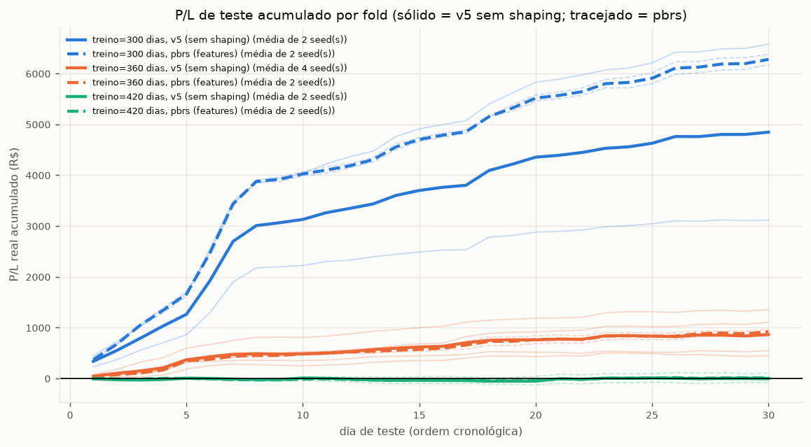

# Walk-forward da v5 em 3 janelas, com e sem shaping pbrs

Resultado das duas rodadas do SDumont: (1) `slurm/submit_walkforward.sh` — a v5
(`ENV_KIND=hedged STATE_KIND=spread`, sem shaping, hiperparâmetros do PPO
idênticos, dados reais WIN×BOVA11) avaliada em 3 janelas de treino em vez de
uma só; (2) `slurm/submit_walkforward_pbrs.sh` — a MESMA configuração, mas com
`SHAPING_KIND=pbrs SHAPING_SIGNAL=features` (o formato que no par sintético
cointegrado capturou 204% da regra ótima causal, `docs/relatorio_diagnostico_sintetico.md`
§8, rodada A), nas mesmas 3 janelas, pra saber se esse resultado se sustenta
no dado real. Nenhuma das duas mudou a definição do ambiente, da recompensa
base, do estado ou os hiperparâmetros do PPO em relação à v5; só a janela de
treino varia (fold) e, na segunda rodada, o formato de shaping.

Todas as 10 execuções (4 da rodada "sem shaping" nos folds novos + 4 seeds já
existentes de v5 no fold 360 + 6 da rodada pbrs) terminaram com `state.json`
`"done": true`, sem falha registrada.

## 1. Janelas dos folds (datas reais, `generate_fixed_window_folds`, sem
embaralhamento — treino sempre antes de val e teste)

| fold (treino) | treino (pregões) | val | teste | movimento do WIN no teste |
|---|---|---|---|---|
| 300 dias | 2021-04-26 a 2022-09-15 (ordens 1–300) | 2022-09-16 a 2022-11-01 (301–330) | 2022-11-03 a 2023-01-18 (331–361, exclui 338) | +1.025 pts |
| 360 dias | 2021-04-26 a 2023-01-18 (1–361, exclui 338) | 2023-01-19 a 2023-04-17 (362–391) | 2023-04-18 a 2023-07-14 (392–421) | +3.055 pts |
| 420 dias | 2021-04-26 a 2023-07-14 (1–421, exclui 338) | 2023-07-17 a 2023-09-06 (422–451) | 2023-09-08 a 2024-03-14 (452–482, exclui 463) | −657,5 pts |

As 3 janelas são contíguas por construção (treino do fold seguinte = treino +
val + teste do fold anterior), confirmado pelas datas batendo exatamente nas
bordas. **Ressalva de qualidade de dado no fold 420**: a janela de teste tem
um hiato de calendário de ~5 meses embutido — 11 pregões em 08–22/set/2023
(ordens 452–462) e 19 pregões em 19/fev–14/mar/2024 (ordens 464–482), com a
ordem 463 excluída (`EXCLUDE_ORDERS`). O "dia de teste" nesse fold mistura
dois regimes de mercado bem diferentes, o que deve ser levado em conta ao
interpretar o resultado dessa janela.

## 2. Execuções, por fold × seed × shaping

`pnl_teste_R$_dia` é o P/L real (não o reward do PPO), `baseline_segurar_par`
é a referência "ficar comprado ou vendido o pregão todo, melhor dos dois",
via `hold_baselines_hedged.run_hold`.

| treino | shaping | execução | seed | pnl teste R$/dia | negócios/dia | % dias pos. | corr. c/ mov. WIN | pnl c/ meio-spread R$ | pnl c/ latência 1 tick R$ | baseline segurar par R$/dia |
|---|---|---|---|---|---|---|---|---|---|---|
| 300 | none | wf_300_s0 | 0 | **219,26** | 46,7 | 1,00 | −0,20 | −930,93 | −6.005,40 | −9,54 |
| 300 | none | wf_300_s1 | 1 | **103,88** | 27,2 | 0,93 | −0,10 | −1.539,31 | −2.593,06 | −9,54 |
| 300 | pbrs | wfp_300_s0 | 0 | **212,64** | 29,8 | 1,00 | −0,19 | +1.352,56 | −3.124,14 | −9,54 |
| 300 | pbrs | wfp_300_s1 | 1 | **205,90** | 26,2 | 1,00 | −0,17 | +1.780,45 | −2.562,64 | −9,54 |
| 360 | none | hedged_s0 | 0 | 15,00 | 14,1 | 0,63 | −0,01 | −1.447,07 | −1.780,68 | −9,52 |
| 360 | none | hedged_s1 | 1 | 36,88 | 11,0 | 0,87 | −0,14 | −359,90 | −1.761,60 | −9,52 |
| 360 | none | hedged_s2 | 2 | 45,16 | 32,2 | 0,87 | 0,12 | −2.428,52 | −2.729,40 | −9,52 |
| 360 | none | hedged_s3 | 3 | 18,20 | 12,2 | 0,63 | 0,16 | −1.089,10 | −1.709,59 | −9,52 |
| 360 | pbrs | wfp_360_s0 | 0 | 28,99 | 4,7 | 0,83 | 0,01 | +220,93 | −709,54 | −9,52 |
| 360 | pbrs | wfp_360_s1 | 1 | 32,34 | 6,2 | 0,90 | −0,09 | +98,41 | −1.000,19 | −9,52 |
| 420 | none | wf_420_s0 | 0 | 1,16 | 9,6 | 0,47 | −0,07 | −1.220,14 | −1.039,64 | −10,17 |
| 420 | none | wf_420_s1 | 1 | −1,27 | 6,8 | 0,33 | −0,32 | −930,70 | −999,52 | −10,17 |
| 420 | pbrs | wfp_420_s0 | 0 | 3,48 | 16,7 | 0,60 | −0,12 | −1.916,60 | −2.516,27 | −10,17 |
| 420 | pbrs | wfp_420_s1 | 1 | −2,82 | 7,5 | 0,33 | −0,05 | −1.084,99 | −930,27 | −10,17 |

O baseline flat (ficar de fora o tempo todo) é sempre 0 por definição, então
não repetido na tabela — todas as 12 execuções com P/L teste positivo batem
esse baseline; as 2 negativas (`wf_420_s1`, `wfp_420_s1`) não.

## 3. Agregado (bootstrap 95% sobre os dias de teste agrupados, pooled)

| treino | shaping | dias de teste agrupados | P/L médio R$/dia | IC95% | % dias positivos |
|---|---|---|---|---|---|
| 300 | none | 60 | 161,57 | [117,43; 212,82] | 0,97 |
| 300 | pbrs | 60 | 209,27 | [159,15; 267,34] | 1,00 |
| 360 | none | 120 | 28,81 | [21,83; 36,16] | 0,75 |
| 360 | pbrs | 60 | 30,66 | [22,06; 40,43] | 0,87 |
| 420 | none | 60 | −0,05 | [−3,83; 4,12] | 0,40 |
| 420 | pbrs | 60 | 0,33 | [−3,24; 4,08] | 0,47 |
| **todos** | **none** | 240 | **54,78** | [41,09; 70,73] | 0,72 |
| **todos** | **pbrs** | 180 | **80,09** | [58,10; 104,86] | 0,78 |

Folds com P/L médio de teste > 0 (agregando as seeds): **none 2/3** (420
fica negativo por uma casa decimal, dentro do ruído), **pbrs 3/3** (420 fica
positivo por uma casa decimal, igualmente dentro do ruído — os dois IC95% do
fold 420 cruzam o zero para ambos os shapings; não dá pra chamar esse fold de
vitória de ninguém).

A comparação pooled acima favorece um pouco o "none" porque o fold 360 tem 4
seeds ali (2 no pbrs) — 120 dos 240 dias "none" vêm da janela mais fácil.
Tirando esse viés, a média simples dos 3 P/L-médios-por-fold dá **63,44
R$/dia (none) vs 80,09 R$/dia (pbrs)** — mesma direção, pbrs à frente nas
duas contagens.

## 4. Leitura honesta

- **Fold 300 (o mais fácil, WIN subiu 1.025 pts): os dois formatos vão muito
  bem** (R$103–219/dia, 93–100% dos dias positivos). O pbrs não perde pra
  none aqui, mas também não é uma vitória clara — as duas seeds do pbrs saem
  bem mais consistentes entre si (212,64 vs 205,90) do que as do none (219,26
  vs 103,88).
- **Fold 360 (a mesma janela da v5 publicada): pbrs empata ou fica levemente
  à frente** (30,66 vs 28,81 R$/dia), mas com só 2 seeds contra 4 do none —
  os IC95% se sobrepõem quase inteiramente; não dá pra afirmar superioridade
  estatística nessa janela.
- **Fold 420 (o mais difícil, WIN caiu 657,5 pts e o teste tem o hiato de 5
  meses): os dois formatos ficam essencialmente em zero**, com uma seed
  positiva e outra negativa em cada grupo. Nenhuma configuração "resolve"
  essa janela — registrado como pediu, sem trocar nada pra salvar o fold.
- **O achado mais nítido não é o P/L bruto, é a robustez a custo**: o P/L sob
  meio-spread adicional é, em média, **−R$1.243/execução no none contra
  +R$75/execução no pbrs** (médias das 8 execuções none e 6 pbrs da tabela
  acima) — o pbrs produz menos negócios/dia em média (15,2 vs 20,0) e não
  depende de capturar o spread cheio pra ficar positivo, consistente com o
  mecanismo do potencial (`Φ = c·posição·(−z)`) recompensar entrar cedo/perto
  do sinal em vez de operar por volume.
- **A latência de 1 tick continua colapsando o resultado nos dois formatos**
  (médias de −R$2.327/execução none, −R$1.807/execução pbrs) — o pbrs não
  resolve esse problema estrutural, só atenua um pouco.
- **Comparado ao sintético (204% da regra ótima causal), o ganho no dado real
  é bem mais modesto e ruidoso** — não há "regra ótima" de referência no
  dado real pra normalizar, e a vantagem do pbrs sobre o none, embora
  consistente em direção nos 3 folds (pooled e não-pooled), não é
  estatisticamente nítida em nenhum fold isolado tomado sozinho.

## 5. O que muda no paper

O pbrs com `SHAPING_SIGNAL=features` — o mesmo estado que a v5 já observa,
sem informação privilegiada — se sustenta no dado real na mesma direção do
sintético (nunca perde, ganha claramente em robustez a custo de meio-spread),
mas sem a magnitude do sintético. Vale como resultado a reportar tal como
saiu: um shaping teoricamente policy-invariant (Ng et al., 1999) que, nas 3
janelas de teste reais, empata ou supera a v5 sem shaping e é
consideravelmente mais robusto a custo de transação — sem, porém, resolver a
janela mais difícil (420) nem o problema de latência.
